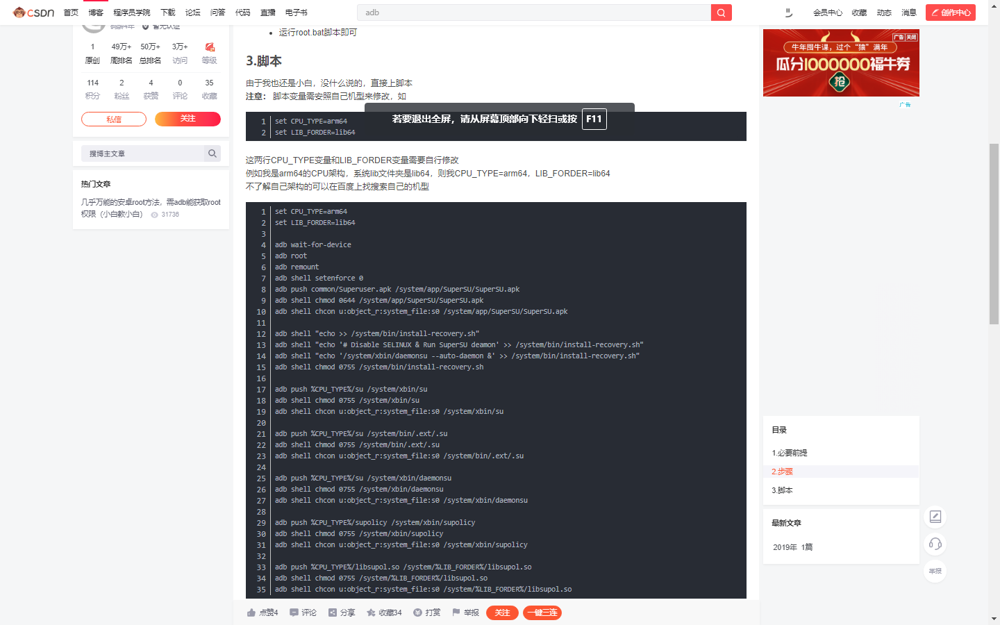
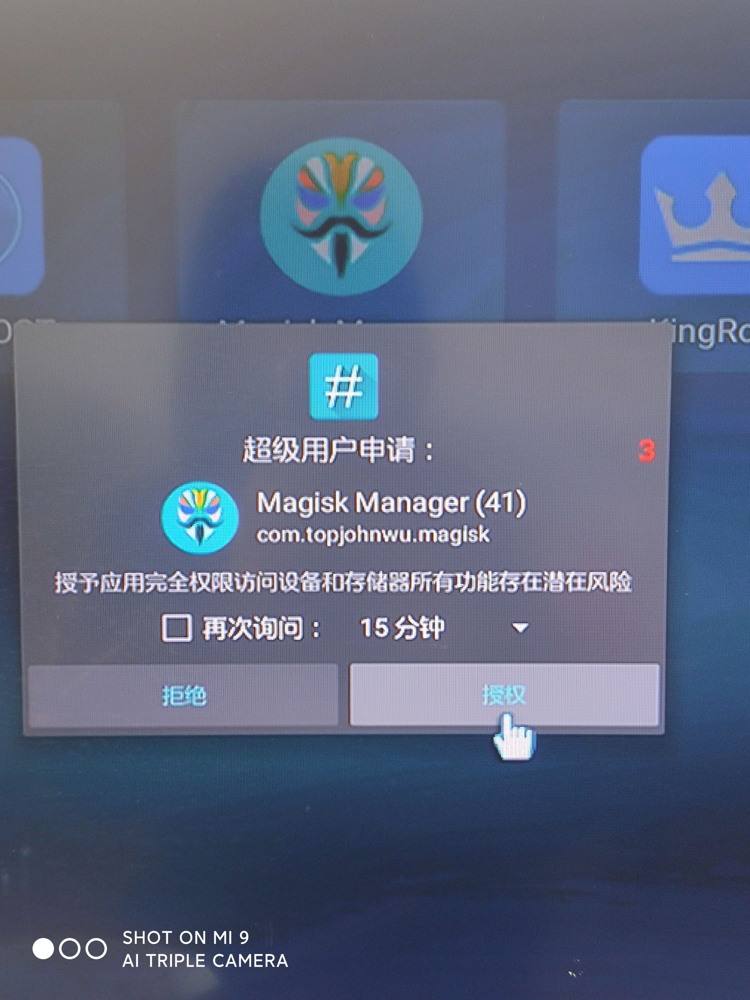
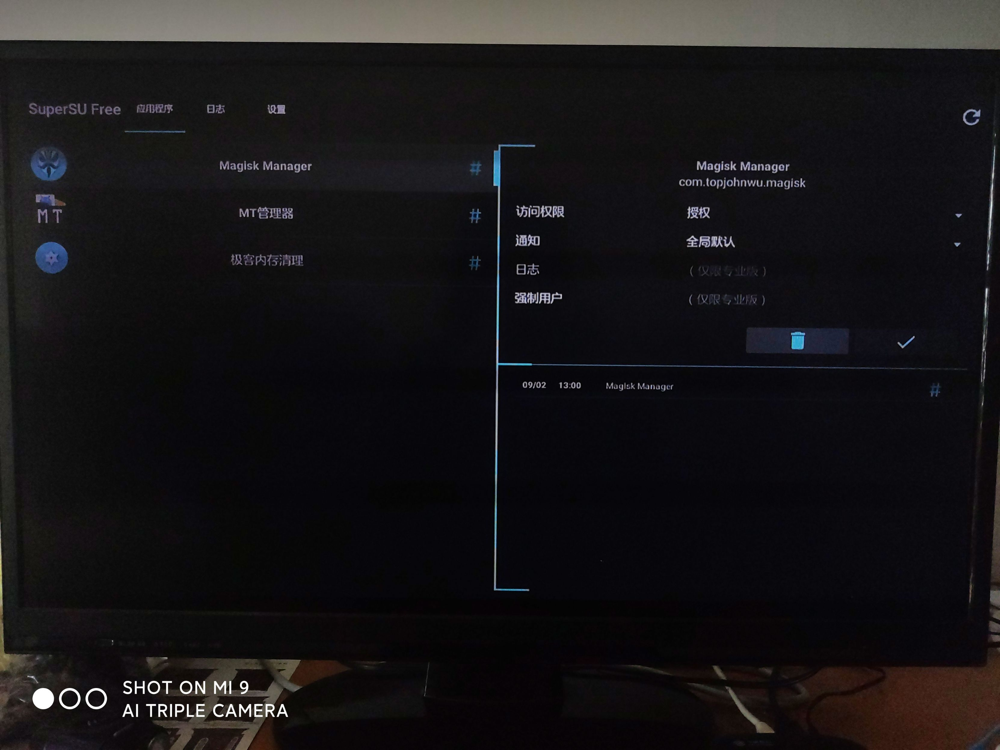
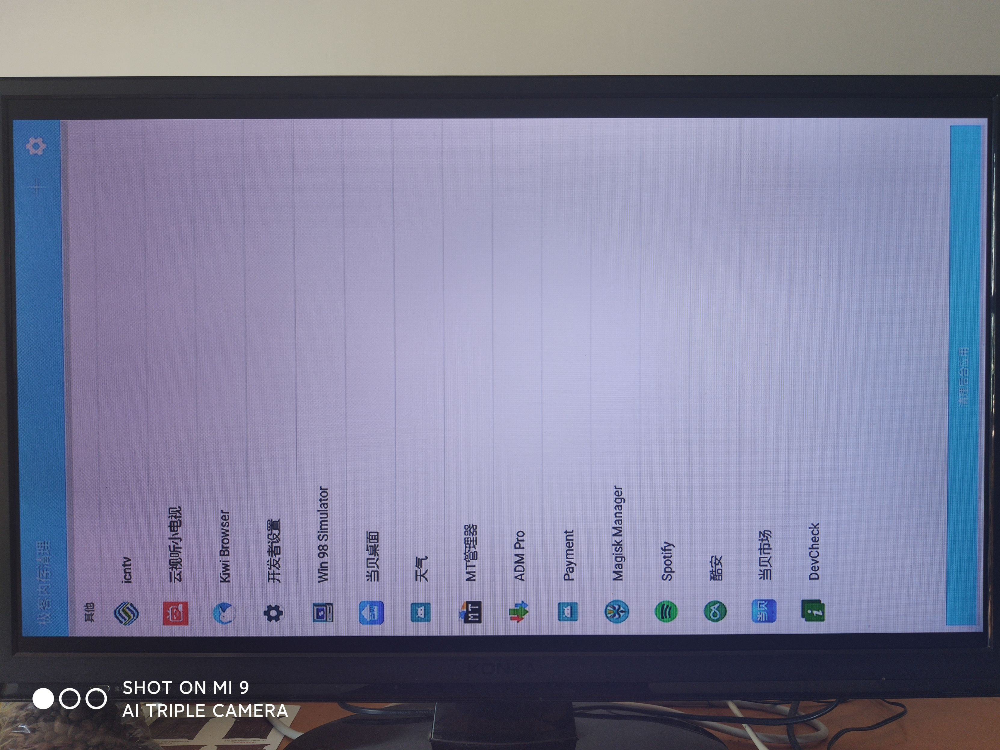
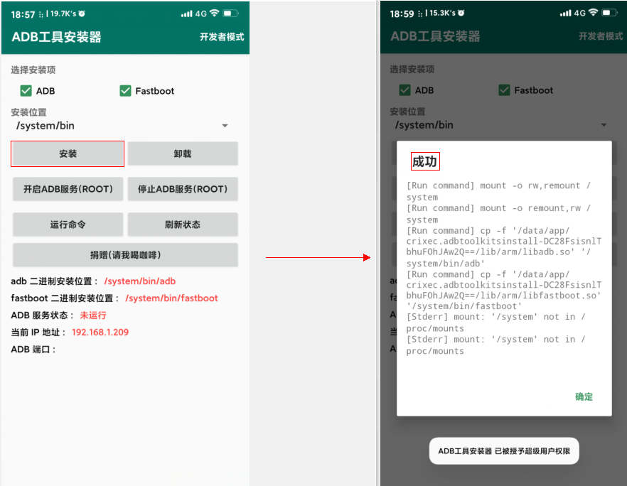
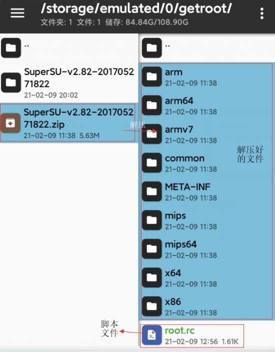
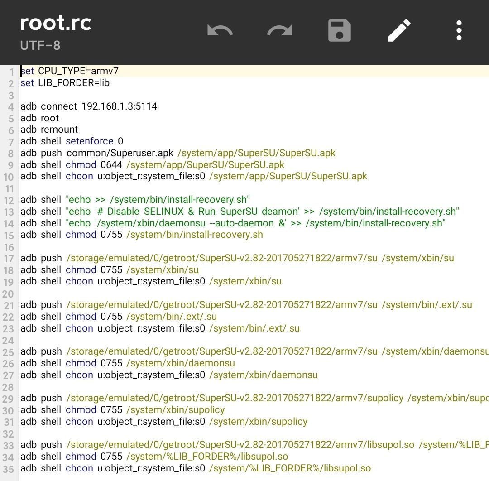
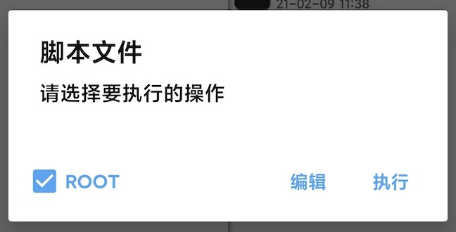
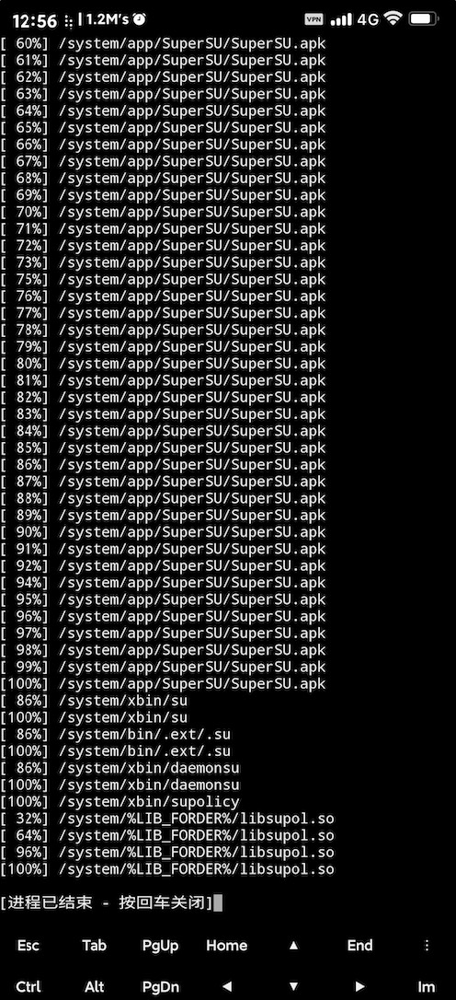

## 我使用的设备和软件

电视盒子：移动魔百盒 CM201z（Android 版本：5.1）  
手机：小米 9（Android 版本：10，已获取 Root 权限）  
软件：  
- MT管理器（修改脚本 | 自带终端，需获取 Root 权限）  
- ADB工具安装器（在已 Root 的 Android 手机上安装 ADB，需获取 Root 权限）  
- SuperSU 压缩包（可从[官网](https://supersuroot.org/download/)下载）

## 历程

通过手机使用 ADB 连接电视盒子后，我意外发现运行 `adb root` 命令后，电视盒子可使 ADB 以 Root 权限运行，获得了最高权限。  
随后，我在网上查找通过 ADB 获取 Root 的方法，最终在 CSDN 论坛找到相关脚本。  
我修改并调试了脚本，在手机终端执行脚本后，重启盒子即可使用 SuperSU 授权 Root 权限。  
以下是原帖部分内容的截图。



## 效果

以下是 Root 后的效果。







## 详细操作

> 在操作前，请确认执行 `adb connect xxxxxxx:5114` 命令成功连接电视盒子后，再执行 `adb root` 命令，检查 ADB 是否以 Root 模式运行。若非 Root 模式，此方法对您的设备无效。可在“ADB工具安装器”主界面点击“运行命令”按钮测试，因为后续操作需在此基础上进行。

1. 在手机上安装“MT管理器”“ADB工具安装器”和 SuperSU 安装包。
2. 在手机上打开“ADB工具安装器”，授予 Root 权限。进入主界面后，点击“安装”按钮，显示“成功”后可进行下一步。此步骤为手机安装 ADB。
   

3. 在手机上打开“MT管理器”，授予 Root 权限。找到下载的 SuperSU 安装包，解压到存储目录下的任意文件夹。我将文件解压至 `/storage/emulated/0/getroot/SuperSU-v2.82-201705271822/` 路径。
   

4. 在解压目录下创建脚本文件，我命名为 `root.rc`。点击该文件，在弹出的窗口中点击“编辑”，输入以下代码，保存并退出。
   

```sh {"1. 这一行代码用来连接电视盒子，端口号必须为 5114；IP 可能不同，需自行修改":3-4} {"2. 以下有颜色的部分是绝对路径，因使用相对路径可能报错，建议使用绝对路径":16-17} wrap=false title="/storage/emulated/0/getroot/SuperSU-v2.82-201705271822/root.rc"
set CPU_TYPE=armv7
set LIB_FORDER=lib

adb connect 192.168.1.3:5114
adb root
adb remount
adb shell setenforce 0
adb push common/Superuser.apk /system/app/SuperSU/SuperSU.apk
adb shell chmod 0644 /system/app/SuperSU/SuperSU.apk
adb shell chcon u:object_r:system_file:s0 /system/app/SuperSU/SuperSU.apk

adb shell "echo >> /system/bin/install-recovery.sh"
adb shell "echo '# Disable SELINUX & Run SuperSU deamon' >> /system/bin/install-recovery.sh"
adb shell "echo '/system/xbin/daemonsu --auto-daemon &' >> /system/bin/install-recovery.sh"
adb shell chmod 0755 /system/bin/install-recovery.sh

adb push /storage/emulated/0/getroot/SuperSU-v2.82-201705271822/armv7/su /system/xbin/su
adb shell chmod 0755 /system/xbin/su
adb shell chcon u:object_r:system_file:s0 /system/xbin/su

adb push /storage/emulated/0/getroot/SuperSU-v2.82-201705271822/armv7/su /system/bin/.ext/.su
adb shell chmod 0755 /system/bin/.ext/.su
adb shell chcon u:object_r:system_file:s0 /system/bin/.ext/.su

adb push /storage/emulated/0/getroot/SuperSU-v2.82-201705271822/armv7/su /system/xbin/daemonsu
adb shell chmod 0755 /system/xbin/daemonsu
adb shell chcon u:object_r:system_file:s0 /system/xbin/daemonsu

adb push /storage/emulated/0/getroot/SuperSU-v2.82-201705271822/armv7/supolicy /system/xbin/supolicy
adb shell chmod 0755 /system/xbin/supolicy
adb shell chcon u:object_r:system_file:s0 /system/xbin/supolicy

adb push /storage/emulated/0/getroot/SuperSU-v2.82-201705271822/armv7/libsupol.so /system/%LIB_FORDER%/libsupol.so
adb shell chmod 0755 /system/%LIB_FORDER%/libsupol.so
adb shell chcon u:object_r:system_file:s0 /system/%LIB_FORDER%/libsupol.so
```

5. 点击脚本文件，在弹出的窗口中点击“执行”，等待终端执行完成。若脚本执行过程中出错，请逐行排查命令是否正确。
   
   

6. 完成以上步骤后，重启电视盒子，开机后即可使用 SuperSU 软件为其他应用程序授予 Root 权限。

## 注意

- 由于我是第一次写博客，本文可能存在表述不完整、不准确或错误，请保持怀疑精神。  
- 某些情况下，仅靠智能盒子的遥控器可能无法完成操作，需外接鼠标或其他辅助工具。  
- 理论上，只要设备情况类似，且执行 `adb root` 无误，此方法适用于相似设备。  
- 可使用电脑替代手机完成操作，需在电脑上安装 ADB，具体参考原帖（见下文）。

## 借鉴

[CSDN 原帖](https://blog.csdn.net/ZLDXXS/article/details/88082691) 感谢分享者。

<div style="text-align: center;">
最后一次修改日期及时间：2021-02-09 20:48:20<br/>
感谢你能看到这里  
</div>