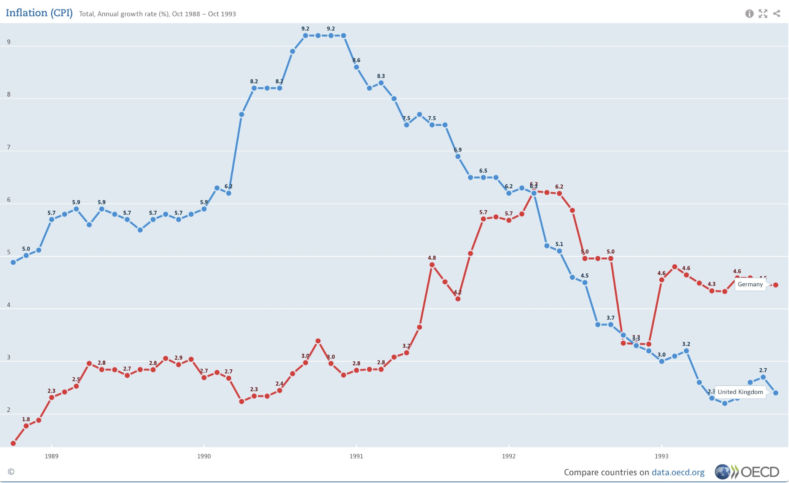
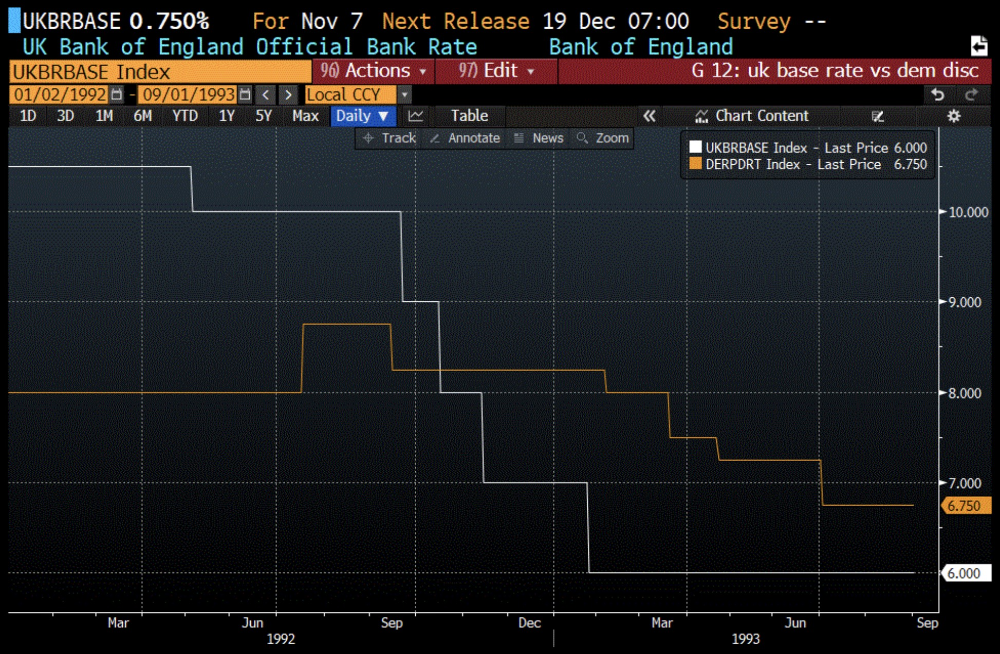
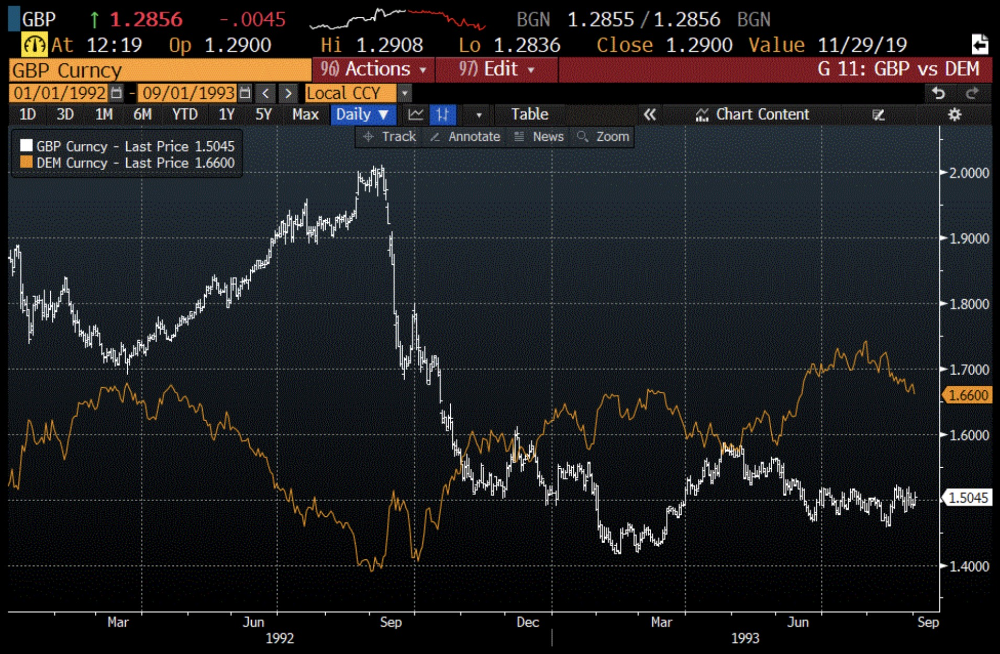
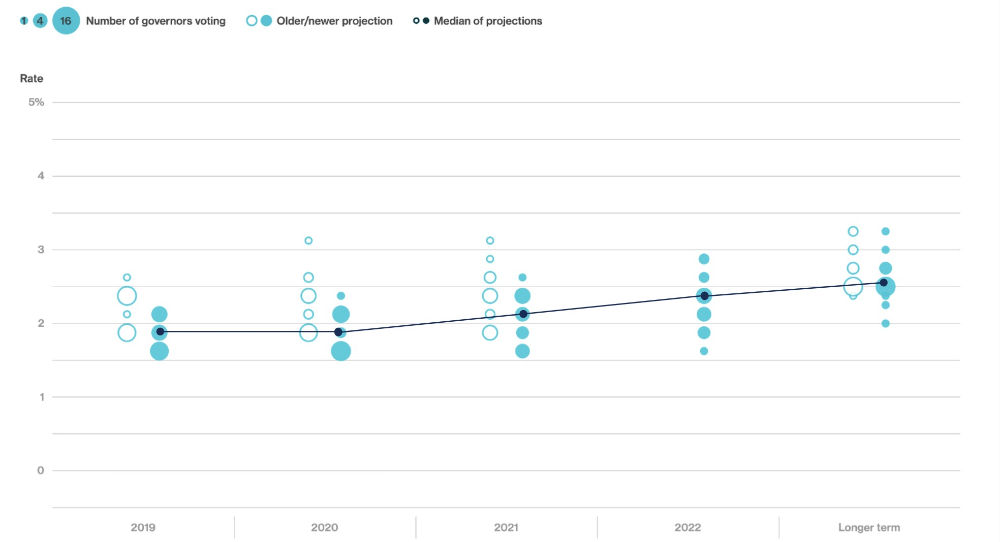
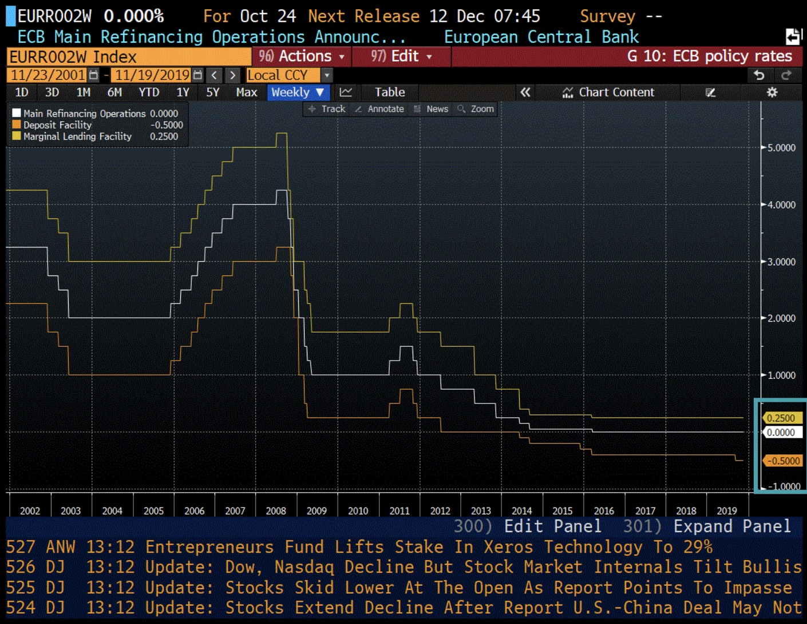

# 经济事件

经济事件(Economic events)帮助市场参与者做出多项决策，例如：

- 制定投资计划（宏观的、方向性的决策）
- 把握交易时机（微观的、具体执行的决策）
- 利用市场的波动性（或其缺乏）来获利（🔑最关键，如何根据市场的“脾气”来调整策略）

这句话列举了三个关键决策：

*   **"Investment plans" (制定投资计划)**
    *   **解释**：这是指**宏观的、方向性的**决策。比如，一个基金经理在看到一系列强劲的美国经济数据后，可能会制定一个“在未来三个月内，增持美元、减持日元”的总体计划。这是关于 **“做什么”** 的战略层面思考。

*   **"Timing trades" (把握交易时机)**
    *   **解释**：这是指**微观的、具体执行**的决策。知道了“做什么”之后，下一个问题就是 **“什么时候做”** 。比如，“美国的CPI数据将在今晚8:30公布，我应该在数据公布*前*入场，还是在数据公布*后*，等市场方向明确了再入场？” 这就是对交易时机的选择。

*   **"Taking advantage of market volatility (or lack thereof)" (利用市场的波动性或其缺乏)**
    *   **解释**：这是最关键的一点，指如何根据市场的“脾气”来调整策略。
        *   **Volatility (波动性)**：当一个重磅经济数据公布时，市场价格通常会像过山车一样剧烈上下波动。这种“波动性”为短线交易者创造了巨大的盈利机会（当然也伴随着高风险）。他们可以通过快速买入卖出来从这种剧烈变动中获利。
        *   **Lack thereof (缺乏波动性)**：指市场非常平静、波澜不惊的时期。这通常发生在重大经济事件公布之前，大家都在观望。有些交易策略专门在这种“风暴前的宁静”中寻找机会。例如，一些期权策略在市场稳定时更容易获利。

经济事件就像是给所有市场参与者（交易员、投资者）发出的“信号枪”

作为一名外汇和黄金交易者，你的学习重点不应该是钻研深奥的经济学理论，而是要高度关注即将发生的“经济事件”。

你需要：
1. 知道有哪些重要的经济事件（财经日历是你的必备工具）。
2. 理解这些事件（如CPI、非农就业数据）代表什么含义。
3. 学习当这些数据公布后，市场（尤其是外汇和黄金市场）通常会如何反应。

这门课程的目的，就是教你这些在真实战场上能直接使用的知识。

## 经济事件类型

像专业人士一样**审视和解读**经济新闻，不要盲目相信你看到的每一个经济数据，你需要批判性地思考它的“类型”和“来源”。

---

### **第一部分：经济事件的两种“类型”——定量 vs. 定性**

#### **1. 定量 (Quantitative) 数据**
*   **原文**：“Figures don't lie...” (数字不会说谎...)
*   **解释**：这是指可以用**具体数字**来衡量的经济信息。
*   **例子**：
    *   国内生产总值 (GDP) 增长了 **2.5%**。
    *   通货膨胀率 (CPI) 是 **3.1%**。
    *   失业率是 **4.0%**。
*   **特点**：客观、直接、清晰。市场对这类数据反应通常很快。

#### **2. 定性 (Qualitative) 数据**
*   **原文**：“Subjective or qualitative releases often require a deeper dive.” (主观或定性的发布通常需要更深入的研究。)
*   **解释**：这是指基于**观点、情绪、感受或意见**的经济信息。它不是一个硬性数字，而是一种描述。
*   **例子**：
    *   美联储主席在讲话中表示，他对经济前景“持谨慎乐观态度”。（“谨慎乐观”是定性的）
    *   一份商业调查报告显示，企业高管们对未来的“信心有所减弱”。（“信心减弱”是定性的）
*   **特点**：主观、模糊，需要你去分析字里行间的真实含义。

#### **3. 重要的警告：“数字的陷阱”**
*   **原文**：“...but they're often open to interpretation and adjustment or modification in the future.” (...但它们往往可以在未来进行解释、调整或修改。)
*   **解释**：这是关键！一个“定量”的数字虽然客观，但它的意义并非一成不变。
    *   **解释 (Interpretation)**：GDP增长2.5%，是好是坏？如果市场预期是3.0%，那么2.5%就是坏消息。如果预期是2.0%，那2.5%就是好消息。数字本身没变，但市场的解读变了。
    *   **调整 (Adjustment/Modification)**：很多重要的经济数据在首次公布后，还会在接下来的几个月里进行修正。比如，今天公布的上个月就业人数是20万，但下个月修正后可能变成了18万。**初值 (Initial Release) 和终值 (Final Revision) 可能不同**。

#### **4. 两者的桥梁：PMI 指数**
*   **原文**：“...purchasing managers index or PMI, which take a qualitative measure, business sentiment, and quantify it as an index...” (...采购经理人指数或 PMI，它们采取定性的衡量标准，商业情绪，并将其量化为指数...)
*   **解释**：PMI是一个绝佳的例子，它把“定性”信息变成了“定量”数据。
    *   **过程**：调查机构去问很多公司的采购经理一个**定性问题**：“你觉得下个月的生意会更好、更差还是不变？”
    *   **量化**：然后，他们把这些“更好/更差/不变”的回答，通过一个公式，变成一个**具体的数字**（PMI指数）。
    *   **结果**：如果指数是55，你不需要知道每个经理的具体感受，你只需要知道**55代表经济在扩张（好消息）**。如果指数是48，就代表**经济在收缩（坏消息）**。它把模糊的情绪变成了一个交易者可以快速反应的客观数字。

---

### **第二部分：经济新闻的“来源”——谁在说话？**

*   **原文**：“This is important for us when we consider the source of the economic news.” (当我们考虑经济新闻的来源时，这对我们来说很重要。)
*   **解释**：知道一条新闻是谁发布的，和新闻内容本身一样重要。来源决定了它的**权威性、可信度和市场影响力**。

#### **1. 官方机构 (Official Agencies)**
*   **解释**：由政府或中央银行的统计部门发布。
*   **例子**：美国劳工统计局发布的**非农就业报告 (NFP)**、美国经济分析局发布的**GDP数据**。
*   **特点**：**最权威、影响力最大**。这些数据发布时，市场通常会产生最剧烈的波动。它们是市场的“金标准”。

#### **2. 准官方或私人实体 (Quasi-official or Private Entities)**
*   **解释**：由大学、研究机构或私营公司发布。
*   **例子**：
    *   **ADP**：这是一家大型私营薪资服务公司。它会在**官方非农就业报告(NFP)公布前两天**，发布一个自己统计的“ADP就业报告”（俗称“小非农”）。
    *   **密歇根大学 (University of Michigan)**：发布消费者信心指数。
    *   **凯斯-席勒 (Case-Shiller)**：发布美国房价指数。
*   **特点**：
    *   **预测价值**：像ADP这样的私人数据，市场会用它来**预测**两天后公布的官方数据会是多少。如果ADP数据远超预期，交易者可能会提前开始买入美元，押注官方的NFP数据也会很好。
    *   **影响力较小**：虽然也有参考价值，但它们的市场影响力通常远小于官方数据。如果ADP和NFP的数据“打架”，市场最终会相信官方的NFP。

---

### **总结：这对你意味着什么？**

当你看到一条财经新闻时，立刻在脑中问自己三个问题：

1.  **这是数字还是观点？** (是定量的，还是定性的？)
2.  **这个数字是初值吗？未来会修正吗？** (如何解读这个数字？)
3.  **这是谁发布的？** (是政府官方数据，还是私人机构的预测？)

养成这个习惯，你就能从一个被动接收信息的新手，转变为一个能够**独立思考、审慎判断**的聪明交易者。

## 经济指标的重要方面

如何像一个数据分析师一样，去“解剖”和理解你看到的每一个经济指标？它分为两个核心部分。

---

### **第一部分：解构一个经济数字的核心三要素 (V x P = V)**

这段话告诉你，很多经济数据都可以被拆解成三个基本部分：**数量 (Volume)、价格 (Price) 和 价值 (Value)**。

#### **1. Volume (数量 / 交易量)**
*   **解释**：这是指某个东西的**物理数量**。它回答的问题是“**有多少个？**”
*   **例子**：
    *   上个月美国卖出了 **50万套** 房屋。
    *   沙特阿拉伯一天生产了 **900万桶** 石油。

#### **2. Price (价格)**
*   **解释**：这是指那个东西**每一单位的市场价格**。它回答的问题是“**一个多少钱？**”
*   **例子**：
    *   一套房屋的平均售价是 **40万美元**。
    *   一桶石油的价格是 **85美元**。
    *   **消费者物价指数 (CPI)** 也是一种“价格”，它衡量的是一篮子商品和服务的平均价格水平。

#### **3. Value (价值)**
*   **解释**：这是指**总的货币价值**。它回答的问题是“**总共值多少钱？**”
*   **计算公式**：`数量 (Volume) × 价格 (Price) = 价值 (Value)`
*   **例子**：
    *   房屋销售总价值 = 50万套房屋 × 40万美元/套 = **2000亿美元**。
    *   一天生产的石油总价值 = 900万桶 × 85美元/桶 = **7.65亿美元**。

**这对你为什么重要？**
理解这个关系，可以让你分析得更深入。比如，如果新闻说“石油销售总价值上升了”，你可以进一步追问：是因为**卖得更多了（数量增加）**？还是因为**油价更高了（价格上涨）**？这两者的根本原因和对市场的影响是完全不同的。

---

### **第二部分：经济数字的四种“包装”方式**

这段话告诉你，即使是同一个经济概念，也可能会以不同的格式呈现出来。你需要知道你看到的是哪一种。

#### **1. Absolute (绝对数值)**
*   **解释**：就是一个**原始的、未经处理的数字**。
*   **例子**：“美国上个月的贸易逆差是 **600亿美元**。” 这是一个直接的数字。

#### **2. Index (指数)**
*   **解释**：这是一个**相对数字**，它将当前的数据与一个“基准点”（通常设为100）进行比较，让你能快速看出变化和趋势。
*   **例子**：消费者物价指数(CPI)。如果去年的CPI是120，今年的CPI是126，你不需要知道一篮子商品具体是多少钱，你只需要知道价格水平**上涨了5%** (`(126-120)/120`)。指数让比较变得非常简单。

#### **3. Time Series / Year over Year (时间序列 / 同比增长率)**
*   **解释**：这不是一个孤立的数字，而是**与过去某个时间点进行的比较**，最常见的是“**同比**”（Year over Year, YoY）。
*   **例子**：“美国4月份的零售销售额**同比增长了3%**。”
*   **为什么重要？**“同比”比较（即今年4月 vs. 去年4月）可以**剔除季节性因素**。比如，零售额在12月份（圣诞节）总会比11月份高，直接比较这两个月没有意义。但比较“今年12月”和“去年12月”的增长情况，就能真实反映消费是在变好还是变坏。

#### **4. Moving Averages / Seasonal Adjustments (移动平均线 / 季节性调整)**
*   **解释**：这些是统计学家用来“清洗”数据，让趋势更清晰的方法。
    *   **移动平均线 (Moving Averages)**：将最近几个月的数据（比如3个月）平均一下，得出一个更平滑的数字。这可以**避免某一个月偶然的、极端的数据**干扰你的判断。
    *   **季节性调整 (Seasonal Adjustments)**：用统计方法**剔除掉每年都会发生的、可预测的季节性波动**（比如冬天建筑业放缓，夏天招聘临时工增加）。经过“季调”后的数据，更能反映经济的真实 underlying 趋势。

---

### **总结：像侦探一样分析数据**

这段话的最终目的是告诉你：当你看到一个经济指标时，不要只看那个标题数字。你需要像侦探一样问自己：

*   这个数字是**数量、价格还是总价值**？
*   它是一个**绝对值**，还是一个**指数**？
*   它是一个**原始数据**，还是**和去年同期比较**的增长率？
*   这个数据有没有经过 **“平滑”或“季调”处理** ？

理解了这些背景，你才能真正读懂数据背后的故事，做出更明智的交易决策。

## 三类经济指标

将经济指标按照“时间”这个维度分成了三类。理解这个分类，能让你知道什么时候该用什么数据，以及如何将它们组合起来，形成一个完整的市场判断。

我将用一个非常简单的比喻来解释：**把分析经济想象成开车**。

---

### **1. Leading Indicators (领先指标) — 你的“挡风玻璃”**

*   **原文定义**：“...any economic factor that changes before the rest of the economy begins to go in a particular direction, or foretell something in the future.” (任何在整体经济开始朝某个特定方向发展之前就发生变化的经济因素，或者能预示未来的东西。)
*   **它回答的问题**：“**前方路况如何？经济将要去向何方？**”
*   **开车的比喻**：这就是你车前的**挡风玻璃**。你通过它来观察前方的路况、弯道和潜在的障碍，从而提前做出减速或转向的准备。
*   **文中举例解析**：
    *   **Confidence Surveys (信心调查)**：直接问消费者和企业：“你们觉得未来6个月的经济会好吗？你们打算多花钱吗？” 如果大家普遍感到乐观（信心强），那么未来的消费和投资就很可能会增加。这是在**预测**未来的行为。
    *   **Housing Starts (新屋开工)**：建筑公司决定盖一栋新楼，是一个巨大的前期投资。他们只有在**预期**未来几个月到几年内，人们有能力、有信心买房时，才会这么做。所以，新屋开工数的增加，预示着未来的经济活动会很活跃。
    *   **Durable Goods' Orders (耐用品订单)**：工厂收到了一大笔购买大型机器（耐用品）的订单。这意味着企业主**相信**未来的产品需求会很旺盛，所以他们现在投资扩大生产。这也是一个关于未来信心的强烈信号。
*   **交易者如何使用**：领先指标用于**预测和布局**。它们帮助交易者抢在市场趋势形成之前入场。风险较高，但潜在回报也大。

---

### **2. Coincident Indicators (同步指标) — 你的“速度表”**

*   **原文定义**：“These indicators measure the current economic state and give timely evidence of how the economy is doing.” (这些指标衡量当前的经济状况，并及时提供经济运行情况的证据。)
*   **它回答的问题**： “**现在车速是多少？经济现在正处于什么状态？**”
*   **开车的比喻**：这就是你车上的**速度表和转速表**。它告诉你**此时此刻**你的车速是快是慢，引擎运转是否正常。它不告诉你未来，也不告诉你过去，只告诉你**现在**。
*   **文中举例解析**：
    *   **Weekly Employment Figures (周度就业数据)**：上周有多少人申请失业救济金？这个数据非常及时，能反映**当前**劳动力市场的健康状况。
    *   **Worker's Earnings (工人工资)**：工人们**现在**每个月能赚多少钱？这直接反映了当前的社会购买力。
    *   **Auto Sales (汽车销售)**：**本月**卖出了多少辆汽车？这是衡量当前大宗消费是否强劲的一个非常好的指标。
*   **交易者如何使用**：同步指标用于**确认现状**。它告诉你领先指标的预测是否正在变为现实。

---

### **3. Lagging Indicators (滞后指标) — 你的“后视镜”**

*   **原文定义**：“...for economic indicators that give confirmation of what's already happening, we call those lagging indicators.” (对于那些能确认已经发生的事情的经济指标，我们称之为滞后指标。)
*   **它回答的问题**： “**我们刚刚经过了什么路？经济过去表现如何？**”
*   **开车的比喻**：这就是你车里的**后视镜**。它让你看清你已经走过的路。正如原文所说，你不能只看着后视镜开车，但你需要它来**确认**你是否已经成功变道，或者你走过的路是否平坦。
*   **文中举例解析**：
    *   **Gross Domestic Product (GDP / 国内生产总值)**：为什么GDP是滞后的？因为第一季度（1月-3月）的GDP数据，通常要到4月底才公布。当你看到数据时，事件已经**过去了一个月**。它是在总结和确认过去三个月的经济活动。
    *   **Consumer Price Index (CPI / 消费者物价指数)**：9月份的通胀数据，要到10月中旬才公布。它告诉你的是**上个月**物价上涨的情况。
*   **交易者如何使用**：滞后指标用于**验证趋势**。当你想确认一个长期的经济趋势（比如一场衰退是否真的已经发生）时，滞后指标能提供最权威的证据。它们风险最低，因为它们确认的是已经发生的事实。

---

### **总结**

| 指标类型 | 开车比喻 | 回答的问题 | 作用 |
| :--- | :--- | :--- | :--- |
| **领先 (Leading)** | 挡风玻璃 | 将要去向何方？ | 预测、布局 |
| **同步 (Coincident)** | 速度表 | 现在处于什么状态？ | 确认、监测 |
| **滞后 (Lagging)** | 后视镜 | 过去发生了什么？ | 验证、总结 |

一个成熟的交易者会像一个老练的司机一样，**同时关注这三者**：通过“挡风玻璃”预判前方路况，看着“速度表”控制当前车速，并不时瞥一眼“后视镜”确认自己走过的路，从而安全、高效地到达目的地。

## 金融市场的“动物世界”

交易入门的“必修课”，它教你如何听懂金融世界的“行话”，以及如何从海量信息中筛选出真正重要的内容。

我们把它分成两个核心部分来彻底解析。

---

### **第一部分：金融市场的“动物世界”——听懂情绪和意图**

市场是由人组成的，人的情绪和意图决定了价格的走向。为了快速描述这些复杂的情绪和政策倾向，市场发明了一套生动的“动物”术语。

#### **1. 描述市场方向：Bulls (牛) vs. Bears (熊)**

这是用来形容**整体市场趋势**或**个人观点**的。

*   **Bulls (牛 / 多头)**
    *   **形象来源**：公牛攻击时，会用角**由下往上**顶，象征着价格上涨。
    *   **含义**：
        *   **牛市 (Bull Market)**：指市场正在持续上涨，并且大家普遍相信它会继续涨下去。
        *   **看涨的人 (A Bull)**：一个乐观主义者，他相信经济、市场或某个特定资产（如黄金）的价格会上涨。
    *   **交易行为**：牛（多头）会**买入 (Buy)**，期待未来以更高的价格卖出获利。

*   **Bears (熊 / 空头)**
    *   **形象来源**：熊攻击时，会用熊掌**由上往下**拍，象征着价格下跌。
    *   **含义**：
        *   **熊市 (Bear Market)**：指市场正在持续下跌，并且大家普遍相信它会继续跌下去。
        *   **看跌的人 (A Bear)**：一个悲观主义者，他相信经济、市场或某个特定资产的价格会下跌。
    *   **交易行为**：熊（空头）会**卖出 (Sell)**，期待未来以更低的价格买回获利。

#### **2. 描述央行政策：Hawks (鹰) vs. Doves (鸽)**

这套术语**专门用来形容中央银行（如美联储）的政策倾向**，这一点至关重要。它直接影响利率，从而剧烈影响外汇和黄金价格。

*   **Hawks (鹰派)**
    *   **形象来源**：鹰是一种凶猛、有攻击性的猛禽。
    *   **政策倾向**：
        *   **首要任务**：**控制通货膨胀 (Controlling Inflation)**。他们认为物价飞涨是经济最大的敌人。
        *   **主要武器**：倾向于**加息 (Higher Policy Rates)** 或减少市场上的钱（减少刺激）。
        *   **附带影响**：加息会给经济增长“踩刹车”，所以他们“不太关心经济增长”。
    *   **对市场的影响**：鹰派言论通常会**提振本国货币**（因为高利率吸引外国资本），同时**打压黄金**（因为持有不生息的黄金的机会成本变高了）。

*   **Doves (鸽派)**
    *   **形象来源**：鸽子是和平、温顺的象征。
    *   **政策倾向**：
        *   **首要任务**：**刺激经济增长和促进就业 (Economic Activity and Employment)**。他们认为经济不景气和失业是最大的问题。
        *   **主要武器**：倾向于**降息 (Lower Policy Rates)** 或向市场注入更多的钱（增加刺激）。
        *   **附带影响**：降息可能会导致通货膨胀上升，所以他们“不太关心潜在的通胀压力”。
    *   **对市场的影响**：鸽派言论通常会**打压本国货币**（因为低利率导致资本流出），同时**利好黄金**（因为利率降低，持有黄金的机会成本下降）。

*   **Centrists (中间派 / 摇摆派)**
    *   **解释**：他们既不是鹰派也不是鸽派，立场中立。他们最重要的特点是 **“数据依赖”** ，即完全根据最新的经济数据来做决定，没有预设立场。

---

### **第二部分：信息的“金字塔”——如何筛选新闻**

*   **原文核心**：“...economic releases and indicators run the gamut from the most important top tier news to some things that are so niche that it wouldn't impact the average person...” (经济发布和指标包罗万象，从最重要的顶级新闻，到一些小众到不会影响普通市场参与者的东西。)

*   **解释**：每天都有成百上千条经济新闻发布，但你绝对不需要全部关注。你需要学会区分什么是“**信号**”（能引发市场巨浪的新闻），什么是“**噪音**”（无关紧要的信息）。

*   **例子解析**：
    *   **顶级新闻 (信号)**：这些是能影响全球市场的大事。文末提到会列出清单，通常包括：
        *   **美联储利率决议**
        *   **美国非农就业报告 (NFP)**
        *   **美国消费者物价指数 (CPI)**
        *   **主要经济体的GDP数据**

    *   **小众新闻 (噪音)**：原文举了几个非常好的例子：
        *   **瑞士手表进口变化 (Swiss Watch imports change)**：这个数据只会对瑞士法郎和奢侈品公司的股票有微乎其微的影响，对你交易欧元/美元或黄金几乎毫无关系。
        *   **乌干达票据拍卖 (Ugandan bill auctions)**：除非你专门交易乌干达的金融产品，否则这条新闻对你来说就是纯粹的噪音。
        *   **波多黎各的CPI (CPI for Puerto Rico)**：这只反映了当地的通胀，对决定全球储备货币地位的美元（USD）毫无影响。

---

### **总结：这对你意味着什么？**

1.  **学会“贴标签”**：当听到美联储主席讲话时，你要立刻在心里判断：“他说的话是偏鹰派还是偏鸽派？” 这能帮你快速预测美元和黄金的可能走势。当看到市场分析时，你要知道“分析师看涨黄金”意味着他是个“黄金多头 (Gold Bull)”。

2.  **建立你的“关注清单”**：不要试图追踪所有新闻。你的首要任务是找到一个**权威的财经日历**，筛选出那些对你交易的货币对（如EUR/USD）和黄金（XAUUSD）**标记为“高重要性”**的经济事件。把精力集中在这些能真正撼动市场的大事上。


# 央行

如果你能彻底理解中央银行的角色，你就理解了外汇和黄金交易中最重要的驱动力。

让我们用一个核心比喻来解释：**中央银行是一个国家经济的“总驾驶员”或“总舵手”。**

---

### **第一部分：“经济事件中的老大哥” (The Big Daddy of All Economic Events)**

*   **原文**：“Let's start off with the big daddy of all economic events, central bank announcements.”
*   **解释**：为什么中央银行的公告是所有经济事件中**最重要**的？
    *   其他经济指标（如GDP, CPI）只是在**描述**经济这辆车“过去跑得怎么样”或“现在仪表盘显示什么”。
    *   而中央银行的公告，是“总驾驶员”在**宣布**：“听好了，根据现在的路况，我**决定**要踩油门/踩刹车/转方向盘了！”
*   **结论**：央行公告不是在“报告”经济，而是在**主动“改变”经济的未来走向**。它的每一个决定都会对整个金融市场产生巨大而直接的连锁反应。

---

### **第二部分：中央银行的“工作职责”**

这段话列出了中央银行的多项职能，我们可以把它们归纳为几个核心角色：

#### **1. 宏观经济的“调温器” (The Economy's Thermostat)**
*   **原文**：“...manage the macroeconomic objectives namely, growth, employment, inflation, and consumption... by conducting monetary policy.”
*   **解释**：这是央行的**核心任务**。它们有一个“双重使命”：
    *   **促进就业和增长**：当经济过冷、失业率高时，它们会**降息**（鸽派），让借钱更容易，鼓励企业投资和民众消费，给经济“加热”。
    *   **控制通货膨胀**：当经济过热、物价飞涨时，它们会**加息**（鹰派），让借钱更贵，抑制过度消费和投资，给经济“降温”。
*   **主要工具**：**货币政策 (Monetary Policy)**，其中最核心的工具就是**调整利率**。

#### **2. 金融体系的“监护人” (The Guardian of the Financial System)**
*   **原文**：“...regulating the banking sector... acting as lender of last resort...”
*   **解释**：
    *   **日常监管**：确保商业银行（比如你存款的银行）运营稳健，遵守规则，不会乱来导致破产。
    *   **危机救助 (Lender of Last Resort)**：当一个大银行快要倒闭，可能引发整个金融体系崩溃的“多米诺骨牌效应”时，中央银行会作为 **“最后的贷款人”** ，借钱给它，防止金融危机的发生。这是维护金融稳定的最终防线。

#### **3. 国家的“大管家” (The Nation's Manager)**
*   **原文**：“...managing the country's reserves.”
*   **解释**：中央银行管理着国家的“金库”，里面存放着：
    *   **黄金储备**
    *   **外汇储备**（比如美元、欧元等）
    *   它们买卖这些资产的行为，会直接影响黄金和外汇市场的价格。

#### **4. 公共服务的“提供者”**
*   **原文**：“...providing services such as research and economic indicators...”
*   **解释**：我们看到的很多权威经济数据，正是由中央银行的研究部门统计和发布的。它们是重要的信息来源。

---

### **第三部分：世界上最重要的“驾驶员”们**

*   **原文**：“Some of the largest and most influential central banks are listed on this table...”
*   **解释**：作为外汇和黄金交易者，你必须认识这几个名字，因为它们控制着世界上最重要的货币：
    *   **The Fed (美联储)**：控制**美元 (USD)**。它是全球影响力最大的央行，它的每一个决定都会影响全世界。
    *   **The ECB (欧洲央行)**：控制**欧元 (EUR)**。
    *   **The BOE (英国央行)**：控制**英镑 (GBP)**。
    *   **The BOJ (日本央行)**：控制**日元 (JPY)**。

---

### **第四部分：特殊角色——IMF**

*   **原文**：“...the IMF is actually a supernational agency, and it's known as the central bank to central banks.”
*   **解释**：国际货币基金组织 (IMF) 不是某个国家的央行，而是 **“央行的央行”** ，或者可以理解为 **“世界的金融急救中心”** 。
    *   当一个**国家**本身陷入严重的金融危机（比如政府快破产了，没钱还债了），IMF会介入，向这个国家提供紧急贷款。
    *   作为交换，IMF会要求这个国家进行严厉的经济改革。

---

### **总结：这对你意味着什么？**

1.  **盯紧央行**：你的交易日历上，最重要的事件永远是**美联储、欧洲央行等主要央行的利率决议和行长讲话**。
2.  **听懂潜台词**：学习分辨他们的言论是**鹰派**（倾向于加息，利好本国货币）还是**鸽派**（倾向于降息，利空本国货币）。
3.  **理解利率**：利率是央行最强的武器。**利率的变动和预期**是驱动外汇和黄金价格最根本的动力。


## 央行投资的优先级

中央银行作为全球最大“投资者”之一的行为准则。理解这一点，能让你明白为什么某些资产（比如美元和黄金）在全球金融体系中如此重要。

```
"Central Banks use their reserves to invest in markets. When investing, they look for assets that have ample liquidity (since investing/divesting reserves can distort markets), capital preservation as they are risk-averse (public institution), and capital gain since they implement benchmarks for managers."
```

中文翻译：
```
“中央银行使用其储备金来投资市场。在投资时，它们会寻找具备以下特点的资产：
1) 充足的流动性（因为买卖储备金可能会扭曲市场），
2) 资本保值（因为它们是厌恶风险的公共机构），以及 
3) 资本增值（因为它们为基金经理设定了业绩基准）。”
```

让我们来彻底解析这句话。

### **核心思想**

中央银行在管理其庞大的国家储备（也就是“国家队的钱袋子”）时，其投资目标和普通投资者完全不同。它们有三个首要原则，并且有明确的优先级。

---

### **三大投资原则的深度解析**

#### **1. Ample Liquidity (充足的流动性) — “想卖就能立刻卖掉”**

*   **简单解释**：**流动性**是指一项资产能够多快地在不影响其市场价格的情况下被转换成现金。流动性越高，变现越容易、越快。
*   **为什么对央行至关重要？**
    *   括号里的解释是关键：“(since investing/divesting reserves can distort markets)” — **因为买卖储备金可能会扭曲市场**。
    *   中央银行是金融市场中的“巨鲸”。如果它们持有的资产流动性很差（比如某个小国家的股票或房地产），一旦它们需要紧急卖出（比如为了稳定本国货币），它们的巨大卖单会瞬间砸盘，导致价格暴跌，甚至引发市场恐慌。
    *   **因此，它们必须投资于那些规模巨大、买卖极其容易的市场**，比如**美国国债市场**。在这个市场里，即使是几百亿美元的交易，也只是沧海一粟，不会引起价格的剧烈波动。

#### **2. Capital Preservation (资本保值) — “安全第一，绝对不能亏钱”**

*   **简单解释**：**保本**比赚钱更重要。
*   **为什么对央行至关重要？**
    *   括号里的解释是关键：“(as they are risk-averse (public institution))” — **因为它们是厌恶风险的公共机构**。
    *   中央银行管理的钱是**国家的钱，是人民的钱**。它们的首要职责是维护国家金融稳定，而不是去冒险博取高回报。如果国家储备因高风险投资而遭受巨大损失，将是灾难性的。
    *   所以，它们会选择信用等级最高、最安全的资产，即使回报率不高。这再次解释了为什么**美国国债**会成为全球央行的主要储备资产，因为它被认为是世界上最安全的金融资产之一。

#### **3. Capital Gain (资本增值) — “在安全的前提下，尽量多赚一点”**

*   **简单解释**：在确保本金安全和流动性的基础上，也希望资产能够升值，至少要跑赢通货膨胀，以保持储备的购买力。
*   **为什么对央行也很重要？**
    *   括号里的解释是关键：“(since they implement benchmarks for managers)” — **因为它们为基金经理设定了业绩基准**。
    *   中央银行内部也有专业的投资团队（基金经理）。这些团队有业绩目标（基准），比如“年化收益率需要超过某个短期利率”或“超过某个债券指数”。这确保了国家的“钱袋子”不会因为过于保守而不断贬值。

---

### **总结：央行投资的优先级**

你可以将这三个原则看作一个清晰的优先级金字塔：

1.  **第一位（基石）：资本保值 (Capital Preservation)** - 绝对安全是底线。
2.  **第二位（重要支柱）：流动性 (Liquidity)** - 必须能随时调动资金而不引发混乱。
3.  **第三位（顶层目标）：资本增值 (Capital Gain)** - 在满足前两个条件后，追求稳健的回报。

这个框架完美地解释了为什么**美元 (USD)** 和**黄金 (Gold)** 是全球央行储备的核心组成部分。美元资产（尤其是美国国债）提供了无与伦比的**流动性**和**安全性**，而黄金虽然流动性稍差，但被视为终极的**保值**和避险资产。

## 外汇储备

中央银行作为全球最大“玩家”之一的动机和行为。理解了这些，你就能明白全球资本流动的宏观背景。

我将为你彻底分解这段话，把它变成几个清晰易懂的核心要点。

---

### **核心思想**

一个国家的中央银行就像一个家庭，它需要一个 **“储蓄账户”** ，里面存的主要是**外币（尤其是美元）**，这个账户就是 **“外汇储备”** 。这段话解释了这个家庭**为什么需要存钱**，以及**存了钱之后会怎么花、怎么投资**。

---

### **第一部分：为什么需要一个“外币储蓄账户”？（外汇储备的用途）**

原文列举了三个主要用途：

#### **1. 用途一：干预外汇市场 (FX Intervention) — 扮演“市场操盘手”**

*   **简单解释**：这是最直接、最重要的用途。央行利用其庞大的外汇储备来**买卖货币**，从而控制本国货币的汇率，使其保持在理想的水平。
*   **具体操作**：
    *   **防止本币过快升值**：如果一个国家的出口非常强劲（比如中国），全世界都想用美元换取它的人民币来买东西，这会导致人民币升值压力巨大。为了保持出口竞争力（让商品更便宜），中国央行就会入场**卖出人民币、买入美元**。结果就是，它“吸收”了市场上多余的美元，人民币汇率保持稳定，而自己的**美元储备则越来越多**。
    *   **防止本币崩溃**：反之，如果一个国家的经济出现危机，大家都在抛售其货币，央行就会反向操作，**卖出自己储备的美元，买入本国货币**，从而支撑住汇率，防止崩盘。
*   **一句话总结**：外汇储备是央行**调控汇率**最有力的“弹药库”。

#### **2. 用途二：维持流动性和信心 (Maintaining Liquidity and Confidence) — 扮演“定心丸”**

*   **简单解释**：一个国家拥有巨额的外汇储备，就像一个家庭拥有巨额的储蓄一样，能给所有人带来**安全感**。
*   **对内**：本国公民会相信，即使发生危机，银行系统也有足够的“硬通货”（美元）来应对，因此不会发生挤兑。
*   **对外**：国际投资者和贸易伙伴会相信这个国家有能力偿还外债、支付进口款项，因此愿意继续和它做生意、向它投资。
*   **一句话总结**：外汇储备是国家信用的**压舱石**。

#### **3. 用途三：支付账单和战略投资 (Funding Obligations & Strategic Investment) — 扮演“支付方”和“投资人”**

*   **简单解释**：
    *   **支付账单**：国家需要进口商品（如石油、芯片）、偿还外债，这些通常都需要用美元来结算。外汇储备就是用来支付这些账单的。
    *   **战略投资**：一些国家（特别是那些靠出口自然资源赚钱的国家，如挪威、沙特）会将一部分外汇储备像一个 **“国家投资基金”**（主权财富基金）一样进行全球投资，为国民的未来福祉进行储蓄和增值。

---

### **第二部分：央行作为“全球第一大客户”**

*   **原文**：“...they are considered one of the most important client groups for global financial institutions...”
*   **解释**：由于中央银行管理的资金规模高达数万亿美元，它们是华尔街所有顶级投行（如高盛、摩根大通）最想服务的**终极VIP客户**。它们是固定收益（债券）、外汇、股票、大宗商品等市场中体量最大的参与者。

---

### **第三部分：央行如何投资？（三大原则的再次强调）**

这段话最后一部分再次强调并细化了上一课的三个投资原则，并给出了更具体的例子，这表明其极端重要性：

1.  **流动性 (Liquidity)**：重申因为体量巨大，必须投资于**能轻松买卖而不会引发市场混乱**的资产。

2.  **资本保值 (Capital Preservation)**：因为这是公共资金，**安全是第一位的**。这里给出了更具体的例子：
    *   “**very high grade bonds**” (非常高评级的债券)：这主要指美国、德国等顶级信用国家的国债。
    *   “**blue chip stocks**” (蓝筹股)：指那些规模巨大、信誉良好、经营稳健的大公司股票（如苹果、微软、可口可乐）。

3.  **资本增值 (Capital Gains)**：央行内部的投资经理同样面临**业绩压力**，需要跑赢市场基准。他们甚至会把一部分资金外包给世界顶级的资产管理公司（如贝莱德 BlackRock）去投资，以追求更好的回报。

---

### **总结：这对你意味着什么？**

1.  **理解“大背景”**：当你看到新闻说“中国外汇储备增加/减少”时，你现在知道这可能意味着中国央行正在干预汇市，这会直接影响美元/人民币的汇率。

2.  **认识“定盘星”**：全球央行对美元资产（尤其是美国国债）的巨大需求，是支撑美元在全球金融体系中核心地位的基石之一。只要这个结构不变，美元的价值就有了最根本的支撑。

3.  **知晓“巨鲸”的动向**：虽然央行的具体交易是保密的，但它们的宏观行为（增持/减持某种资产）会通过官方数据披露。分析这些动向，可以帮你理解长期的资本流动趋势。


## 中央银行与主权财富基金

介绍了与中央银行密切相关但角色完全不同的另一个金融巨头：**主权财富基金 (Sovereign Wealth Fund, SWF)**。

为了让你彻底明白，我们继续使用那个 **“国家 = 富裕家庭”** 的比喻。

---

### **核心思想**

如果说**中央银行**是这个家庭的 **“日常账房先生”** ，负责管理活期存款、支付账单、确保家庭财务稳定；那么，**主权财富基金**就是这个家庭聘请的 **“顶级投资经理”** ，负责管理家庭的**长期储蓄和投资**，目标是让财富实现最大化的增值。

---

### **第一部分：主权财富基金的“诞生”——钱太多了怎么办？**

*   **原文**：“...were created because holdings of foreign currency reserves in some countries had increased so much that they needed to diversify investments...”
*   **家庭比喻**：这个家庭（国家）太会赚钱了，它的活期存款账户（中央银行的外汇储备）里的钱多到花不完，堆积如山。把这么多钱都放在活期账户里是非常**浪费**的，因为利息很低，甚至会被通货-膨胀“吃掉”。
*   **解决方案**：家庭决定，拿出一大笔“闲钱”，交给一个专业的投资经理（主权财富基金），去做一些**更高回报、更高风险的长期投资**。
*   **核心目的**：**分散投资 (Diversify Investments)**。不能把所有鸡蛋都放在“低收益、超安全”的篮子里（比如美国国债），也要配置一些“高收益、有一定风险”的资产。

---

### **第二部分：投资范围的“升级”——从“保守储蓄”到“积极投资”**

*   **原文**： “...diversify investments into non-traditional or alternative assets. Such as hedge funds, private equities, infrastructure, and real estate, as well as direct investments...”
*   **解释**：主权财富基金的投资工具箱比中央银行要丰富得多，也**激进**得多。
    *   **中央银行买什么**：主要是超安全的**国债**。
    *   **主权财富基金买什么**：
        *   **对冲基金 (Hedge Funds)、私募股权 (Private Equities)**：投资于更复杂、更专业的基金。
        *   **基础设施 (Infrastructure)**：直接投资修建一个港口、一条高速公路或一个机场。
        *   **房地产 (Real Estate)**：在纽约、伦敦买下整栋的商业写字楼。
        *   **直接投资 (Direct Investments)**：直接购买一家科技创业公司（比如Uber）的大量股份，成为其股东。

---

### **第三部分：与中央银行的“分工”——各司其职**

*   **原文**：“...these entities do not have any of the regulatory monetary policy nor lender of last resort responsibilities...”
*   **家庭比喻**：这个“投资经理”（主权财富基金）的职责**只有一个：为家庭赚钱**。他**不负责**家庭的日常开销、不负责制定家庭预算（货币政策），也不负责在家庭成员急需用钱时提供紧急贷款（最后贷款人）。这些都是“账房先生”（中央银行）的工作。
*   **结论**：它们之间有明确的**防火墙**。一个负责国家的**稳定**，一个负责国家的**财富增值**。

---

### **第四部分：运营模式的“市场化”**

*   **原文**：“...many sovereign wealth funds act like typical buy side managers, hiring the best and the brightest fund managers and paying wages in line with the private sector.”
*   **解释**：虽然主权财富基金100%由政府拥有，但它们的行事风格完全是**华尔街**式的。
    *   **人才**：它们会用和顶级投行、对冲基金一样的超高薪水，去市场上招聘最顶尖的投资人才。
    *   **文化**：它们是纯粹的 **“买方机构 (Buy Side)”** ，和任何一个大型基金公司一样，以投资回报率论英雄。

---

### **总结：一张图看懂区别**

| 特征 | 中央银行 (Central Bank) | 主权财富基金 (Sovereign Wealth Fund, SWF) |
| :--- | :--- | :--- |
| **角色定位** | 国家的“账房先生”/“经济总管” | 国家的“首席投资官”/“长期理财师” |
| **主要目标** | **稳定** (经济稳定、金融稳定) | **增值** (为国家财富实现长期最大化增长) |
| **投资风格** | 极端保守、厌恶风险 | 积极进取、可承受一定风险 |
| **典型资产** | 美国国债、德国国债、黄金 | 股票、房地产、基础设施、私募股权 |
| **核心职责** | 制定货币政策、监管银行 | 进行全球化、多元化的投资 |


## 央行行动

详细列出了中央银行用来“驾驶”或“操控”整个国家经济的“工具箱”。理解这个工具箱里的每一样工具，你就能预测“驾驶员”（央行）的下一步行动。

让我们用 **“经济调控工具箱”** 这个概念来彻底解析这段话。

---

### **核心思想**

中央银行的首要职责是**主动引导和管理**宏观经济。为了实现这个目标，它们拥有一个强大的工具箱，里面有四种主要的工具。市场的参与者们（比如你）会像侦探一样，仔细研究央行使用的每一种工具，以寻找关于未来方向的线索。

---

### **工具一：政策利率 (Policy Rate) — 经济的“油门”与“刹车”**

*   **原文**：“...policy rates are short term rates that help central bankers control the speed of the economy by changing the cost of borrowing.”
*   **这是最重要的工具，没有之一。**
*   **工作原理**：
    *   **踩刹车 (加息 / Tightening)**：当央行觉得经济太热，通货膨胀太高时，它会**提高政策利率**。这使得商业银行向央行借钱的成本变高，进而导致你我申请房贷、车贷和企业申请经营贷款的利息也变高。**借钱变贵了，大家就会减少消费和投资**，经济的速度就会慢下来。
    *   **踩油门 (降息 / Loosening)**：当央行觉得经济太冷，失业率太高时，它会**降低政策利率**。**借钱变得便宜了，大家就会更愿意消费和投资**，经济的速度就会快起来。
*   **一句话总结**：利率是央行控制经济速度最直接、最有效的踏板。

### **工具二：货币估值 (Currency Valuations) — “汇率遥控器”**

*   **原文**：“...central banks determine when and by how much to move FX rates or ranges.”
*   **解释**：这个工具主要用于那些**不完全**让市场决定汇率的国家（比如实行固定汇率或管理浮动汇率的国家）。央行会直接下场干预，决定本国货币的官方价格应该是多少。
*   **工作原理**：通过动用其庞大的外汇储备，在市场上买卖货币，强行把汇率“固定”或“引导”到它想要的位置。
*   **一句话总结**：对于某些国家，央行手里握着一个可以直接设定汇率的遥控器。

### **工具三：政策变动 (Policy Changes) — “调整引擎”的精细操作**

*   **原文**：“...loosen or tighten bank lending guidelines or by increasing or decreasing regulation...”
*   **解释**：除了利率这种“大开大合”的工具，央行还有一些更精细的调节手段，直接作用于银行系统。
*   **具体操作**：
    *   **贷款指导 (Lending Guidelines)**：央行可以向商业银行发出“窗口指导”，告诉它们是应该“多放贷”还是“少放贷”。比如，直接调整买房的最低首付比例，这就是一种非常精准的调控。
    *   **金融监管 (Regulation)**：通过加强或放松对银行的监管，来控制金融体系的风险偏好。监管收紧，银行放贷就会更谨慎；监管放松，银行就更愿意冒险。
    *   **流动性供应 (Provide Liquidity)**：央行可以决定向银行系统注入多少“现金”（流动性）。钱多了，银行就更有能力放贷；钱少了，银行就得收紧贷款。
*   **一句话总结**：这些工具就像是对经济引擎进行的精细微调，影响着资金流动的顺畅程度。

### **工具四：信息与沟通 (Information & Communication) — “喊话”的力量**

*   **原文**：“...releasing central bankers speeches, press conferences, meeting minutes and testimonies...”
*   **解释**：在现代，这已经成为一个**威力几乎不亚于利率**的工具。央行通过“说话”来管理市场的**预期**。
*   **具体方式**：
    *   **行长讲话/新闻发布会 (Speeches/Press Conferences)**：市场会逐字逐句分析行长措辞的微小变化，判断他是偏“鹰派”还是“鸽派”。
    *   **会议纪要 (Meeting Minutes)**：公布上一次利率会议的详细讨论记录。市场通过纪要可以了解央行内部官员们的分歧和共识，推测下一次的决策方向。
    *   **经济研究报告 (Economic Research)**：发布央行自己对经济的看法和预测。
*   **为什么“喊话”如此重要？**
    *   市场是靠**预期**驱动的。如果美联储主席今天只是**暗示**“未来可能会加息”，市场就会立刻开始行动，其效果有时堪比一次真正的加息。这种通过沟通来引导市场预期的行为，被称为 **“前瞻性指引” (Forward Guidance)** 。

---

### **结论：侦探游戏**

*   **原文**：“Market participants and economists go over all Central Bank events and releases with a fine tooth comb to try and glean any insight on future actions.”
*   **解释**：这句话完美总结了你的工作。作为一个交易者，你需要像一个拿着放大镜的侦探，仔细审查央行发布的每一份文件、说的每一句话，从中寻找关于未来政策走向的蛛丝马迹。
*   **因为，谁能更准确地预测出“驾驶员”的下一步动作，谁就能在市场中抢占先机。**


## 货币政策

这段内容是整个课程的核心，它将宏观经济政策分成了三大类，并详细拆解了中央银行的“货币政策工具箱”。理解了它，你就掌握了分析宏观经济的顶级框架。

我将为你彻底分解这一切，使用清晰的比喻来让你过目不忘。

---

### **第一部分：管理国家经济的三大“政策杠杆”**

想象一个国家的经济是一个巨大的、复杂的机器。政府和央行有三个主要的“控制杆”来调节这台机器的运转。

#### **杠杆一：财政政策 (Fiscal Policy) — 政府的“钱袋子”**

*   **由谁控制？** **政府**（国会、财政部等），**不是中央银行**。
*   **工具有哪些？**
    1.  **开支 (Spending)**：政府直接花钱。比如修建高速公路、投资新能源项目、给民众发疫情补贴。
    2.  **税收 (Taxes)**：政府调整向企业和个人收钱的比例。比如减税（让大家口袋里有更多钱去消费）或增税。
*   **核心思想 (凯恩斯主义)**：这是最**直接**影响经济的方式。经济不景气时，政府就应该主动“开闸放水”，通过花钱来创造需求和就业。
*   **一句话总结**：财政政策就是政府通过 **“花钱”和“收钱”** 来直接干预经济。

#### **杠杆二：外汇政策 (Foreign Exchange Policy) — 国家的“汇率盾牌”**

*   **由谁控制？** **中央银行**（在特定国家）。
*   **工具有哪些？** 直接干预外汇市场，买卖货币，以控制本国货币的汇率。
*   **核心思想**：通过人为地让本国货币**贬值**（undervalued），可以极大地促进出口（因为商品在国际上卖得更便宜了），从而拉动经济增长。中国就是这方面的一个典型例子。
*   **一句话总结**：外汇政策是央行通过**调控汇率**来影响对外贸易。

#### **杠杆三：货币政策 (Monetary Policy) — 央行的“总阀门”**

*   **由谁控制？** **中央银行**。
*   **工具有哪些？** 调控整个经济体中 **“钱的数量（供给）”** 和 **“钱的价格（借贷成本）”** 。
*   **核心思想**：通过间接的方式影响整个经济。它不像财政政策那样直接把钱塞到你手里，而是通过让你更容易（或更难）借到钱，来刺激或抑制你的消费和投资行为。
*   **一句话总结**：货币政策是央行通过**控制“金钱”本身**来调节经济。

---

### **第二部分：货币政策的“三大神器”**

现在，我们打开中央银行的工具箱，看看它们是如何实施货币政策的。

#### **神器一：政策利率 (Policy Rates) — “雷神之锤”**

*   **原文描述**：“the sledge hammer in the central bank arsenal” (央行武器库中的大锤)。
*   **它是什么？** 它是央行借钱给商业银行的那个“官方利率”，是整个经济体所有利率的“锚”。
*   **为什么是“大锤”？** 因为它威力巨大、影响深远。央行甚至不需要真的挥舞锤子（加息/降息），只要**放出风声或威胁**要举起锤子，就足以让整个市场闻风而动。
*   **效果**：直接改变全社会的**借贷成本**。

#### **神器二：公开市场操作 (Open Market Operations) — “水龙头”**

*   **它是什么？** 央行在公开市场上**买卖政府债券**等证券。
*   **工作原理**：
    *   **买入债券 = 开大水龙头**：央行付钱给商业银行，买入它们持有的债券。这样一来，市场上的**钱（流动性）就变多了**。这个操作的“加强版”就是大家熟知的 **“量化宽松”(Quantitative Easing, QE)** 。
    *   **卖出债券 = 关小水龙头**：央行把债券卖给商业银行，把市场上的钱收回到自己手里。市场上的**钱就变少了**。
*   **效果**：直接改变市场上的**货币供应量**。

#### **神器三：存款准备金率 (Reserve Requirements) — “银行的缰绳”**

*   **它是什么？** 央行规定，商业银行每收到一笔存款，必须按一定比例把钱存放在央行，**不准**拿出去放贷。这个比例就是准备金率。
*   **工作原理**：
    *   **提高准备金率 = 收紧缰绳**：比如，准备金率从10%提高到11%。现在银行每收到100元存款，就必须锁住11元（以前是10元），能用来放贷的钱从90元减少到89元。银行的放贷能力**被削弱**。
    *   **降低准备金率 = 放松缰绳**：银行能用来放贷的钱变多了，放贷能力**被增强**。
*   **文末的例子解释**：当准备金率提高时，银行被迫把更多“几乎不赚钱”的钱锁在央行。为了弥补这部分利润损失，银行就必须对剩下的、可以放贷的资金**收取更高的利息**。最终结果就是，企业和个人的贷款利率都上升了。
*   **效果**：改变银行的**放贷能力**，从而影响货币供应。

### **总结**

| 政策类型 | 实施者 | 核心工具 | 目标 |
| :--- | :--- | :--- | :--- |
| **财政政策** | 政府 | 税收、政府开支 | 直接刺激/抑制经济活动 |
| **外汇政策** | 央行 (特定国家) | 干预汇市 | 促进出口、稳定汇率 |
| **货币政策** | 中央银行 | **利率、公开市场操作、准备金率** | 调控货币供给和借贷成本 |


## 外汇交易者如何思考和反应货币政策

作为一名外汇交易者，你的核心任务就是解读这些政策，并预测它们对特定货币价值的影响。

以下是外汇交易者看到这些政策时应该如何思考和反应的详细指南。

---

### **核心原则：万变不离其宗**

外汇交易的核心是**利率预期**和**资本流动**。一个国家的利率越高、经济越强劲，国际资本就越愿意流入，其货币就会升值。反之亦然。你所有的分析最终都应回归到这个问题上：**“这个政策，是会让这个国家的利率预期走高还是走低？是会吸引还是会赶走国际资本？”**

---

### **一、 当你看到“货币政策”时 (Monetary Policy) — 反应速度最快**

这是**最直接、最重要**的信号，市场对此的反应也最快。你的核心问题是：**“央行是变得更鹰派 (Hawkish) 了，还是更鸽派 (Dovish) 了？”**

#### **1. 利率 (Policy Rates) — “雷神之锤”**
*   **信号**：央行**加息 (Hike)**，或**暗示**未来将要加息（鹰派）。
*   **逻辑**：持有该国货币的利息回报变高了，对国际投资者吸引力大增。
*   **你的反应**：**果断买入 (Buy) 该国货币**。
    *   **例子**：美联储宣布加息，你应该立即考虑买入美元，比如做多 **USD/JPY**（买入美元，卖出日元）或做空 **EUR/USD**（卖出欧元，买入美元）。

*   **信号**：央行**降息 (Cut)**，或**暗示**未来将要降息（鸽派）。
*   **逻辑**：持有该国货币的回报降低，资本会流出，去寻找更高回报的货币。
*   **你的反应**：**果断卖出 (Sell) 该国货币**。
    *   **例子**：欧洲央行暗示可能降息，你应该立即考虑卖出欧元，比如做多 **EUR/JPY**（卖出欧元，买入日元）或做多 **EUR/USD**。

#### **2. 公开市场操作 (Open Market Operations) — “水龙头”**
*   **信号**：央行宣布**量化宽松 (QE)** 或进行其他购债操作（鸽派）。
*   **逻辑**：央行在“印钱”，增加了该货币在市场上的供应量。根据供需原理，供给增加，价格就会下跌。
*   **你的反应**：**卖出 (Sell) 该国货币**。
    *   **例子**：日本央行宣布扩大QE规模，你应该考虑卖出日元，比如做多 **USD/JPY**。

*   **信号**：央行宣布**量化紧缩 (QT)** 或缩减购债规模（鹰派）。
*   **逻辑**：央行在从市场“抽水”，减少了该货币的供应量。供给减少，价格就会上涨。
*   **你的反应**：**买入 (Buy) 该国货币**。

#### **3. 存款准备金率 (Reserve Requirements) — “银行的缰绳”**
*   **信号**：央行**提高**存款准备金率（鹰派）。
*   **逻辑**：银行放贷能力受限，市场上的钱变少，是紧缩信号。
*   **你的反应**：**倾向于买入 (Lean towards Buying) 该国货币**。

*   **信号**：央行**降低**存款准备金率（鸽派）。
*   **逻辑**：银行放贷能力增强，市场上的钱变多，是宽松信号。
*   **你的反应**：**倾向于卖出 (Lean towards Selling) 该国货币**。

**专业提示**：市场交易的是**预期**。当加息已经是板上钉钉的事实时，货币的涨幅可能已经提前兑现了。最剧烈的波动往往发生在**预期之外**的结果出现时。

---

### **二、 当你看到“财政政策”时 (Fiscal Policy) — 反应较慢，看长远**

财政政策的影响是间接的，需要更长的时间来发酵。你的核心问题是：**“这个政策是会让经济变得更强劲，从而迫使央行未来加息吗？”**

*   **信号**：政府宣布**大规模支出计划**或**减税**（扩张性财政政策）。
*   **逻辑**：
    1.  **短期**：刺激经济增长，理论上利好该国货币。
    2.  **长期（关键）**：如果刺激导致经济过热和**高通货膨胀**，这将**迫使中央银行采取更鹰派的立场（即加息）**来给经济降温。这才是外汇交易者真正的交易机会。
    3.  **风险**：如果刺激计划是通过大量发行国债来融资，可能导致国家债务风险上升，长期来看反而会损害货币信用。
*   **你的反应**：**这是一个中长期信号。** 你应该开始关注该国的**通胀数据 (CPI)**。一旦通胀数据开始抬头，你就可以**提前布局，预期央行会转向鹰派，然后买入该国货币**。

---

### **三、 当你看到“外汇政策”时 (Foreign Exchange Policy) — 信号明确，别对着干**

这是最直接的信号，虽然不常见于主要发达国家，但一旦发生，威力巨大。你的核心问题是：**“央行想让它的货币升值还是贬值？”**

*   **信号**：某国央行**公开宣布**要干预市场，以**阻止本币过快升值**。
*   **逻辑**：央行会亲自下场卖出本币、买入外币。
*   **你的反应**：**不要和中央银行对着干！** 这是市场中最强大的力量。你应该顺应它的方向，**卖出 (Sell) 该国货币**。

*   **信号**：某国央行**入市干预**以**支撑本币**。
*   **逻辑**：央行会动用外汇储备，卖出外币、买入本币。
*   **你的反应**：这将导致该货币瞬间飙升。如果你能提前预判，这是绝佳的**买入 (Buy)** 机会。但如果你逆势做空，将面临巨大亏损。

### **总结：一张图看懂如何反应**

| 政策类型 | 信号 | 市场解读 | 你的反应 |
| :--- | :--- | :--- | :--- |
| **货币政策** | **加息 / 紧缩 (QT)** | 鹰派 (Hawkish) | **买入该货币** |
| | **降息 / 宽松 (QE)** | 鸽派 (Dovish) | **卖出该货币** |
| **财政政策** | **大规模刺激 (花钱/减税)** | 长期可能引发通胀 -> 迫使央行加息 | **中长期看涨，关注通胀数据** |
| **外汇政策** | **央行干预，要让货币贬值** | 官方做空 | **顺势而为，卖出该货币** |
| | **央行干预，要让货币升值** | 官方做多 | **顺势而为，买入该货币** |

## 政策利率如何影响现实世界

这段话是整个课程的“心脏”，它解释了货币政策的 **“传导机制” (Transmission Mechanism)** —— 也就是，中央银行的一个小动作（比如降息0.25%）是如何像多米诺骨牌一样，一步步地影响到你我的工作、消费和国家经济的方方面面。

作者承认，这个过程非常复杂，连他第一次看到欧洲央行(ECB)的图表时都头晕。所以，我们的目标就是把这个“令人头晕”的过程变得清晰易懂。

---

### **核心比喻：扔进池塘的石头**

想象一下，整个经济是一个平静的池塘。
*   **中央银行的利率决定** = 你扔进池塘中心的那颗**石头**。
*   **传导机制** = 石头激起的**一圈圈涟漪**，从中心向四周扩散，最终影响到池塘的每一个角落。

---

### **第一部分：涟漪的扩散路径 (当石头是“降息”时)**

让我们跟着“降息”这颗石头激起的涟漪，看看它是如何一步步改变经济的。

#### **涟漪第一圈：直接影响金融市场**
*   **原文**：“Changes in the federal funds rate... trigger a change of events that affect other short-term interest rates, foreign exchange rates, long-term interest rates, the amount of money and credit...”
*   **解释**：
    1.  **借贷成本降低**：央行降息，商业银行的借钱成本立刻降低。这会迅速传导到你我身上：房贷、车贷、信用卡利率都会跟着下降。
    2.  **货币供应增加**：因为借钱便宜了，企业和个人更愿意去银行贷款，市场上的钱（货币供应）就变多了。
    3.  **汇率下跌（货币贬值）**：这是外汇交易者最关心的！因为在这个国家存钱的利息变低了，国际投资者就会把钱换成其他更高利息的货币。**大家都卖出这个国家的货币，导致其汇率下跌**。

#### **涟漪第二圈：影响实体经济**
*   **原文**：“...ultimately a range of economic variables, including employment, output, and prices of goods and services.”
*   **解释**：
    1.  **刺激消费和投资**：因为贷款利率低，普通人更愿意贷款买房买车，企业也更愿意贷款投资建厂、购买设备。
    2.  **出口增加**：因为本国货币贬值了（涟漪第一圈的结果），这个国家的商品在国际上就变得更便宜，外国人更愿意购买，从而**促进出口**。
    3.  **就业增加，产出提高**：由于国内外需求（消费、投资、出口）都在增加，工厂需要雇佣更多工人来扩大生产，整个国家的经济产出 (Output) 和就业 (Employment) 都得到提升。

#### **涟漪第三圈：最终影响通货膨胀**
*   **原文**：“This stimulates demand... which drives up prices and ultimately inflation.”
*   **解释**：当所有人都想买东西，所有工厂都在满负荷生产时，商品和服务就会变得“供不应求”。根据最基本的供需原理，**需求旺盛会导致价格上涨**，最终推高整个国家的**通货膨 ઉ (Inflation)**。

---

### **第二部分：反向操作 (当石头是“加息”时)**

*   **原文**：“The opposite of this also applies when rates are hiked or expected to be hiked.”
*   **解释**：你只需要把上面所有的多米诺骨牌**反过来推**一遍：
    *   **加息** -> 借钱变贵 -> 消费和投资减少 -> 货币升值，出口受阻 -> 经济降温，失业率可能上升 -> **通货膨胀得到控制**。

---

### **第三部分：紧急情况处理 (External Shocks)**

*   **原文**：“...shocks outside the control of the central bank... For example, the US Fed cut rates after 9/11 and during the global financial crisis...”
*   **解释**：有时候，经济这辆车不是在正常行驶，而是突然被一颗陨石砸中了（比如9/11恐怖袭击、全球金融危机）。在这种**紧急情况**下，中央银行的角色就从“驾驶员”变成了 **“急救医生”** 。
*   **行动**：它们会立即采取非常规的、强有力的措施（比如紧急大幅降息、开启QE印钱），向金融系统**大量“输血”**，以防止整个经济休克或崩溃。

---

### **最终的“黄金法则” (The Golden Rule)**

作者最后说，如果你觉得上面的一切都太复杂，那么作为交易者，你只需要记住这个最简单、最根本的法则：

1.  **当央行想给经济“踩刹车”（抑制通胀/防止过热）时：**
    *   **它们会“收紧”货币政策 (Tighten) -> 采取的行动是“加息” (Increase Rates)。**
    *   这是**鹰派 (Hawkish)** 行为。

2.  **当央行想给经济“踩油门”（刺激增长/促进就业）时：**
    *   **它们会“放松”货币政策 (Loosen) -> 采取的行动是“降息” (Lower Rates)。**
    *   这是**鸽派 (Dovish)** 行为。

记住这个法则，你就掌握了解读央行意图、并将其转化为交易决策的核心钥匙。


## 案例学习：黑色星期三

这段文字是金融史上一个极其经典的案例——**“黑色星期三”**的背景介绍。理解这个案例，你就能深刻地明白，为什么**经济基本面**是决定货币长期价值的最终力量，任何试图用政策强行扭曲它的行为，最终都可能导致灾难性的后果。

这是一个非常经典的案例，也是每一个交易者都应该了解的故事，它完美地展示了当**政府政策**与**经济现实**发生冲突时，市场会如何用最残酷的方式来纠正错误。我会用最简单易懂的方式，结合这三张图，为你讲解这个惊心动魄的“黑色星期三”。


### **故事背景：一个错误的“婚约”**

想象一下，欧洲在90年代初搞了一个俱乐部，叫做 **“欧洲汇率机制 (ERM)”** 。这个俱乐部的目标是，让所有成员国的货币汇率保持稳定，大家别大涨大跌，为以后统一使用欧元做准备。

1990年，英国决定加入这个俱乐部。它承诺，自己的英镑 (GBP) 将和当时欧洲最强的货币——德国马克 (DEM) 之间，缔结一个“婚约”。这个“婚约”规定，1英镑的价值必须稳定在2.95德国马克左右，上下浮动不能超过6%。

**问题是，这桩“婚约”从一开始就是个错误**。因为当时的英国和德国，经济状况天差地别。

---

### **第一幕：经济基础的巨大裂痕 (结合图表)**

让我们看看当时的证据，为什么说这个“婚约”注定要失败。

#### **证据一：通货膨胀（物价上涨速度）完全不同**


*   **请看第一张图 (Inflation CPI - 通货膨胀图)**：
    *   **蓝线是英国**，**红线是德国**。
    *   你可以清楚地看到，在1990年前后，英国的蓝线高高在上，一度超过9%！而德国的红线则稳定在3%左右。
*   **用大白话解释**：这意味着，在英国，你的钱每年贬值9%，购买力下降得飞快。而在德国，你的钱每年只贬值3%。一个“快速漏气”的货币（英镑），怎么可能和一个“缓慢漏气”的货币（马克）长期保持固定的价值呢？**这从根本上就不合理。**

#### **证据二：英国经济自身已经“生病”**


*   **请看第二张图 (UKBRBASE Index - 英国利率图)**：
    *   这是英国当时的利率。你可以看到，在加入“婚约”时，英国的利率高达10%以上！
*   **用大白话解释**：一个健康的经济体不需要这么高的利率。英国之所以维持高利率，就是为了对抗上面那张图里失控的通货膨胀。这说明英国经济本身已经过热、脆弱，需要“吃药”（高利率）来控制。

**总结一下**：英国经济高通胀、高利率、生产力低下，就像一个身体虚弱的病人。而德国经济当时非常强健。让一个病人去和一个壮汉“锁死”在一起，结果可想而知。

---

### **第二幕：市场“巨鳄”的嗅觉**

市场上的聪明钱，尤其是像**乔治·索罗斯**这样的顶级投机者，敏锐地嗅到了这其中的“血腥味”。

他们看穿了这一切，得出一个结论：**英镑的价值被人为高估了，这个“婚约”不可能维持下去，英镑迟早要大跌！**

于是，他们开始行动：**做空英镑 (Shorting the Sterling)**。

*   **做空是什么？** 简单说，就是 **“赌它跌”** 。他们借来大量的英镑，然后立刻在市场上卖掉，换成德国马克。他们的计划是，等英镑暴跌后，再用很少的马克就能买回当初借的那么多英镑还回去，中间的差价就是他们的巨额利润。

---

### **第三幕：央行 vs. 索罗斯的世纪豪赌**

*   **英国政府和央行的应对**：他们非常顽固，拒绝承认错误。他们命令英国央行（Bank of England）动用国家的**外汇储备**（国家的美元、马克等储蓄），在市场上**疯狂买入英镑**，谁卖他们就买谁的，试图强行撑住英镑的价格。

*   **战斗场景**：这就形成了一场大战。索罗斯和全球的投机者们像潮水一样抛售英镑，而英国央行则像一座孤岛，用自己有限的储备金去接盘。


*   **请看第三张图 (GBP Curncy - 英镑 vs. 德国马克汇率图)**：
    *   注意看**1992年9月之前**，那条白线（英镑汇率）被人为地维持在一个很高的水平，这就是英国央行拼命“撑盘”的结果。

---

### **第四幕：崩溃与投降**

1992年9月16日，也就是 **“黑色星期三”** 当天，战斗进入了白热化。

1.  **绝望的挣扎**：英国央行发现储备金快耗尽了，撑不住了。于是，他们使出了最后的“绝招”：**疯狂加息！** 一天之内，他们宣布将利率从**10%提高到12%，后来又宣布要提高到15%！** 他们希望用如此高的利息回报，来吸引人们买入英镑。

2.  **市场的反应**：市场的投机者们看到这一举动，非但没有害怕，反而更加兴奋。他们知道，一个脆弱的经济根本承受不起15%的利率，这无异于“饮鸩止渴”。这恰恰证明了政府已经黔驴技穷，英镑的崩溃就在眼前。于是，抛售变得更加猛烈。

3.  **最终的投降**：当天晚上，英国政府弹尽粮绝，被迫宣布**投降**：退出“欧洲汇率机制”，不再保卫英镑，让市场来决定它的价格。

*   **请再次看第三张图 (汇率图)**：
    *   看到**1992年9月那个巨大的、垂直向下的“瀑布”**了吗？那就是英镑在投降后瞬间崩溃的壮观景象。

---

### **这个故事教给我们什么？**

对于一个初学者来说，这个故事提供了几个终生受用的教训：

1.  **经济基础是王道**：任何脱离了经济基本面（通胀、利率、增长）的政府政策，最终都会被市场无情地纠正。**你做交易，必须尊重基本面。**
2.  **不要与强大的市场趋势为敌**：当所有证据都指向一个方向时，即使是强大的中央银行也无法扭转乾坤。
3.  **央行也会犯下致命错误**：不要盲目迷信权威。他们的错误，往往就是交易者最大的盈利机会。
4.  **央行的行动是“双刃剑”**：你看，英国央行为了保卫汇率，把利率加到15%，结果是汇率没保住，反而把本国无数的企业和房主推入了破产的深渊，引发了严重的经济衰退。


## 美国联邦储备系统

这段话介绍了世界上最重要的中央银行——**美国联邦储备系统 (The Federal Reserve, 简称 The Fed)**。

理解美联储的结构和重要性，就像学开车前必须先了解引擎、方向盘和刹车一样。这是基础中的基础。

让我们用一个简单的比喻来彻底解析这段复杂的文字：**把美联储系统想象成美国的“国家经济管理公司”。**

---

### **第一部分：为什么这家“公司”是全球CEO？**

*   **原文**：“...arguably the most important central bank out there... Their monetary policy not only shapes their domestic market but also shapes the global economy.”
*   **简单解释**：美联储不是一个普通的央行，它是**全球经济的“太阳”**。它的每一个决定（加息/降息）都会像太阳的光和热一样，辐射到地球的每一个角落。
*   **为什么这么重要？**
    1.  **美元是世界货币**：全球大部分的贸易、石油交易、外汇储备都是用美元计价的。美联-储控制着美元的“水龙头”，就等于间接控制了全球的金融命脉。
    2.  **美国经济体量巨大**：美国是全球最大的消费市场，它的经济好坏直接决定了其他国家（比如中国、德国）的出口生意好不好做。
    3.  **拯救世界的“消防队长”**：在2008年全球金融危机时，正是美联储带头向全球金融系统“大放水”，才避免了整个世界经济的彻底崩溃。

---

### **第二部分：这家“公司”的奇特组织架构**

美联储不是一家银行，而是一个系统。

*   **原文**：“...the Federal Reserve system is made up of 12 regional Federal Reserve banks...”
*   **比喻解释**：
    *   **华盛顿总部 (Board of Governors)**：这就是“国家经济管理公司”的**董事会和总CEO**，是真正的决策大脑。
    *   **12家地区联储银行 (Regional Fed Banks)**：这就像是公司设在全国各地的**12个大区办公室或分公司**（比如纽约分公司、旧金山分公司）。它们是总部的“手和脚”，负责：
        *   管理和监督自己片区内的商业银行。
        *   收集本地区的经济数据，向总部汇报。

---

### **第三部分：一个历史遗留的“误会”——银行“持股”之谜**

这是最让人困惑，也最容易产生阴谋论的地方。

*   **原文**：“...all US National Banks must be a member... and subscribe to 3% of their own capital as stock in the respective Federal Reserve Bank.”
*   **听起来像什么？** 听起来好像花旗、摩根大通这些私人银行是美联储的“股东”，好像它们“拥有”并控制着美联储。
*   **事实是什么？** **完全不是！** 这段话花了很多篇幅来辟谣。美联储的这种“股票”和你在股市上买的苹果公司股票，有天壤之别。

**把这种“股票”理解成一张“强制办理的会员卡”就对了。**

| 特征 | 你买的苹果公司股票 | 银行持有的美联储“股票” (会员卡) |
| :--- | :--- | :--- |
| **投票权** | **有**，可以投票选举董事 | **没有** |
| **买卖** | **可以**自由买卖 | **不行** |
| **控制权** | 持股多就能影响公司决策 | **完全没有**，不能决定美联储主席是谁 |
| **所有权** | 你拥有公司的一部分资产 | **没有**，美联储的资产属于国家 |

*   **结论**：这只是一个从100多年前遗留下来的、如今只具**象征意义**的规定。**私人银行绝对不拥有、也绝对不控制美联储。** 美联储是一个为公共利益服务的**政府机构**。

---

### **第四部分：真正的“权力核心”——谁在做决定？**

*   **原文**：“The main governing body of the Fed is known as the Board of Governors... who also sit on the Fed's Open Market Committee known as the FOMC.”
*   **比喻解释**：
    1.  **理事会 (Board of Governors)**：这就是前面说的“公司董事会”，位于华盛顿特区。由**7名理事**组成，包括最重要的**主席 (Chair)** 和副主席。他们是美联储的最高领导层。
    2.  **联邦公开市场委员会 (FOMC)**：这是 **“货币政策的战情室”** 。所有关于**加息还是降息**的最终决定，都是在这个委员会里投票产生的。它由7名理事会成员和几位地区联储银行行长共同组成。

---

### **总结：作为交易者，你需要知道什么？**

1.  **美联储是全球老大**：它的影响力超越所有其他央行。分析全球市场，必须先分析美联储。
2.  **别信阴谋论**：美联储是独立的政府机构，不受私人银行控制。
3.  **盯紧FOMC**：你不需要关心12家地区分行的具体事务。你唯一需要盯紧的，就是**FOMC的每一次会议、每一份声明、以及美联储主席的每一次讲话**。那里才是决定市场方向的真正源头。


## 美联储理事会和联邦公开市场委员会

这段话是美联储内部运作的“终极揭秘”。它告诉你，当新闻里说“美联储决定加息”时，这个决定到底是在**哪个房间**、由**哪些人**、通过**什么流程**做出来的。

这就像看一场精彩的足球比赛，这段话就是带你走进 **“裁判室”** ，看清主裁判和小组成员是如何决定一次关键判罚的。

---

### **第一部分：最高领导层 — 理事会 (Board of Governors)**

*   **他们是谁？** 7名最高级别的“经济沙皇”，由美国总统提名、国会批准。你可以把他们想象成美联储的 **“常务委员会”** 。
*   **他们的工作？** 制定美联储的整体战略方向，并监管全国的银行体系。
*   **你需要关注什么？**
    *   **主席 (The Chair) 是最重要的**：主席的每一次公开讲话，都被市场用显微镜来分析。
    *   **两个特别重要的“必看”事件**：
        1.  **半年度国会证词 (Humphrey Hawkins Report)**：主席每年两次去国会作证，全面阐述对经济的看法和未来的政策思路。这是非常系统的官方表态。
        2.  **杰克逊霍尔全球央行年会 (Jackson Hole Symposium)**：每年8月底，全球央行行长和顶级经济学家都会聚集在这个度假胜地开会。美联储主席在这里的演讲，通常被用来**释放关于未来重大政策转向的信号**，极其重要！

---

### **第二部分：真正的“战场” — 联邦公开市场委员会 (FOMC)**

这是全篇的重中之重。**所有关于利率的决定，都在这里做出。**

#### **1. 谁是“裁判组”成员？ (12名投票委员)**

*   **固定成员 (8席)**：
    *   **7名理事会成员**：他们是当然的核心成员。
    *   **纽约联储主席 (President of the FRB of New York)**：他拥有**永久投票权**。为什么？因为纽约是美国的金融心脏，华尔街就在那里。纽约联储负责执行FOMC的交易指令，所以他必须永远在场。
*   **轮值成员 (4席)**：
    *   剩下的11家地区联储银行行长，**轮流**获得为期一年的投票权。

#### **2. “比赛”如何进行？(会议流程)**

*   **频率**：每年开**8次**会，大约每6周一次。
*   **议程**：大家关起门来开两天的会，激烈辩论当前的经济形势，最后对“是否要调整利率”进行**投票**。
*   **结果**：少数服从多数。投反对票的人，他们的名字和理由也会被记录在案（这很重要，可以用来判断内部分歧）。

---

### **第三部分：你（交易者）如何解读“比赛结果”？**

在会议结束的当天下午2点（美国东部时间），FOMC会同时公布三样东西。作为交易者，你需要像分析情报一样解读它们：

#### **1. FOMC声明 (FOMC Statement) — “判决书”**

*   **这是什么？** 一份措辞极其严谨、字斟句酌的官方公告。
*   **你要做什么？** **玩“找不同”游戏**。市场参与者会立刻拿出这次的声明和上一次（6周前）的声明，逐字逐句地对比。
    *   比如，上次说“经济温和增长”，这次改成了“经济强劲增长”，这就是一个强烈的**鹰派**信号。
    *   哪怕只是一个单词的改变，都可能引发市场的剧烈波动。你需要解读这些变化的 **“潜台词” (Tone)** 。

#### **2. 利率决定 (Policy Rates)**

*   这是最直接的结果：加息、降息还是不变。

#### **3. 点阵图 (The Dot Plot) — “未来路径预告图”**



*   **这是什么？** 这是FOMC最有趣的“发明”之一。它是一张图表，上面有很多个点。**每一个点，都代表一位FOMC成员（包括所有19位，无论有没有投票权）对未来几年利率水平的匿名预测。**
*   **你要做什么？**
    1.  **看“中位数”**：找到所有点最集中的位置（中位数），这代表了FOMC作为一个集体的**共识**。比如，如果点阵图显示，大部分成员认为今年年底会再加息两次，这就是一个明确的鹰派信号。
    2.  **看“变化”**：对比这次的点阵图和上一次（通常是3个月前）的点阵图。如果这一次整体的点位比上一次**更高**了，说明FOMC变得**更加鹰派**了，反之亦然。
*   **为什么重要？** 因为美联储说自己是 **“数据依赖”(data-dependent)** 的，点阵图就为你提供了关于他们将如何根据未来的数据来调整利率的**最清晰的路线图**。

### **总结：你的FOMC行动指南**

1.  **事前**：密切关注所有美联-储官员的讲话，特别是主席在**国会**和**杰克逊霍尔**的演讲，以预判FOMC的动向。
2.  **事中 (FOMC决议日)**：下午2点准时守在屏幕前，准备迎接市场波动。
3.  **事后**：
    *   **第一步**：看利率决定是否符合预期。
    *   **第二步**：立刻对比**FOMC声明**的措辞变化。
    *   **第三步**：仔细分析**点阵图**，看未来的利率路径预期是上移了还是下移了。

这三步，就是专业交易者分析FOMC决议的标准流程。


## 美联储关键政策利率

这段话深入到了美联储利率工具箱的 **“精密仪器”** 层面。前面我们说了“加息”或“降息”，这里就是告诉你，美联储到底在“加”和“降”哪些具体的利率。

为了让你彻底明白，我们把美联储想象成一个 **“银行的银行”** 。商业银行（比如花旗、摩根大通）也需要找地方存钱、借钱，它们的首选就是美联储。这段话就是介绍了美联储和商业银行之间资金往来的三种“价格”。

---

### **利率一：联邦基金利率 (Federal Funds Rate) — 银行间的“同业拆借”利率**

*   **这是什么？** 这是**最重要的利率**，是所有新闻里谈论的美联储“政策利率”。
*   **谁借给谁？** **银行A** 向 **银行B** 借钱。**注意：这笔钱不是从美联储那里借的。**
*   **借多久？** **一夜 (Overnight)**。
*   **为什么借？** 每天关门结算时，银行A发现自己存在美联储的准备金不够了（没达到法定要求）。而银行B正好有超额的准备金。于是，A就向B借一笔钱，补足自己的准备金，第二天再还。这笔**银行间**的隔夜借款利率，就是联邦基金利率。
*   **美联储的角色**：美联储**不直接设定**这个利率，而是设定一个**目标范围 (Target Range)**，比如1.50% - 1.75%。然后，美联储通过公开市场操作等工具，调节市场上的钱多钱少，来**引导**实际的银行间借贷利率落在这个目标范围内。
*   **一句话总结**：**联邦基金利率是FOMC的主要调控目标，是美国利率体系的“基石”。**

---

### **利率二：贴现率 (Discount Rate) — 向“央妈”求助的“紧急贷款”利率**

*   **这是什么？** 商业银行走投无路时，向美联储**直接借钱**的利率。
*   **谁借给谁？** **美联储** 借给 **商业银行**。
*   **借款渠道**：这个借款窗口被称为 **“贴现窗口” (Discount Window)** 。
*   **为什么贵？**
    *   **惩罚性利率**：贴现率**总是**比联邦基金利率目标高。为什么？因为美联-储希望银行们自己先在市场上互相借钱解决问题（用联邦基金利率）。只有当你真的借不到钱了，才能来找“央妈”求助。这是一种带有**惩罚性质**的紧急贷款。
    *   **污名效应 (Stigma)**：在市场上，如果一家银行沦落到要去使用贴现窗口，大家会认为这家银行出了严重的财务问题，连其他银行都不愿意借钱给它了。这会损害它的声誉，所以银行们会**极力避免**使用它。
*   **一句话总结**：**贴现率是银行在紧急情况下向美联储借钱的“惩罚性”利率，是一个重要的安全阀，但日常很少使用。**

---

### **利率三：存款准备金利率 (IORR & IOER) — “地板价”利率**

*   **这是什么？** 商业银行把钱**存**在美联储那里，美联储反过来付给商业银行的**存款利息**。
*   **为什么会有这个？** 2008年金融危机后，美联储向市场注入了海量的资金 (QE)。商业银行手里的现金多到用不完，又因为害怕风险不敢放贷，就把大量的钱作为超额准备金存回了美联储。
*   **这个利率的作用**：
    *   **设定一个“利率地板”**：想象一下，如果银行A可以把钱存在美联储，无风险地拿到1.5%的利息（IOER）。那么，当银行B想向A借钱时，A绝对不可能以低于1.5%的利率借给B，因为它宁愿直接存在美联储。
    *   **稳定联邦基金利率**：通过设定这个“地板价”，美联储可以有效地防止银行间的联邦基金利率跌得过低，从而更好地将其控制在目标范围内。
*   **两个名字，一个利率**：
    *   **IORR**：付给“法定”准备金的利息。
    *   **IOER**：付给“超额”准备金的利息。
    *   但实际上，这两个利率的数值是**完全一样**的。
*   **一句话总结**：**存款准备金利率是美联储付给商业银行的存款利息，它为整个利率体系设定了一个坚实的“地板”，是美联储在后危机时代一个非常重要的新工具。**

### **总结：一张图看懂三种利率**

| 利率名称 | 谁借给谁？ | 利率高低 | 作用 |
| :--- | :--- | :--- | :--- |
| **联邦基金利率** | **银行 -> 银行** | **基准** | **FOMC的主要调控目标** |
| **贴现率** | **美联储 -> 银行** | **高（惩罚性）** | 紧急情况下的安全阀 |
| **存款准备金利率** | **银行 -> 美联储 (存款)** | **低（地板价）** | 设定利率下限，稳定市场 |

作为外汇交易者，你最需要关注的就是**联邦基金利率的目标范围**，因为它是所有政策的核心。其他两个利率主要是辅助性的技术工具。


## 联邦公开市场委员会会议声明语气（FOMC Statements Tone）

这段话解释了现代金融市场中一个非常有趣的现象：**关于美联储利率决议的“群体共识”是如何形成的**，以及作为交易者你应该如何看待这种“共识”。

让我们用一个 **“天气预报”** 的比喻来彻底解析它。

---

### **第一部分：市场如何“预测”FOMC — “经济天气预报”**

*   **原文**：“...Refinitiv produces a survey of all the experts forecasts of the Fed fund's target here...”
*   **比喻解释**：想象一下，FOMC的利率决议就像是下周二会不会下雨的“天气实况”。而在周二到来之前，各大新闻机构（比如路透社、彭博社）会去**采访一大群顶级的气象专家**（经济学家、分析师），问他们：“你觉得下周二会下雨吗？”
*   **Refinitiv的调查**：就像一个 **“天气预报汇总”** 。它把所有专家的预测收集起来，告诉你：
    *   有多少专家预测“会下雨”（加息）。
    *   有多少专家预测“不会下雨”（利率不变）。
    *   有多少专家预测“会降温”（降息）。

### **第二部分：“惊人的共识” — 为什么所有天气预报都一样？**

*   **原文**：“There was an absolute consensus for the July 2021 FOMC meeting... with all 106 forecasters agreeing.”
*   **观察到的现象**：在2021年7月的那次会议中，**106位被调查的专家，意见完全一致**，都预测利率会保持不变。这就像106个气象台都预报“绝对不会下雨”。
*   **为什么会这样？** 作者给出了两个主要原因：

#### **原因一：美联储自身变得“透明”了 — “气象局提前通风报信”**

*   **原文**：“...since the Fed pledged to increase transparency... by telegraphing their future actions to the market...”
*   **比喻解释**：在2008年金融危机之后，美联储（气象局）学乖了。它不希望因为自己的突然行动而吓到市场（民众）。
*   **做法**：在真正的“天气变化”（利率决议）到来之前，美联储主席和各位官员会通过各种**演讲、报告、听证会**，不断地向市场 **“打预防针”** 。
    *   如果他们打算加息，他们会提前几个月就开始说：“我们看到通胀的乌云正在聚集，大家要为未来的‘下雨’做好准备。”
*   **结果**：由于美联储自己已经把“天气预报”说得很明白了，所有的“气象专家”自然就能做出非常准确的预测。

#### **原因二：分析师的“羊群效应” — “没人想当那个唯一的乌鸦嘴”**

*   **原文**：“I personally believe that no one likes to be wrong by themselves... forecasters move in a herd like manner... preferring to be wrong together...”
*   **这是一个非常深刻的心理学洞察！**
*   **比喻解释**：想象一下，你是106位气象专家中的一员。
    *   **情况A**：其他105位专家都预测“晴天”，只有你一个人预测“会下雨”。
        *   **如果真的下雨了**：你虽然对了，但会被视为异类，甚至被指责引发不必要的恐慌。
        *   **如果没下雨**：你将成为整个行业的笑柄，职业生涯可能都会受到影响。
    *   **情况B**：你跟着其他105位专家一起预测“晴天”。
        *   **如果没下雨**：皆大欢喜。
        *   **如果真的下雨了**：没关系，**所有人都错了**，法不责众。你可以说“这是一个谁也想不到的极端天气事件”。
*   **结论**：出于职业安全的考虑，分析师们有强烈的动机去**向“共识”靠拢**。他们会互相观察预测，不断修正自己的观点，最终导致大家的预测都趋于一致。

---

### **第三部分：紧急情况下的“意外”**

*   **原文**：“There's also the unscheduled FOMC action on March 3rd, 2019, as a result of the developing Covid-19 pandemic...” (注意：这里的年份原文可能有误，应为2020年)
*   **比喻解释**：这就像是天气预报本来都说是晴天，结果突然一颗**陨石**砸了下来（新冠疫情爆发）。在这种极端突发事件下，美联储（气象局）会召开**紧急会议**，发布一个所有人都没预料到的“极端天气警报”（紧急大幅降息）。

---

### **总结：作为交易者，你应该如何利用这些信息？**

1.  **关注“共识”**：在FOMC会议前，你必须了解当前市场的“共识预期”是什么。各大财经网站都会公布这类调查结果。

2.  **交易“意外”**：
    *   如果FOMC的最终决定**完全符合**市场共识，那么市场的波动通常不会太大，因为这个消息已经被提前“消化”了。
    *   **真正的、能带来巨大利润（或亏损）的交易机会，来自于FOMC的决定与市场共识不符的“意外时刻”**。
        *   比如，所有人都预期利率不变，结果美联储意外宣布加息，美元会在瞬间飙升。
        *   反之，所有人都预期加息，结果美联储宣布利率不变，美元则会瞬间暴跌。

3.  **理解“羊群”**：认识到分析师预测的“羊群效应”，可以让你对所谓的“专家共识”保持一份警惕，并让你更专注于分析美联储自身的言论，而不是被分析师们的“抱团取暖”所迷惑。


## 联邦公开市场委员会会议纪要（FOMC Minutes）

这段话介绍了FOMC会议后另一个极其重要的信息发布：**FOMC会议纪要 (FOMC Minutes)**。

如果说**FOMC声明**是一份简洁的“判决书”，只告诉你最终的结果；那么**会议纪要**就是一份详细的“庭审记录”，它让你深入了解“法官们”（FOMC委员）在做出判决前的**思考过程、辩论细节和内部分歧**。

让我们用一个 **“公司董事会会议”** 的比喻来解析它。

---

### **核心思想**

想象一下，你是一家上市公司的股东。
*   **FOMC会议日**：董事会开完了会，下午2点发布了一份 **“董事会决议公告” (FOMC Statement)** 。这份公告很短，只告诉你：“公司决定，本季度不分红。”
*   **三周后**：公司公布了一份详细的 **“董事会会议纪要” (FOMC Minutes)** 。这份纪要会告诉你更多内幕。

---

### **会议纪要的四个章节 — “董事会会议记录”的结构**

这份纪要就像一份标准的会议记录，分为四个部分。作为交易者，你最需要关注的是**第三和第四部分**。

#### **第一章：与会者名单 (Attendees)**
*   **原文**：“Section 1 contains a list of the attendees.”
*   **董事会比喻**：记录了“出席本次董事会会议的有：董事长张三、董事李四……”
*   **对交易者的意义**：通常一扫而过，除非你想确认某位特定的官员是否参加了会议。

#### **第二章：背景资料介绍 (Staff Presentation)**
*   **原文**：“...information provided to the committee by the staff...”
*   **董事会比喻**：在董事们开始讨论前，公司的研究部门（美联储的经济学家团队）先向董事会做了一个**工作汇报**：“根据我们部门的调研，目前市场环境如下，公司面临的机遇和挑战如下……”
*   **对交易者的意义**：这部分内容反映了美联储内部专业团队对经济的客观评估，有参考价值，但不是市场的焦点。

#### **第三章：与会者的观点 (Participants' Views) — **这是最重要的部分！**

*   **原文**：“Section 3 contains the perspectives of meeting participants...”
*   **董事会比喻**：这部分详细记录了**各位董事的发言**。
    *   “董事张三认为，公司目前应该削减开支，因为未来市场风险很大。” (鹰派观点)
    *   “董事李四反驳说，现在正是加大投资、抢占市场的最佳时机。” (鸽派观点)
    *   “多数董事认为，我们应该保持观望。” (主流观点)
*   **对交易者的意义**：这是会议纪要的 **“灵魂”** 所在！它让你能：
    1.  **感知“内部情绪”**：通过措辞，你可以判断出FOMC内部的整体氛围是偏乐观还是偏悲观，是更担心通胀（鹰派）还是更担心失业（鸽派）。
    2.  **发现“内部分歧”**：纪要会写“一些委员认为...”、“另一些委员表示担忧...”、“多数委员同意...”。这可以让你了解FOMC内部的**意见分裂程度**。如果支持加息和支持降息的人数相当，说明未来的政策路径非常不确定。
    3.  **寻找“未来线索”**：委员们可能会在会议上讨论一些**尚未实施**的潜在政策工具或未来的可能行动。这些讨论往往是未来政策变化**最早的预警信号**。

#### **第四章：政策决定 (Policy Decision)**
*   **原文**：“Section 4 contains the policy decision...”
*   **董事会比喻**：记录了最终的投票结果和决议。“经讨论，董事会投票决定，本季度不分红。同意票7票，反对票2票。”
*   **对交易者的意义**：这部分内容主要是对三周前已经公布的FOMC声明的正式重申，通常不会有新信息。但它可以让你看到具体的投票情况，再次确认内部分歧的大小。

---

### **总结：为什么要在三周后还关注这份“旧闻”？**

你可能会问，既然结果三周前就知道了，为什么还要看这份“庭审记录”？

*   **因为市场交易的是未来！**
*   **FOMC声明**告诉你 **“现在是什么” (What)** 。
*   **FOMC会议纪要**告诉你 **“为什么是这样” (Why)** ，以及更重要的——**“未来可能会是什么” (What might be next)**。

通过仔细研读会议纪要中委员们的辩论和担忧，你可以更准确地预测FOMC**下一次**会议可能会采取什么行动，从而在市场中抢占先机。这就是专业交易者必须分析会议纪-要的核心原因。


## 欧洲中央银行和主要政策利率

这段话将我们的视线从美国的美联储，转移到了欧洲的“央妈”——**欧洲中央银行 (European Central Bank, ECB)**。

理解ECB，你需要抓住一个核心特点：它不是管理一个国家，而是管理**19个语言、文化、经济状况各不相同的国家**（欧元区）。这使得它的工作比美联储要复杂得多。

让我们用一个 **“公寓楼业主委员会”** 的比喻来解析它。

---

### **第一部分：ECB的组织架构 — “业主委员会”**

*   **ECB是谁？** 它是欧元区19个成员国**共同的**中央银行。
*   **决策机构 (Governing Council)**：这就是“业主委员会”。
    *   **比喻**：想象一下，这栋公寓楼里有19户人家（19个国家）。“业主委员会”就是由**6位专业的物业经理**（ECB执行董事会成员）和**19位业主代表**（各国央行行长）共同组成的。
    *   **特点**：和美联储类似，不是每个业主代表每次都有投票权，他们也是**轮流**投票，以确保决策效率。
*   **决策频率**：和美联储一样，大约每**六周**开一次会来决定货币政策。
*   **你需要特别关注**：**ECB行长在会后的新闻发布会 (President's Press Conference)**。因为欧元区情况复杂，市场极度渴望从行长的讲话中，解读出委员会内部的共识和未来的政策方向。

---

### **第二部分：ECB的“利率工具箱” — 公寓楼的“水电费”定价**

和美联储一样，ECB也通过设定一系列利率来控制欧元区的“资金”成本。

#### **利率一：主要再融资利率 (Main Refinancing Operations Rate, MRO) — “常规水电费”**

*   **这是什么？** 这是ECB**最主要、最核心的政策利率**，相当于美联-储的“联邦基金利率”。
*   **谁借给谁？** **ECB** 借给 **欧元区的商业银行**。
*   **借多久？** **一周 (Weekly)**。
*   **需要什么？** 银行需要提供**抵押品 (Collateral)** 才能借到钱。
*   **比喻**：这就是公寓楼里，业主向物业缴纳的**常规水电费率**。这是最基础、最重要的价格。

#### **利率二：存款便利利率 (Deposit Facility Rate) — “把钱存物业的保管费”**

*   **这是什么？** 商业银行把多余的钱**隔夜存放在ECB**，ECB“付给”银行的利率。
*   **特点**：这个利率通常是**负数**！
*   **比喻**：这就像你把多余的东西寄存在物业的储藏室，不但没有利息，你反而需要向物业**支付一笔保管费**。
*   **为什么这么做？** ECB希望通过“罚款”的方式，**逼着**银行不要把钱“囤积”在央行，而是把它们拿出去放贷，以刺激疲软的经济。
*   **作用**：它为欧元区的利率设定了一个 **“地板”** 。

#### **利率三：边际贷款利率 (Marginal Lending Facility Rate) — “紧急开锁费”**

*   **这是什么？** 商业银行在紧急情况下，向ECB借**隔夜**资金的利率。
*   **特点**：
    1.  **利率最高**：这个利率总是比“常规水电费”（MRO利率）要高得多。
    2.  **无需抵押**：原文这里有一个小错误，实际上边际贷款便利也是需要抵押品的，但其主要特点是作为紧急流动性支持。真正的区别在于它的**惩罚性高利率**。
    *   **（原文勘误）**：原文说边际贷款不需抵押品，这可能是一个简化或错误。在实际操作中，ECB的所有贷款操作通常都需要合格的抵押品。边际贷款便利与主要再融资操作的关键区别在于其**惩罚性的高利率**和作为**最后求助手段**的角色。
*   **比喻**：这就像半夜你把自己锁在门外了，不得不打电话给物业，让他们派人来紧急开锁。这个 **“紧急开-锁费”** 自然要比平时的费用贵得多。
*   **“红旗”效应**：和美联储的“贴现窗口”一样，如果一家银行需要动用这个工具，市场会认为这家银行出现了严重的流动性问题，是一个危险的 **“红旗”信号** 。

---

### **总结：一张图看懂ECB三大利率**

这三个利率构成了一个 **“利率走廊” (Interest Rate Corridor)** 。

| 利率名称 | 角色 | 利率水平 |
| :--- | :--- | :--- |
| **边际贷款利率 (Marginal Lending Facility)** | **利率天花板 (Ceiling)** (紧急贷款) | **最高** |
| **主要再融资利率 (MRO Rate)** | **核心政策利率** (常规贷款) | **中间** |
| **存款便利利率 (Deposit Facility)** | **利率地板 (Floor)** (银行存款) | **最低 (通常为负)** |

作为外汇交易者，你最需要关注的是**主要再融资利率 (MRO)**，因为它是ECB政策的核心。同时，ECB行长在新闻发布会上的**鹰派/鸽派**言论，对欧元 (EUR) 的汇率有着决定性的影响。


## 关键政策利率 (来源：Refinitiv)



这段话和这张图表是对前面理论知识的一次绝佳的 **“可视化总结”** 。它让你亲眼看到ECB的利率工具在真实世界中是如何运作的。

让我们结合图表来深入解析这段话的三个核心要点。

---

### **核心要点一：看懂“利率走廊” (The Interest Rate Corridor)**

这张图完美地展示了我们上一节课讨论的ECB三大利率所构成的 **“利率走廊”** 。

*   **请看图表左上角的图例**：
    *   **黄色线 (Marginal Lending Facility)**：边际贷款利率。
    *   **白色线 (Main Refinancing Operations)**：主要再融资利率。
    *   **橙色线 (Deposit Facility)**：存款便利利率。

*   **观察三条线的关系**：
    *   你可以清楚地看到，这三条线始终保持着**平行的、阶梯状**的关系。
    *   **黄线永远在最上面**，是利率的 **“天花板”** 。
    *   **白线永远在中间**，是ECB想要引导市场围绕其波动的 **“核心”** 。
    *   **橙色线永远在最下面**，是利率的 **“地板”** 。

*   **一个有趣的细节**：注意看橙色线（地板）。从2014年左右开始，它**降到了0%以下**，进入了**负利率**区域。这就是我们之前讨论的，银行把钱存在ECB，不但没利息，还要倒贴“保管费”。

---

### **核心要点二：利率变动的“标准步伐”**

*   **原文**：“...the ECB moves rates in 25 basis point increments, except in extreme cases...”
    *   **25个基点 (Basis Points)**：在金融世界里，**100个基点 = 1%**。所以，25个基点就是 **0.25%**。
*   **观察图表**：
    *   仔细看图中利率的每一次上下移动，你会发现绝大多数时候，它们都是以**0.25%**为一个台阶，非常规整地进行调整。这就像是央行调整利率的 **“标准步伐”** 。
*   **极端情况**：
    *   注意看**2008年**那个巨大的“瀑布”。在全球金融危机（GFC）爆发后，ECB为了拯救经济，采取了非常规的行动。你可以看到，那一次的降息幅度远不止0.25%，而是**一次性降了0.50% (50个基点)**甚至更多。这显示了当时情况的极端危急。

---

### **核心要点三：为什么利率是“大锤”，而不是“手术刀”？**

*   **原文**：“As you may remember from earlier, I described policy rates as a sledge hammer. Policy rates are not used to fine-tune the economy...”
*   **这句话是对货币政策本质的深刻洞察。**
*   **观察图表**：
    *   纵观整个图表的时间跨度（从2001年到2019年），你会发现利率的变动**并不频繁 (don't tend to move very often)**。有时候，利率会连续好几年都保持在同一个水平上一动不动。
*   **“大锤”的比喻**：
    *   想象一下，你想在墙上挂一幅画。
        *   **手术刀 (Fine-tune)**：用一把精巧的手术刀，你可以在墙上进行毫米级的微调。
        *   **大锤 (Sledge hammer)**：而利率政策，就像一把大锤。你不能用它来进行精细操作。你只有在确定墙上需要一个“大洞”的时候，才会抡起锤子砸下去。
*   **结论**：中央银行**不会**因为上个月的经济数据稍微有点波动，就轻易地动用利率这个工具。只有当它们确信经济的大方向需要一次强有力的、根本性的调整时，它们才会决定加息或降息。这正说明了利率政策的**滞后性、威力的巨大性以及使用的审慎性**。

### **总结：作为交易者，你从这张图能学到什么？**

1.  **直观理解“利率走廊”**：你现在能一眼看出ECB的三个利率是如何协同工作的。
2.  **建立“基准预期”**：你知道了0.25%是常规的调整幅度。如果未来ECB一次性调整了0.50%，你就知道这绝对是一个**重大信号**，市场将会有剧烈反应。
3.  **理解央行的“耐心”**：不要期望央行会频繁变动利率。你需要从它们的讲话和经济数据中，去判断它们**下一次**挥舞“大锤”的**时机和方向**。


## 英国央行和银行利率

我们现在来看看英国的中央银行——**英格兰银行 (Bank of England, BoE)**。

理解英格兰银行的关键在于抓住它一个最与众不同的特点：它像一个**纪律严明、只有一个目标的“班主任”**。

---

### **第一部分：BoE的“铁律” — 独一无二的通胀目标**

*   **原文**：“...the UK is one of the few developed nations with an explicit hard inflation ceiling of 2%.”
*   **“班主任”的比喻**：
    *   想象一下，美联储这个班主任有两个班规：1) 保证班级就业率（充分就业），2) 保证物价稳定（控制通胀）。
    *   而英格兰银行这个班主任，墙上**只贴着一条班规，用血红色的大字写的：“必须让通货膨胀率保持在2%！”**
*   **“写检讨”制度**：
    *   **原文**：“If inflation exceeds or falls short... the governor... is required to explain the variance... in writing...”
    *   **比喻**：如果班级的“考试平均分”（通胀率）偏离了2%这个目标超过1%（即高于3%或低于1%），班主任（BoE行长）就必须**亲手写一份检讨信**给校长（财政大臣），详细解释为什么没达标，以及接下来打算怎么纠正。
*   **这对你意味着什么？** 这个制度意味着BoE对通胀的反应是**高度可预测**的。作为交易者，你的首要任务就是**紧盯英国的通胀数据(CPI)**。一旦CPI偏离2%太远，你就可以非常有信心地预测，BoE将要被迫采取行动了。

---

### **第二部分：决策者们 — 货币政策委员会 (MPC)**

*   **原文**：“...the Monetary Policy Committee, the MPC, decides what monetary policy action to take...”
*   **“班主任”的比喻**：MPC就是班主任的“教学研讨小组”，由9名成员组成。
*   **成员构成**：这是一个 **“内部+外部”** 的组合。
    *   **内部人士**：行长和他的副手们，他们最了解银行的日常运作。
    *   **外部专家**：4名由政府直接任命的经济学家或专家，他们带来独立的、外部的视角。
*   **决策过程**：和美联储一样，大约每六周开一次会，9名成员投票决定是否调整利率。

---

### **第三部分：BoE的“教鞭” — 银行利率 (The Bank Rate)**

*   **原文**：“The BoE sets the interest rate they charge banks to borrow money... and that's called the bank rate.”
*   **解释**：这就是BoE最主要的政策工具，相当于美联储的“联邦基金利率”。它直接决定了商业银行从央行借钱的成本，并最终传导到你我的抵押贷款和储蓄利率上。

---

### **第四部分：一张图看懂英国利率的“沧海桑田”**


这张30年的利率历史图，生动地讲述了英国经济的故事。

#### **1. 90年代初的高利率时代 (左侧)**
*   **观察**：在图表的左侧，你可以看到利率曾经高达**14%**！
*   **联系**：还记得我们之前讨论的“黑色星期三”吗？这就是那个动荡时代的真实写照。为了对抗失控的通货膨胀和保卫英镑，BoE不得不维持极高的利率。

#### **2. 全球金融危机 (GFC) 的“大瀑布” (中间)**
*   **观察**：请看图中**橙色箭头**所指的位置。在2008年前后，利率曲线像一个**瀑布一样垂直下坠**。
*   **解释**：这显示了全球金融危机对英国经济的巨大冲击。为了应对这场史无前例的危机，BoE和美联储一样，采取了**紧急、大幅度**的降息措施，试图为经济“输血”。

#### **3. 后危机时代的“超低利率”时期 (右侧)**
*   **原文**：“...rates have barely moved since the global financial crisis in 2008.”
*   **观察**：从2009年开始，一直到图表结束的2019年，利率曲线几乎变成了一条**又低又平的“地平线”**。
*   **解释**：这说明，在长达十年的时间里，英国经济一直在缓慢地从金融危机的重创中恢复。为了支撑脆弱的经济复苏，BoE不得不将利率维持在历史最低水平，几乎没有上调的空间。这和我们在ECB图表中看到的景象非常相似。

### **总结：作为交易者，你需要记住什么？**

1.  **通胀是第一信号**：交易英镑(GBP)时，**英国的CPI数据是你最重要的参考指标**。任何显示通胀将大幅偏离2%的数据，都可能预示着BoE的政策转向。
2.  **关注“检讨信”**：如果新闻报道BoE行长即将或已经向财政大臣“写信”，这是一个非常强烈的信号，表明BoE正面临巨大的政策压力，市场波动性可能会增加。
3.  **理解历史背景**：这张图告诉你，央行在正常时期和危机时期的行为模式是完全不同的。在危机中，它们可以变得非常果断和激进。


## 日本央行

我们现在来聊聊一个最特殊、最“另类”的中央银行——**日本央行 (Bank of Japan, BoJ)**。

理解日本央行，你需要抓住一个关键词：**“战斗”**。在过去的三十年里，它一直在与一个极其顽固的敌人进行一场史诗般的、几乎从未胜利过的战斗。这个敌人就是——**通货紧缩 (Deflation)**。

---

### **第一部分：日本的“经济怪病” — 失去的三十年**

*   **原文**：“...the country has undergone economic stagflation and resulted in what economists have dubbed as the lost decade... now almost three decades of low growth, low inflation...”
*   **故事背景**：在80年代，日本经济如日中天，房地产和股市泡沫巨大。但在1991年泡沫破灭后，日本经济就得了一种“怪病”。
*   **症状**：
    1.  **经济停滞 (Low Growth)**：GDP几乎不增长。
    2.  **通货紧缩 (Low Inflation / Deflation)**：物价不但不涨，反而经常下跌！
*   **通缩的可怕之处**：
    *   想象一下，你明知道你看中的那台电视机，下个月会更便宜，再下个月会更更便宜。你会怎么做？你**永远不会在今天买**，你会一直等下去。
    *   当所有人都这么想时，整个国家的**消费就会冰冻**，公司赚不到钱，就不敢投资、不敢给员工涨工资，员工没钱就更不敢消费……这就形成了一个可怕的**死亡螺旋**。

**日本央行的首要任务**：就是打破这个死亡螺旋，想尽一切办法让物价**涨起来**，达到和别人家一样**2%的通胀目标**。

---

### **第二部分：BoJ的“武器试验场” — 各种“字母”政策**

为了对抗通缩，日本央行变成了一个激进的 **“货币政策实验室”** ，发明了许多其他国家后来才开始模仿的“新式武器”。这些武器通常用几个英文字母来命名。

#### **1. QE (量化宽松) — “初代印钞机” (2001年)**
*   **原文**：“...QE quantitative easing in 2001, which is known also as large scale asset purchases.”
*   **它是什么？** 日本央行是**全世界第一个**搞QE的。
*   **工作原理**：央行直接下场，大规模购买政府债券等资产。这就像开动印钞机，向银行系统注入海量的现金（流动性），希望银行能把这些钱借出去，刺激经济。

#### **2. QQE (量化与质化宽松) — “超级印钞机” (2013年)**
*   **原文**：“...quantitative and qualitative monetary easing... expand the monetary base by further increasing bond... purchasing...”
*   **它是什么？** QE的“威力加强版”。
*   **升级在哪里？**
    *   **量 (Quantitative)**：印钱的**规模**更大、速度更快。
    *   **质 (Qualitative)**：不但买国债，连**风险更高**的资产（比如股票ETF、房地产信托基金REITs）也开始买了！并且买的债券**期限更长**。

#### **3. NIRP (负利率政策) — “存款罚款” (2016年)**
*   **原文**：“...introduced negative interest rates in order to force banks from placing their deposits with the BOJ...”
*   **它是什么？** 在发现印了再多钱，商业银行也宁愿把钱囤着、不愿放贷之后，日本央行使出了“杀手锏”。
*   **工作原理**：商业银行如果把钱存在央行，不但没有利息，反而要向央行**交罚金**！
*   **目的**：用“惩罚”的方式，**逼着**银行把钱从央行的金库里拿出来，投放到实体经济中去。

#### **4. YCC (收益率曲线控制) — “国债价格的遥控器” (2018年)**
*   **原文**：“...introduced YCC, known as Yield Curve Control...”
*   **它是什么？** 这是日本央行最新的、最精巧的发明。
*   **工作原理**：它不再只是简单地印钱买债，而是向市场**公开承诺**：“我将无限量地买卖10年期政府债券，以确保其收益率**永远保持在0%附近**。”
*   **效果**：它从一个“数量”的控制者（印多少钱），变成了一个 **“价格”的控制者**（直接设定长期利率的价格）。这是一种更强大、更精准的调控方式。

---

### **总结：作为交易者，你需要知道什么？**

1.  **日本央行是“鸽派之王”**：在所有主要央行中，日本央行在过去三十年里几乎一直是**最鸽派 (most dovish)** 的。它的所有政策，都是为了让日元 (JPY) 变得更便宜、流动性更泛滥，以刺激通胀。

2.  **日元是“避险货币”的悖论**：尽管日本央行拼命想让日元贬值，但在全球发生金融危机时（比如2008年），日元却往往会**大幅升值**。为什么？因为日本是全球最大的债权国，在恐慌时期，日本的投资者会把海外的资金换回日元，导致日元升值。这使得日本央行的工作难上加难。

3.  **关注政策的“极限”**：交易日元时，你最需要关注的是，日本央行的这些极端政策**是否已经走到了尽头**？或者**是否会发生转向**？比如：
    *   日本的通胀数据是否终于有了起色？
    *   日本央行是否会暗示将**放弃YCC**或**退出负利率**？
    *   任何这种“正常化”的信号，都会导致**日元在瞬间大幅升值**，这将是巨大的交易机会。


## 量化宽松 (QE) 和收益率曲线控制 (YCC)

这段话深入解释了现代央行工具箱里两个最强大、也最具争议性的“核武器”：**量化宽松 (QE)** 和 **收益率曲线控制 (YCC)**。

让我们来彻底拆解这两个概念，让你明白它们到底是什么，以及它们是如何运作的。

---

### **第一部分：量化宽松 (QE) — “大水漫灌”**

#### **1. 为什么需要QE？ — 当“利率”这个油门踩到底之后**

*   **原文**：“...central banks had already cut their policy rates to effectively zero... so further rate cuts would be problematic.”
*   **比喻**：想象一下，经济是一辆正在下坡的车，速度越来越慢，眼看就要停下来陷入衰退。
    *   **常规操作**：央行开始 **“踩油门”（降息）** 。
    *   **问题出现**：油门很快就**踩到底了**（利率降到了0%）。车速虽然没有再下降，但还是太慢了，无法爬上前面的坡。你不能把油门踩到地板下面去（负利率在当时被认为是不可能的）。
    *   **怎么办？** 央行需要一个**新的、更强的引擎**来给车子提供动力。这个新引擎就是QE。

#### **2. QE是如何工作的？ — “央行牌印钞机 + 购物车”**

*   **原文**：“...central banks can create money digitally to buy corporate and government bonds.”
*   **简单两步**：
    1.  **凭空造钱**：央行不需要真的去印纸币，它只需要在自己的电脑系统里敲几个数字，就能“凭空创造”出大量的电子货币。
    2.  **疯狂购物**：央行拿着这些新造出来的钱，进入金融市场，像一个超级买家一样，从商业银行手里**大量购买政府债券**和其他资产。

#### **3. QE希望达到什么效果？**

*   **原文**：“...squeeze them out of these assets and into lending money, as well as to pump liquidity directly into the system...”
*   **两个主要目的**：
    1.  **把水灌满，让水溢出**：QE向银行系统注入了海量的现金（流动性）。这就好比往一个杯子里不停地倒水。央行希望，水满到溢出来之后，这些钱能够流向实体经济（比如企业贷款和个人消费）。
    2.  **逼着银行去放贷**：当央行买走了商业银行手里所有“安全又有一点利息”的国债后，银行手里只剩下一大堆“不生息”的现金。为了赚钱，银行就被 **“挤压” (squeeze)** 着去寻找新的投资渠道，比如把钱借给企业和个人。

---

### **第二部分：收益率曲线控制 (YCC) — 从“控制水量”到“控制水位”**

YCC是日本央行的独家发明，是比QE更精巧、更霸道的一招。

#### **1. 为什么需要YCC？ — 当“大水漫灌”效果不佳时**

*   **原文**：“...the Bank of Japan felt that QE, QQE, and negative interest rates did not get inflation to the targeted 2%.”
*   **问题出现**：日本央行发现，尽管它已经向市场灌入了天量的水 (QE)，但水位（长期利率）还是不听话，有时候甚至会不合时宜地上涨，打击经济复苏。

#### **2. YCC是如何工作的？ — “智能水位控制器”**

*   **原文**：“...they wanted to directly affect the price of the 10-year JGBs by... having a bond yield of more or less at the level around 0%.”
*   **核心转变**：
    *   **QE的目标是“数量”**：每个月买**80万亿日元**的债券（至于能把利率压到多少，随缘）。
    *   **YCC的目标是“价格”**：不管需要买多少，我的目标就是把**10年期国债的收益率（价格）死死地钉在0%**。
*   **霸道的承诺**：
    *   如果10年期国债收益率想**涨到0.01%**，日本央行就会立刻冲进市场，**无限量地买入**国债，把收益率打回0%。
    *   如果收益率想**跌到-0.01%**，央行甚至可以**卖出**国债，把它拉回到0%。
*   **效果**：日本央行从一个“参与者”变成了市场的 **“绝对主宰”** 。它不再需要每个月都买固定的量，它只需要站在那里，告诉所有人：“价格我说了算，谁也别想动。”

---

### **YCC的短期成功与长期困境**

*   **短期效果**：**立竿见影**。日本央行成功地将10年期国债收益率“锚定”在了0%附近，阻止了长期利率不受控制地上涨。
*   **长期困境**：
    *   **原文**：“...10-year JGB yields have slipped back into negative yield territory since then.”
    *   **解释**：尽管央行设定了目标，但由于全球经济放缓等因素，市场的悲观情绪依然强大，最终还是把收益率再次推回了负值区域。这表明，即使是YCC这样强大的工具，也难以凭一己之力彻底扭转根深蒂固的通缩预期。
    *   **副作用**：YCC严重**扭曲了市场**的正常功能，使得债券市场几乎丧失了价格发现的能力，变得死气沉沉。

### **总结：作为交易者，你需要知道什么？**

1.  **QE = 货币贬值**：QE就是“印钱”。当一个国家宣布QE时，意味着该国货币的供应量将大幅增加，通常会导致该**货币贬值**。
2.  **YCC是“终极鸽派”信号**：YCC比QE更进一步。一个实施YCC的央行，是在用最强的手段压低利率。因此，只要YCC政策不变，该国货币就很难有持续走强的基础。
3.  **关注“退出”信号**：无论是QE还是YCC，市场最关注的永远是**央行何时会“退出”或“缩减”**这些非常规政策。任何关于“退出”的暗示，都会被市场解读为**强烈的鹰派信号**，并导致该国**货币大幅升值**。这正是2022年日元剧烈波动的根本原因。


## 日本央行货币政策和关键利率

这段话是对日本央行(BoJ)决策机制的一个简洁总结，并且点出了理解当前BoJ政策的**一个核心要点**。

让我们来解析一下。

---

### **第一部分：决策者是谁？— 政策委员会 (The Policy Board)**

*   **原文**：“Policy is decided rather by the policy board at monetary policy meetings.”
*   **解释**：和美联储的FOMC、英国央行的MPC一样，日本央行也有一个专门负责制定货币政策的“战情室”，叫做 **“政策委员会”** 。
*   **成员构成**：由**9名成员**组成。
    *   1位行长 (Governor)
    *   2位副行长 (Deputy Governors)
    *   6位审议委员 (Members)
*   **决策过程**：
    *   每年开**8次**会，每次会期**两天**。
    *   最终决定由9名成员**投票**产生，少数服从多数。
*   **一个特别之处**：
    *   **原文**：“The policy decisions do not come out at a set time...”
    *   **解释**：与其他主要央行不同，BoJ的决议公布**没有一个固定的、精确到分钟的时间**（比如美联储总是在下午2点）。通常是在第二天会议结束后发布，时间不确定，这给交易者带来了一些额外的紧张感。

---

### **第二部分：当前BoJ的核心矛盾 — “短期利率已失效”**

这是整段话**最关键、最有洞察力**的一点。

*   **原文**：“...the policy rate isn't really that useful or relevant, as their present concern is a long term interest rate.”
*   **比喻解释**：
    *   想象一下，你生病了，医生给你开了两种药：一种是**普通的退烧药（短期政策利率）**，另一种是**强效的、针对病根的抗生素（YCC等长期工具）**。
    *   在过去的三十年里，日本经济这个病人一直在发低烧（通缩）。普通的退烧药早就吃到了最大剂量，甚至吃到了不管用的地步（利率降到了0或负值）。
    *   现在，医生（BoJ）的全部注意力已经**不再是**那颗普通的退烧药了。它是否多吃0.1毫克或少吃0.1毫克，对病情已经毫无意义。
    *   医生的**全部精力**都集中在如何使用那些强效的“抗生素”（比如YCC）上，希望能从根本上解决问题。

*   **结论**：
    *   对于其他央行，短期政策利率是市场的绝对焦点。
    *   但对于日本央行，由于其短期利率早已是“地板价”，市场更关心的是它那些**非常规政策**的动向，特别是**收益率曲线控制 (YCC)**，因为它直接影响的是**长期利率**。

---

### **第三部分：持之以恒的目标**

*   **原文**：“Hence, they continue to pursue QQE with yield curve control to achieve the elusive goal of 2% inflation.”
*   **解释**：尽管困难重重，尽管过去的政策效果不佳，但日本央行依然没有放弃。它仍在坚持使用它认为最强力的武器——**带有YCC的QQE**，来努力实现那个看起来遥不可及的**2%通胀目标**。
*   **“Elusive” (难以捉摸的/遥不可及的)**：作者用这个词，非常传神地描绘了2%通胀目标对于日本来说是多么的困难。

### **总结：作为交易者，你应该如何看待BoJ？**

1.  **忘记短期利率**：分析BoJ时，不要像分析美联储那样，把焦点放在短期政策利率上。它已经不重要了。

2.  **聚焦YCC**：你的**全部注意力**都应该放在**YCC政策**上。
    *   BoJ是否会调整YCC的目标（比如从0%上调到0.25%）？
    *   BoJ是否会扩大YCC的目标范围？
    *   BoJ是否会暗示未来可能放弃YCC？
    *   **任何关于YCC的调整，都是关于日元(JPY)交易的核弹级新闻。**

3.  **关注通胀数据**：持续跟踪日本的通胀数据(CPI)。如果CPI能持续稳定地站在2%以上，那将是动摇整个YCC政策根基的开始，也是日元可能发生历史性转向的起点。


# 经济指标

我们现在进入了一个新的、非常实用的模块：**经济指标 (Economic Indicators)**。

## 劳动力市场指标

这段话是这个模块的开篇，它向我们介绍了分析经济指标的第一个重要领域——**劳动力市场 (Labor Market)**，并引出了其中最重磅的“明星数据”。

---

### **核心思想**

如果说中央银行是经济的“驾驶员”，那么经济指标就是汽车的 **“仪表盘”** 。它们提供客观、量化的数据，告诉你引擎转速、行驶速度、油耗等真实情况。

在众多仪表中，**“劳动力市场”**这个仪表盘尤其重要，因为它直接关系到普通民众的口袋，从而决定了整个国家的消费能力。

---

### **第一部分：为什么劳动力市场如此重要？**

*   **原文**：“...job growth or decline impact individual household directly through consumption and saving changes...”
*   **简单解释**：劳动力市场的数据之所以重要，因为它是一个连接 **“宏观经济”** 和 **“微观家庭”** 的桥梁。
    *   **工作多、工资涨** -> 家庭收入增加 -> **敢花钱（消费增加）** -> 公司产品好卖 -> 公司扩大生产，雇佣更多人 -> 形成良性循环。
    *   **工作少、工资跌** -> 家庭收入减少 -> **不敢花钱（储蓄增加）** -> 公司产品滞销 -> 公司裁员 -> 形成恶性循环。
*   **时间属性**：劳动力数据既是**同步指标**（反映当下就业情况），也是**领先指标**（预示着未来的消费趋势）。

---

### **第二部分：劳动力市场的几个关键“读数”**

#### **1. 就业 (Employment) vs. 失业 (Unemployment)**

*   **就业人数**：衡量有多少人有工作，代表了经济**当前的产出能力**。
*   **失业人数/失业率 (Unemployment Rate)**：衡量有多少想工作但找不到工作的人，代表了**经济中被浪费的潜力**。
    *   **失业率的公式**：`失业人数 / (就业人数 + 失业人数)`
    *   **信号意义**：公司是在**积极招人（经济强劲）**还是在**大量裁员（经济疲软）**？失业率给出了最直观的答案。

#### **2. 劳动生产率 (Labor Productivity)**

*   **它是什么？** 每个工人平均能产出多少价值 (`总产出 / 总工时`)。
*   **为什么重要？** 它是衡量一个经济体**长期健康状况和竞争力**的关键。如果劳动生产率持续提高，意味着可以用更少的人干更多的活，这是实现工资增长和生活水平提高的根本。

---

### **第三部分：隆重介绍 — “数据之王”**

*   **原文**：“...the big daddy of labor market economic indicators is the change in US non-farm payrolls figure, or simply the payrolls.”
*   **它就是：美国非农就业报告 (Non-Farm Payrolls, 简称 NFP)**。

#### **1. 它是什么？**
*   衡量上一个月，美国**除了农业部门以外**，所有行业**新增了多少个就业岗位**。
*   它被看作是反映美国经济健康状况的 **“终极月度体检报告”** 。

#### **2. 为什么是“王”？**
*   **及时性**：每月初就公布上个月的数据，非常及时。
*   **全面性**：覆盖了美国绝大部分的经济部门。
*   **重要性**：**新增就业 = 经济增长**。它被视为美国经济增长最直接、最可靠的“代理指标 (proxy)”。
*   **全球瞩目**：
    *   **原文**：“All market participants across the world watch this release closely, working late into the night in Asia.”
    *   **解释**：每个月第一个周五的纽约时间早上8:30，是全球金融市场最紧张、最刺激的时刻。从纽约到伦敦，再到深夜的东京和香港，所有交易员都会屏息以待这个数据的公布。

#### **3. 央行也看重**
*   **原文**：“...central banks watch labor market indicators very closely as well, as full employment is one of their mandates...”
*   **解释**：别忘了，促进 **“充分就业”** 是美联储等央行的核心使命之一。因此，非农就业数据的好坏，会**直接影响**美联储对经济的判断，并最终影响其利率决策。

---

### **总结：作为交易者，你应该知道什么？**

1.  **非农是“每月大考”**：把**每个月第一个周五**在你的日历上圈出来。这一天，市场的波动性会急剧放大，既是巨大的机会，也是巨大的风险。

2.  **交易“预期差”**：和所有经济数据一样，市场交易的不是数据本身，而是**数据与“市场预期”之间的差距**。
    *   如果公布的非农数据**远超预期**，美元和美股通常会**大涨**。
    *   如果数据**远低于预期**，美元和美股通常会**大跌**。

3.  **不仅仅是“一个数字”**：非农报告实际上是一个数据包，除了新增就业人数，还包括**失业率**和**平均时薪**。有时候，即使新增就业人数不错，但如果工资增长乏力，市场也可能会感到失望。你需要综合分析。


## 产出指标

我们来看第二类重要的经济指标：**产出相关指标 (Output-related Indicators)**。

---

### **核心思想**

如果说劳动力市场指标衡量的是“有多少人在工作”，那么产出相关指标衡量的就是 **“这些人总共干出了多少活，创造了多少价值”** 。

它就像是一个国家在一个季度或一年内的 **“最终成绩单”** 或 **“年度总结报告”** 。

---

### **第一部分：产出指标的“三巨头”**

这段话介绍了三个最核心的产出指标。

#### **1. 国内生产总值 (Gross Domestic Product, GDP) — “国家年度总收入”**

*   **原文**：“...GDP, which adds up all spending in an economy...”
*   **它是什么？** 这是**最重要、最著名**的宏观经济指标。它衡量的是一个国家在一定时期内，其**国境以内**所有最终产品和服务的**市场总价值**。
*   **计算公式（支出法）**：`GDP = 消费(C) + 投资(I) + 政府支出(G) + (出口(X) - 进口(M))`
    *   **消费**：你我他买东西、看电影、吃饭花的钱。
    *   **投资**：企业买机器、盖厂房花的钱。
    *   **政府支出**：政府修路、建学校、发公务员工资花的钱。
    *   **净出口**：卖给外国人的（出口）减去从外国人那里买的（进口）。
*   **一句话总结**：**GDP衡量的是一个国家“境内”的经济总量，无论创造这些价值的是本国人还是外国人。**

#### **2. 国民生产总值 (Gross National Product, GNP) — “国民年度总收入”**

*   **原文**：“...GNP... is GDP... plus net property income from abroad...”
*   **它和GDP的区别**：
    *   **GDP**：强调 **“地理范围”** 。只要是在中国境内产生的价值，无论是中国公司还是美国公司创造的，都算中国的GDP。
    *   **GNP**：强调 **“国民身份”** 。只要是中国人或中国公司创造的价值，无论是在中国境内还是在美国，都算中国的GNP。
*   **计算公式**：`GNP = GDP + 本国公民在国外的收入 - 外国公民在本国的收入`
*   **一句话总结**：**GNP衡量的是一个国家“国民”的经济总量，无论他们身在何处。** (在现代全球化经济中，GDP的使用频率远高于GNP)

#### **3. 国际收支平衡 (Balance of Payments, BoP) — “国家与世界的资金往来账本”**

*   **原文**：“...the net amount of transactions between one nation and the rest of the world...”
*   **它是什么？** 这是一个记录一个国家在一定时期内，与所有其他国家之间全部经济交易的**详细账本**。
*   **两个主要账户**：
    1.  **经常账户 (Current Account)**：记录**商品和服务的买卖**。
        *   **贸易顺差**：出口 > 进口 (赚钱了)。
        *   **贸易逆差**：出口 < 进口 (花钱了)。
        *   这对于像德国、日本、中国这样的**出口导向型经济体**尤其重要。
    2.  **资本账户 (Capital Account)**：记录**资本的流动**，比如外国人来本国投资（买股票、建工厂），或本国人去外国投资。

---

### **第二部分：一个衍生指标 — 人均GDP (GDP per capita)**

*   **原文**：“...GDP of a nation divided by the population.”
*   **它是什么？** `国家的总GDP / 国家总人口`
*   **为什么重要？**
    *   GDP总量大，可能只是因为你国家人多。但**人均GDP**才能真正反映一个国家民众的**富裕程度和平均生活水平**。
    *   它是区分 **“发达国家”** 和 **“发展中国家”** 的一个重要门槛。

---

### **第三部分：产出指标的时间属性 — “后视镜”**

*   **原文**：“...output is generally viewed as a lagging indicator, and at very best, a coincident indicator.”
*   **这是理解产出指标的关键！**
*   **为什么是滞后指标？**
    *   **计算耗时**：统计一个国家一个季度的GDP是一项极其庞杂的工作，需要收集海量数据。
    *   **发布延迟**：通常，第一季度（1月-3月）的GDP数据，要到**4月底**才会公布“初值”，而“终值”甚至要等到更晚。
    *   **结论**：当你看到GDP数据时，你看到的已经是**至少一个月前**的经济状况了。它是在**总结和确认过去**，而不是在预测未来。
*   **比喻**：GDP就像是汽车的 **“里程总结报告”** 。它会告诉你“你上个季度总共跑了5000公里，平均油耗是8升/百公里”，但它不能告诉你前方路况如何。

### **总结：作为交易者，你应该如何看待产出指标？**

1.  **用于“确认趋势”**：GDP数据是**验证**经济是处于复苏、繁荣、衰退还是萧条周期的最权威证据。它为你的长期交易判断提供宏观背景。

2.  **同样交易“预期差”**：尽管是滞后指标，但GDP的发布依然会引发市场剧烈波动。因为市场会提前对它进行预测。
    *   如果公布的GDP数据**好于预期**，说明经济比大家想象的更强劲，利好该国**货币**。
    *   如果**差于预期**，则利空该国货币。

3.  **不要用它来预测短期拐点**：由于其滞后性，你不能依靠GDP数据来捕捉市场的短期顶部或底部。为此，你需要去看我们之前讨论的**领先指标**（比如信心调查、PMI等）。


## 价格与工资指标

我们现在来看第三类，也是**与中央银行决策最息息相关**的一类经济指标：**价格与工资指标 (Prices and Wages)**。

---

### **核心思想**

这类指标的核心任务只有一个：**衡量通货膨胀 (Inflation)**。

如果说GDP衡量的是经济的 **“增长速度”** ，那么通胀指标衡量的就是经济的 **“体温”** 。中央银行就是“医生”，它们会死死盯住“体温计”上的读数，来决定是该给经济“降温”（加息）还是“加热”（降息）。

---

### **第一部分：为什么通胀指标如此重要？**

*   **原文**：“Central bankers very much focus on these indicators as many of them are tasked with maintaining price stability...”
*   **“班主任”的比喻**：还记得吗？几乎所有央行（尤其是英格兰银行和欧洲央行）的首要任务，就是**维持物价稳定**（即把通胀控制在一个理想的水平，通常是2%）。
*   **决策的直接依据**：通胀数据是央行决定 **“踩油门”还是“踩刹车”** 的最直接、最重要的依据。
    *   **通胀太高（体温发烧）** -> 央行倾向于**收紧政策（加息）**。
    *   **通胀太低（体温过冷）** -> 央行倾向于**放松政策（降息）**。
*   **时间属性**：
    *   **原文**：“...most inflation figures are lagging indicators...”
    *   **解释**：和你看到的GDP一样，9月份的通胀数据要到10月中旬才公布。所以它衡量的是**已经发生**的价格变化，是**滞后指标**。

---

### **第二部分：衡量通胀的三个维度**

通货膨胀会影响到经济的方方面面。我们可以从三个不同的角度去观察它。

#### **1. 消费者端：消费者物价指数 (Consumer Price Index, CPI) — “生活成本”的温度计**

*   **原文**：“...inflation and the impact on the consumer, which is generally measured by using a basket of goods and services...”
*   **它是什么？** 这是**最著名、最常用**的通胀指标。
*   **工作原理**：
    1.  **选定一个“购物篮” (basket of goods)**：统计机构会创建一个虚拟的购物篮，里面装满了普通家庭每月需要购买的典型商品和服务（比如面包、牛奶、汽油、房租、理发等）。
    2.  **追踪价格变化**：每个月去市场上调查这个购物篮里所有东西的价格变化。
    3.  **计算指数**：如果这个月买下整个购物篮需要103元，而上个月只需要100元，那么CPI就上涨了3%。
*   **“核心”指标**：有时候你会听到 **“核心CPI” (Core CPI)** 。这是指从购物篮里**剔除掉**价格波动剧烈的**食品和能源**后计算出的指数。央行更喜欢看这个指标，因为它能更好地反映经济潜在的、长期的通胀趋势。

#### **2. 生产者端：生产者物价指数 (Producer Price Index, PPI) — “出厂价”的温度计**

*   **原文**：“...inflation can also take effect on producers and output prices of goods at the factory door...”
*   **它是什么？** 它衡量的是商品在**离开工厂时**的价格变化，即“出厂价”。
*   **为什么重要？** PPI被看作是CPI的 **“领先指标”** 。
    *   **逻辑链**：工厂生产商品（比如一台冰箱）的成本上升了（比如钢材、塑料涨价），它的出厂价（PPI）就会上涨。几周或几个月后，这个成本压力最终会传导到零售端，导致你在商场里看到的冰箱价格（CPI）也跟着上涨。
*   **一句话总结**：**今天的PPI，可能就是明天的CPI。**

#### **3. 工资端：工资增长 (Wage Growth) — “收入”的温度计**

*   **原文**：“...we can also see the impact of inflation on wage costs.”
*   **它是什么？** 衡量普通工人的平均工资上涨速度。
*   **为什么重要？** 工资和通胀之间存在一个非常重要的 **“工资-物价螺旋” (Wage-Price Spiral)** 关系。
    *   **工资上涨 ->** 民众口袋里钱多了，购买力增强，推高了商品价格（通胀上升）。
    *   **通胀上升 ->** 生活成本增加，工人要求更高的工资来弥补损失。
    *   **更高的工资 ->** 企业用人成本增加，不得不提高产品售价，进一步推高通胀……
*   **央行的关注点**：央行非常警惕这种恶性循环的形成。如果它们看到工资增长过快，就会把它当作一个**强烈的鹰派信号**，预示着未来通胀压力巨大，可能需要提前加息来预防。

---

### **补充：央行们的“私房指标”**

*   **原文**： “...the ECB focusing on HICP... and the US Fed focusing on PCE core deflator.”
*   **解释**：虽然CPI和PPI是通用指标，但各大央行有自己最偏爱的“御用”通胀数据。
    *   **欧洲央行 (ECB)**：看 **HICP** (Harmonized Index of Consumer Prices)，这是一个为了能在欧元区各国之间进行公平比较而“协调”过的CPI。
    *   **美联储 (The Fed)**：最看重的是 **核心PCE平减指数 (Core PCE Deflator)**。它和CPI类似，但覆盖的范围更广，权重计算方式也不同。**美联储官方的2%通胀目标，指的就是这个PCE，而不是CPI。**

### **总结：作为交易者，你应该如何看待通胀指标？**

1.  **通胀是央行的“指挥棒”**：通胀数据是所有经济指标中，与央行利率决策**关联最紧密**的一个。
2.  **数据高于预期 = 鹰派信号**：如果公布的通胀数据（CPI, PCE, PPI, 工资）**高于市场预期**，意味着“体温”有发烧的风险。市场会立刻开始预期央行将采取更**鹰派**的立场（加息），从而利好该国**货币**。
3.  **数据低于预期 = 鸽派信号**：反之，则利空该国货币。
4.  **关注“核心”指标和央行的“偏好”**：在分析时，要更重视央行自己最看重的那个指标（比如，分析美联储时，核心PCE比整体CPI更重要）。


## 消费指标

我们来看第四类经济指标：**消费指标 (Consumption Indicators)**。

---

### **核心思想**

在几乎所有发达国家（比如美国、英国），**消费**都是驱动经济增长的 **“主引擎”** 。把它想象成一辆汽车，消费的贡献可能占到整个引擎动力的**70%**。

因此，消费指标就是用来衡量这个“主引擎”运转得**是否强劲、是否平稳**的“仪表盘”。

---

### **第一部分：为什么消费指标如此重要？**

*   **原文**：“In most developed economies, the largest contributor towards economic activity is consumption.”
*   **引擎的比喻**：如果引擎的70%都来自于消费，那么只要消费强劲，整个经济就不会差到哪里去。反之，如果消费熄火了，无论其他部分（如政府支出、出口）如何努力，经济都很难有起色。
*   **时间属性 — 兼具“现在”与“未来”**：
    *   **原文**：“...consumption can be both leading and coincident indicators.”
    *   **同步指标 (Coincident)**：今天的零售额直接反映了**当下**的经济活力。
    *   **领先指标 (Leading)**：持续强劲的消费，预示着企业未来的**订单会增加**，需要**雇佣更多人**，整个经济的**未来走向会更好**。

---

### **第二部分：几个关键的消费“读数”**

这段话列举了几个衡量消费活力的具体指标。

#### **1. 个人消费支出 (Personal Consumption Expenditures, PCE)**

*   **原文**：“...personal expenditure, which is a key component of GDP...”
*   **它是什么？** 这是最**宏观、最全面**的消费数据。它衡量的是一个国家所有家庭在商品和服务上的**总支出**。
*   **重要性**：还记得GDP的计算公式吗？`GDP = C + I + G + (X-M)`。这里的 **“C” (Consumption)** 就是指PCE。它是GDP中**占比最大**的部分。

#### **2. 汽车销售 (Vehicle Sales)**

*   **原文**：“As the second largest single purchase a household makes after the home...”
*   **它是什么？** 每月销售了多少辆汽车。
*   **为什么是重要指标？**
    *   **“大件消费”的代表**：买车是普通家庭除了买房以外最大的一笔开销。人们只有在对自己的**财务状况有信心、对未来经济有安全感**的时候，才敢做出这样重大的购买决定。
    *   **产业链的龙头**：汽车行业涉及钢铁、玻璃、橡胶、电子等众多上下游产业。汽车卖得好，能带动一大片产业链的繁荣。
*   **一句话总结**：汽车销售是衡量**消费者信心**和**制造业活力**的晴雨表。

#### **3. 零售销售 (Retail Sales)**

*   **原文**：“...retail sales, especially during peak shopping seasons...”
*   **它是什么？** 衡量零售商（比如商场、超市、网店）的**总销售额**。这是**最受市场关注**的月度消费数据。
*   **为什么重要？**
    *   **及时性**：每月公布，能非常及时地反映消费者的购买行为。
    *   **情绪的“温度计”**：尤其是在重要的购物季，比如**美国的“黑色星期五”到圣诞节、中国的“双十一”和春节**，零售数据能极好地反映消费者的情绪和购买意愿。
*   **对其他市场的影响**：
    *   **原文**：“They provide excellent leading indicators for corporate earnings...”
    *   **解释**：强劲的零售销售数据，直接预示着零售类公司（如亚马逊、沃尔玛）的**季度财报会很好看**，从而利好它们的股价。

---

### **总结：作为交易者，你应该如何看待消费指标？**

1.  **消费是经济的“基石”**：强劲的消费数据是经济健康的最有力证明。
2.  **数据好于预期 = 鹰派信号**：
    *   **逻辑链**：强劲的消费 -> 经济增长势头良好 -> 可能推高通货膨胀 -> **迫使中央银行采取更鹰派的立场（加息）**。
    *   **反应**：利好该国**货币**。
3.  **数据差于预期 = 鸽派信号**：
    *   **逻辑链**：疲软的消费 -> 经济有衰退风险 -> 通胀压力减小 -> **为中央银行降息或维持宽松政策提供了理由**。
    *   **反应**：利空该国**货币**。
4.  **关注“关键时刻”**：在重大节假日购物季（如圣诞节后）发布的零售数据，尤其值得关注，因为它们能为全年的消费趋势定下基调。


## 工业/制造业指标

我们来看第五类经济指标：**工业/制造业指标 (Industrial Sector Indicators)**。

---

### **核心思想**

如果说消费指标衡量的是“大家花了多少钱”，那么工业指标衡量的就是 **“工厂生产了多少东西”** 。

虽然在发达国家，工业（尤其是制造业）在GDP中的占比不如服务业和消费，但它依然是经济中一个**极其重要且敏感**的部分。它就像是 **“经济的骨架”** ，支撑着整个体系的运转。

---

### **第一部分：为什么工业指标重要？ — 它是“领先指标”**

这是理解工业指标的**关键**。

*   **原文**：“...the category of indicators within the industrial sector are generally a strong leading indicator...”
*   **为什么是领先指标？**
    *   **“长周期”特性**：
        *   **原文**：“...industrial orders have a longer lead time.”
        *   **比喻**：想象一下，你今天去商场买一件T恤（消费），交易瞬间就完成了。但是，如果一家航空公司向波音公司订购一架飞机（工业订单），从下订单、到生产、再到最终交付，可能需要**好几年**的时间。
    *   **“大订单”特性**：
        *   **原文**：“...industrial orders tend to be larger ticket items...”
        *   **解释**：工厂接到的订单，通常都是价值连城的大宗商品（比如飞机、重型机械、发电设备）。

*   **结论**：
    *   当工厂开始接到大量的新订单时，即使这些产品要在很久以后才交付，但也**强烈地预示着**：
        1.  企业对**未来经济非常有信心**，才敢进行如此巨大的资本投资。
        2.  在未来很长一段时间里，这些工厂都会**持续有活干**，需要**雇佣工人**、**购买原材料**，从而带动整个经济链条的运转。
    *   因此，工业订单的增加，是**预测未来经济走向**的一个非常可靠的先行信号。

---

### **第二部分：几个关键的工业“读数”**

#### **1. 工业生产 (Industrial Production)**

*   **原文**：“...industrial production is a strong coincident indicator of industrial activity.”
*   **它是什么？** 衡量一个国家所有工厂、矿山和公共事业（如电力）在某个月份的**总产出量**。
*   **时间属性**：**同步指标 (Coincident)**。它告诉你**当下**工业部门的真实产出情况。

#### **2. 产能利用率 (Capacity Utilization)**

*   **原文**：“...how much existing plants and machinery in an economy are being used...”
*   **它是什么？** 衡量全国所有工厂的机器设备，其**运转的饱和程度**。
*   **比喻**：如果一个工厂100%满负荷运转，就是产能利用率100%。如果只开了一半的生产线，就是50%。
*   **为什么重要？** 它是一个衡量**通货膨胀压力**的领先指标。
    *   **逻辑链**：
        *   如果产能利用率**非常高**（比如超过85%），说明工厂已经接近满负荷运转。
        *   这时如果再来新订单，工厂就没有多余的产能来生产了，很容易出现**供不应求**的局面。
        *   为了决定把有限的产品卖给谁，工厂就会**提高价格**。
        *   这就带来了**通胀压力**。
    *   **央行的关注点**：央行会密切关注这个指标。持续走高的产能利用率，会被视为一个**鹰派**信号。

#### **3. 制造业订单 (Manufacturing Orders)**

*   **原文**：“...measure new orders received by manufacturing companies.”
*   **它是什么？** 衡量制造商收到了多少**新的订单**。其中，最重要的一个子项是 **“耐用品订单” (Durable Goods Orders)** ，指那些可以使用三年以上的商品订单（比如汽车、飞机、家电）。
*   **时间属性**：**最强的领先指标 (Leading)**！
*   **解释**：正如第一部分所说，新订单的增加，是预测未来几个月甚至几年经济活动的最直接的信号。

---

### **总结：作为交易者，你应该如何看待工业指标？**

1.  **领先的“风向标”**：工业/制造业指标（尤其是**新订单数据**）是判断经济周期是否即将迎来**拐点**的极佳工具。

2.  **数据好于预期 = 鹰派信号**：
    *   **逻辑链**：强劲的工业数据（特别是新订单和高产能利用率） -> 预示未来经济增长强劲 -> 可能带来通胀压力 -> **迫使央行采取更鹰派的立场（加息）**。
    *   **反应**：利好该国**货币**。

3.  **数据差于预期 = 鸽派信号**：
    *   **逻辑链**：疲软的工业数据（特别是订单萎缩） -> 预示未来经济可能放缓甚至衰退 -> 通胀压力减小 -> **为央行降息或维持宽松政策提供了理由**。
    *   **反应**：利空该国**货币**。

4.  **关注“大订单”新闻**：除了定期的宏观数据，一些关于获得巨额订单的新闻（比如波音公司签下几百亿美元的飞机合同），虽然是微观事件，但也能从侧面反映出工业部门的景气度。


## 采购经理人指数

我们来看这一类，也是**极其重要**的一类经济指标：**采购经理人指数 (Purchasing Managers' Index, PMI)**。

---

### **核心思想**

PMI是一个非常聪明的“混合型”指标。它通过一种巧妙的方式，将**主观的“感受”**转化为了**客观的“数字”**。

想象一下，你想知道整个森林（经济）的健康状况。你有两个选择：
1.  **等待官方报告 (GDP)**：等林业局花一个月时间，把每一棵树都测量一遍，然后给你一份精确但滞后的报告。
2.  **问护林员 (PMI)**：直接去问那些每天穿梭在森林里的“护林员”（采购经理），**“你感觉，最近森林是更茂盛了，还是更枯萎了？”**

PMI就是第二种方法。它**快速、及时、而且非常有效**。

---

### **第一部分：PMI是如何工作的？— “感受的量化”**

*   **原文**：“...captures anecdotal subjective factors... and trying to put it into a number.”
*   **调查对象**：**采购经理 (Purchasing Managers)**。
    *   **为什么是他们？** 因为采购经理身处生产的**最前线**。他们负责为公司采购原材料。市场好不好，他们**最先知道**。
        *   如果订单多到做不完，他们就需要**增加采购**。
        *   如果产品卖不出去堆在仓库里，他们就需要**减少采购**。
*   **调查问卷**：调查机构（如ISM, IFO）会向成百上千位采购经理发送一份问卷，问他们一系列关于业务状况的问题，比如：
    *   “相比上个月，你们公司的新订单是**增加了、减少了、还是没变**？”
    *   “相比上个月，你们的产量是**增加了、减少了、还是没变**？”
    *   “相比上个月，你们的雇员人数是**增加了、减少了、还是没变**？”
*   **计算指数**：调查机构将所有的回答汇总，通过一个加权公式，最终计算出一个**单一的指数**。

---

### **第二部分：如何解读PMI？— “50分荣枯线”**

这是解读PMI最简单、最核心的法则。

*   **原文**：“Generally, a figure greater than 50 indicates expansion, whilst a figure that's less than 50 indicates contraction.”
*   **PMI > 50**：
    *   **含义**：**扩张 (Expansion)**。
    *   **解释**：超过一半的采购经理认为情况在**变好**。这预示着经济正在增长。数字离50越远（比如58），说明扩张的势头越强劲。
*   **PMI < 50**：
    *   **含义**：**收缩 (Contraction)**。
    *   **解释**：超过一半的采购经理认为情况在**变差**。这预示着经济可能正在走向衰退。数字离50越远（比如42），说明收缩的程度越严重。
*   **PMI = 50**：
    *   **含义**：**荣枯分界线 (Boom-Bust Line)**。
    *   **解释**：认为情况变好和变差的经理人数正好相等。经济既没有扩张，也没有收缩。

---

### **第三部分：为什么PMI如此受重视？**

*   **原文**：“...they give early signals of changes in economic trends and are considered reliable as a leading and coincident indicator.”
*   **1. 领先指标 (Leading Indicator)**：
    *   **及时性**：PMI数据通常在**每个月的第一天或第一周**就公布上个月的情况。相比之下，官方的GDP或工业生产数据要晚得多。
    *   **预测能力**：由于采购经理处于经济活动的最前端，他们的感受和行为（增加或减少采购）是**预测**未来几个月官方经济数据走向的**绝佳“风向标”**。
*   **2. 可靠性 (Reliable)**：
    *   **原文**：“...organizations that provide PMIs... are private sector bodies. Nonetheless, they are very reliable...”
    *   **解释**：尽管发布PMI的机构（如美国的ISM、德国的IFO）大多是**私营或研究机构**，而不是政府的官方统计局，但经过几十年的历史验证，这些数据被证明与官方数据高度相关，非常可靠。

---

### **总结：作为交易者，你应该如何看待PMI？**

1.  **“每月第一份体检报告”**：把PMI的发布日期（通常是月初）标记在你的日历上。它是你**最早**能窥见上个月经济全貌的窗口。

2.  **紧盯“50”这条线**：
    *   一个国家的PMI从50以下**穿越到50以上**，是一个非常强烈的**经济复苏**信号，利好该国**货币**。
    *   反之，从50以上**跌破50**，是一个强烈的**衰退预警**信号，利空该国货币。

3.  **数据好于预期 = 鹰派信号；数据差于预期 = 鸽派信号**：
    *   和所有指标一样，交易的是“预期差”。如果公布的PMI数据（比如55）远高于市场预期的（比如52），这将是一个非常积极的意外，会立即提振市场情绪，利好该国货币。

4.  **关注两大PMI**：通常，每个国家都会发布两个PMI指数：
    *   **制造业PMI (Manufacturing PMI)**：反映工业/制造业的景气度。
    *   **服务业PMI (Services PMI)**：反映服务业（如零售、金融、餐饮）的景气度。在以服务业为主的现代经济中，服务业PMI的重要性甚至更高。

## 信心调查和房地产指标

我们来解析最后两类重要的经济指标：**信心调查 (Confidence Surveys)** 和 **房地产指标 (Housing Sector Figures)**。

---

### **第一部分：信心与情绪调查 (Confidence & Sentiment Surveys)**

#### **核心思想**

这类指标的逻辑非常直白：**经济的本质是人的行为，而人的行为首先取决于“信心”**。

*   **原文**：“...surveys about consumer and business confidence... are also a hybrid type of economic indicator.”
*   **和PMI的共同点**：
    *   它们都是 **“混合型”** 指标，将主观的“感受”（信心、乐观/悲观）转化为客观的数字指数。
    *   它们都是非常有效的**领先指标 (Leading Indicators)**。
*   **比喻**：信心就像是经济这部汽车的 **“油门踏板的深度”**。
    *   驾驶员（消费者和企业）踩下油门的**动作**（消费和投资），首先取决于他们**想不想**踩油门，也就是他们对前方道路（未来经济）的**信心**有多足。

#### **两个主要调查对象**

1.  **消费者信心 (Consumer Confidence)**
    *   **原文**：“...track consumer's perceptions of their economic well being, which determines short term spending, borrowing, and savings plans.”
    *   **调查什么？** 直接去问普通民众：
        *   “你觉得你家未来的财务状况会更好还是更差？”
        *   “你觉得未来6个月国家的经济会更好还是更差？”
        *   “现在是买车、买房的好时机吗？”
    *   **为什么重要？** 消费者的**感受**，直接决定了他们未来的**行为**。
        *   **信心高（乐观）** -> 敢于**花钱 (Spending)**、敢于**借贷 (Borrowing)**。
        *   **信心低（悲观）** -> 倾向于**存钱 (Savings)**，削减开支。
    *   这直接预示了未来**零售销售**等消费数据的走向。

2.  **商业信心 (Business Confidence)**
    *   **原文**：“...get anecdotal measures of business sentiment as early warning of changes in the economic cycle.”
    *   **调查什么？** 直接去问公司的CEO、CFO等高管。
    *   **为什么重要？** 公司的**感受**，直接决定了它们未来的**投资和招聘计划**。
        *   **信心高（乐观）** -> 愿意**投资新项目 (Expenditures)**、**雇佣更多员工**。
        *   **信心低（悲观）** -> 会**削减投资**、**冻结招聘甚至裁员**。

---

### **第二部分：房地产行业指标 (Housing Sector Figures)**

#### **核心思想**

房地产行业是经济的 **“支柱产业”** 和 **“周期之母”** 。它的兴衰，对整个经济有着巨大的牵引和辐射作用。

*   **原文**：“As housing forms one of the largest portions of an individual's assets, the outlook for the sector is important as both a leading and coincident indicator.”

#### **为什么房地产如此重要？**

1.  **财富效应 (Wealth Effect)**：对于大多数家庭来说，**房子是他们最重要的资产**。
    *   **房价上涨** -> 房主感觉自己变富裕了 -> **更愿意消费**。
    *   **房价下跌** -> 房主感觉资产缩水 -> **会削减开支**。
2.  **产业链长**：建房子能带动**钢铁、水泥、玻璃、家居、家电**等数十个上下游行业的繁荣。
3.  **金融关联度高**：房地产与银行的**抵押贷款**业务紧密相连。房地产市场的健康，直接关系到整个金融体系的稳定。

#### **房地产市场的“全生命周期”指标**

我们可以按照盖房子的先后顺序，来观察一系列的房地产指标，它们分别扮演着不同时间属性的角色。

1.  **建筑许可 (Building Permits) — “准生证” (领先指标)**
    *   **它是什么？** 建筑商在盖新房前，必须先向政府申请的许可。
    *   **为什么是领先指标？** 这是房地产开发活动的**第一步**。许可数量的增加，预示着未来几个月的新房建设将会很活跃。

2.  **新屋开工 (Housing Starts) — “动工仪式” (领先指标)**
    *   **它是什么？** 已经拿到许可，并正式破土动工的新房数量。
    *   **为什么是领先指标？** 这标志着真实的建设活动已经开始，将直接拉动就业和原材料需求。

3.  **房屋销售 (Home Sales) & 待售库存 (Inventory) — “销售业绩” (同步指标)**
    *   **它们是什么？** 包括新房销售和二手房销售。库存则指市场上还有多少房子没卖掉。
    *   **为什么是同步指标？** 它们直接反映了**当下**房地产市场的景气程度。

4.  **房价指数 (House Price Indexes) — “最终成绩单” (滞后指标)**
    *   **原文**：“The best known in the US being... the S&P CoreLogic CS House Price Index.” (最著名的是美国的**凯斯-席勒房价指数**)
    *   **它是什么？** 衡量房价的平均变化。
    *   **为什么是滞后指标？** 房价的变动通常是市场供需关系变化的**最终结果**，而且数据的统计和发布需要时间。

### **总结：作为交易者，你应该如何看待这些指标？**

1.  **信心是“情绪的风向标”**：信心指数非常及时，能让你**最早**感知到经济情绪的微妙变化。如果消费者信心和商业信心同时强劲，这是一个非常积极的信号，利好该国货币。

2.  **房地产是经济周期的“放大器”**：房地产市场的指标，特别是**建筑许可和新屋开工**，是预测经济衰退和复苏的极佳领先指标。
    *   房地产市场的持续走强，会巩固央行**加息**的预期，利好货币。
    *   房地产市场的急剧降温，是经济衰退的强烈警示信号，会增加央行**降息**的压力，利空货币。


# 经济数据发布

我们进入了课程的最后一个、也是最**实战**的模块：**经济数据发布 (Economic Releases)**。

---

### **核心思想**

这个模块的目标是 **“连接所有的点” (Connect the Dots)** 。

前面我们学习了各种理论：什么是中央银行，什么是GDP，什么是CPI。现在，我们要把这些理论知识，应用到**真实的市场**中去。

这段开篇的话，就像是教练在决赛前做的最后一次战术部署。它告诉你，在面对每天海量涌来的经济新闻时，你应该如何 **“分门别类”**、**“判断权重”** ，而不是胡子眉毛一把抓。

---

## 经济数据如何影响市场

### **战术一：不是所有新闻都生而平等 (Not All Releases Carry the Same Weight)**

这是最重要的战术原则。你必须学会给不同的经济新闻 **“贴标签”** ，判断它的**影响力等级**。

*   **原文**：“Not all economic releases carry the same market weight.”

#### **1. “核弹级”新闻 — 影响所有市场**
*   **原文**：“...central bank rate decisions and us payrolls... affect the markets generally.”
*   **特点**：这类新闻一旦发布，会引发**全球所有资产类别**（外汇、股票、债券、商品）的剧烈波动。
*   **例子**：
    *   **美联储利率决议**：全球市场的“总开关”。
    *   **美国非农就业报告 (NFP)**：美国经济的“终极体检报告”。

#### **2. “定向导弹” — 只影响特定资产类别**
*   **原文**：“...commodities related production and supply news that may impact a specific commodity.”
*   **特点**：这类新闻的目标非常精准，主要影响某一类特定的资产。
*   **例子**：
    *   **OPEC（欧佩克）宣布石油增产/减产**：这条新闻会直接导致**原油价格**暴涨或暴跌，但对欧元/美元汇率的影响就很小。
    *   **巴西遭遇干旱，影响咖啡豆收成**：这条新闻只会影响**咖啡期货**的价格。

#### **3. “长短狙击枪” — 只影响特定期限的产品**
*   **原文**：“...Japan's YCC, which tend to impact longer dated Japanese government bonds.”
*   **特点**：这类政策的打击目标是特定期限的金融产品。
*   **例子**：
    *   **日本央行的收益率曲线控制 (YCC)**：它的目标是把**10年期**国债收益率钉在0%。所以，任何关于YCC的调整，受冲击最直接、最剧烈的就是**10年期及以上的日本国债**。

#### **4. “国境线内”的新闻 — 只影响特定国家/货币**
*   **原文**：“...GDP release for Germany, which is unlikely to impact things in the US.”
*   **特点**：这类新闻主要影响本国及其货币的走势。
*   **例子**：
    *   **德国的GDP数据**：如果数据强劲，会主要提振**欧元 (EUR)** 的汇率，但不太可能直接导致**美元 (USD)** 或美国股市大幅波动。

#### **5. “公司内部”的新闻 — 微观层面**
*   **原文**：“...company specific releases... tend to be less economics driven...”
*   **特点**：这类新闻与宏观经济关系不大，主要影响某一家公司的股价。
*   **例子**：
    *   **苹果公司发布新款iPhone** 或公布其季度财报。这只会影响**苹果公司的股票**，而不会影响整个外汇市场。

---

### **战术二：没有“万能公式” (No Easy Way of Knowing)**

*   **原文**： “...while there's no easy way of knowing how each economic release will impact a certain market, we will try to give you a few examples...”
*   **教练的提醒**：金融市场是一个复杂的、动态的系统，充满了人的情绪和预期。**绝对没有一个简单的公式**可以让你说“只要A数据发布，B市场就一定会涨”。
*   **本模块的目的**：不是给你一个必胜的公式，而是通过几个典型的**实战案例 (examples)**，让你**亲身体验和感受 (get a flavor)** 市场是如何解读和反应的。通过学习这些案例，你可以培养自己的 **“盘感”** 和 **分析能力** 。

### **总结：作为交易者，你的行动清单**

1.  **建立你的“新闻过滤器”**：
    *   如果你是**外汇交易者**，你的过滤器就应该设定为 **“核弹级”** 和 **“国境线内”** 的新闻。你需要关注美联储的决议、美国的非农，同时也要关注欧元的区CPI、英国的GDP等。
    *   你不需要去关心OPEC的产量会议，也不需要去分析苹果公司的财报。

2.  **判断“影响力半径”**：每看到一条新闻，立刻在心里判断：它的影响范围有多大？是全球性的，还是只针对某个国家或某个特定产品？

3.  **准备好学习案例**：接下来的内容将是本课程的精华，它会手把手教你，当一个真实的数据发布时，市场是如何一步步做出反应的。这是从理论走向实践的关键一步。


## 我们如何获得这些预测

这段话深入到了一个**极其核心**的交易概念：**市场预期 (Market Expectations)** 以及 **“意外” (Misses)** 。

它回答了一个根本问题：为什么有时候公布了一个很好的经济数据，市场反而下跌了？

---

### **核心思想**

金融市场交易的**不是新闻本身**，而是**新闻与“预期”之间的差距**。这个“差距”，就是驱动市场短期波动的最主要燃料。

我们继续用 **“天气预报”** 的比喻。

---

### **第一部分：市场预期是如何形成的？— “天气预报”的出炉过程**

*   **原文**：“...the market does rely on expectations of economic releases called forecasts.”
*   **市场需要“预报”**：在真正的“天气”（经济数据）到来之前，市场上的所有参与者都迫切地想知道 **“天气可能会怎么样？”** 这就是 **“预期”** 或 **“预测” (Forecasts)** 。

*   **谁是“气象专家”？**
    1.  **大银行的经济学家团队 (Banks hire teams of economists)**：像高盛、摩根大通，它们有顶级的经济学家团队，建立复杂的数学模型来预测数据。这些预测首先服务于它们自己的交易员，然后分享给最重要的客户。
    2.  **独立研究公司 (Independent research firms)**：专门向付费订阅者提供专业的经济预测。
    3.  **市场参与者自己 (Clients and market makers)**：大型基金、做市商自己也有研究团队，建立自己的预测模型。

---

### **第二部分：为什么所有“天气预报”都差不多？— “惊人的共识”**

*   **原文**：“...the forecasts were very tightly centered around the median forecast... with very few outliers.”
*   **现象**：就像之前讨论的那样，当你把所有专家的预测放在一起时，你会发现它们惊人地相似，都挤在一个非常窄的范围内。
*   **原因（再次强调）**：
    1.  **信息同步 (Refine their forecast)**：所有专家看到的都是同样的基础数据，而且他们会根据最新的信息不断微调自己的模型。
    2.  **央行“通风报信” (Fed has telegraphed)**：美联储等央行已经提前给出了非常明确的指引，大大降低了预测的难度。
    3.  **羊群效应 (Herd like manner)**：这是作者个人观点，也是最深刻的洞察。**“宁愿和大家一起错，也不愿一个人对。”** 出于职业风险的考虑，分析师们倾向于向主流共识靠拢。

---

### **第三部分：“意外”才是关键 — 当“实际天气”与“预报”不符**

*   **原文**：“It's also important to understand how misses exceed or fall short of market expectations.”
*   **“Misses” (意外/失误)**：指**实际公布的数据**与**市场普遍预期的中位数**之间的差距。

这是驱动交易的核心！市场对已经预料到的事情（共识预期）**不会有太大反应**，因为它已经被提前 **“计价” (priced in)** 了。市场只会对 **“意料之外”** 的事情做出激烈反应。

*   **正面意外 (Positive Surprise)**：
    *   **情况**：实际数据 **好于** 预期。(比如，预期非农新增就业18万，实际公布了25万)
    *   **市场反应**：**利好**该国货币/股市，价格**上涨**。

*   **负面意外 (Negative Surprise)**：
    *   **情况**：实际数据 **差于** 预期。(比如，预期非农新增就业18万，实际公布了10万)
    *   **市场反应**：**利空**该国货币/股市，价格**下跌**。

*   **符合预期 (In Line with Expectations)**：
    *   **情况**：实际数据与预期**基本一致**。
    *   **市场反应**：通常波动不大，可能会出现 **“消息坐实后卖出” (Sell the news)** 的情况，因为好消息已经被提前消化了。

### **一个有趣的引言**

*   **原文**：“...an economist is an expert who will know tomorrow why the things he predicted yesterday did not happen today.”
*   **翻译**：“经济学家是一种专家，他明天就会知道，为什么他昨天预测的事情，今天没有发生。”
*   **含义**：这是一句俏皮的讽刺，点出了经济预测的**巨大难度**。它提醒我们，即使是顶级的专家，也常常会预测错误。而这些 **“错误”** ，恰恰是交易者利润的来源。

### **总结：作为交易者，你的实战流程**

1.  **数据公布前**：
    *   **第一步**：打开财经日历，找到即将公布的重要数据（比如美国CPI）。
    *   **第二步**：找到 **“市场预期中位数” (Consensus/Forecast)** 是多少。这是你的 **“靶心”** 。

2.  **数据公布时**：
    *   **第三步**：看 **“实际公布值” (Actual)** 是多少。
    *   **第四步**：立刻将“实际值”与“预期值”进行比较，判断这是一个 **“正面意外”、“负面意外”还是“符合预期”** 。

3.  **数据公布后**：
    *   **第五步**：根据这个“意外”的方向和程度，做出你的交易决策（买入或卖出）。

这个流程，就是专业交易者围绕经济数据进行交易的核心逻辑。


## 市场应如何应对 vs. 现实世界中市场如何应对

这段话是整个课程的 **“实战总纲”** 。它为你提供了一个基础的、逻辑清晰的 **“交易决策矩阵”** ，告诉你当经济数据出现“意外”时，不同类型的资产（债券、股票、外汇、商品）理论上应该如何反应。

同时，它也给出了非常重要的 **“免责声明”** ，解释了为什么有时候市场并不会按照理论来走。

---

### **第一部分：交易决策矩阵 — 当“意外”发生时**

这张“地图”的核心逻辑是：**所有经济意外，最终都会传导到对“未来央行政策”（尤其是利率）的预期上。**

#### **情景一：数据比预期的“强劲” (Stronger than Expected)**
*   **例子**：非农就业、GDP、CPI、零售销售等数据远超预期。
*   **核心解读**：经济过热 -> 通胀风险上升 -> **央行未来加息（紧缩）的可能性大增**。

*   **各类资产的理论反应**：
    1.  **债券-利率类 (Fixed Income - Rates)**：**下跌**
        *   **逻辑**：债券价格与利率成反比。预期未来利率会上升，那么现在发行的、利息较低的旧债券就变得没有吸引力了，所以价格会下跌。
    2.  **债券-信用类 & 股票 (Fixed Income - Credit & Equities)**：**上涨**
        *   **逻辑**：经济强劲意味着公司**盈利能力增强**，**还债能力也更强**。这对股票（代表公司所有权）和公司债券（代表公司的债务）都是好消息。
    3.  **外汇 (Foreign Exchange)**：**本国货币上涨**
        *   **逻辑**：两个原因。1) 经济强劲，吸引外国资本流入投资。2) 预期未来利率会上升，持有该货币能获得更高利息，吸引套利资本流入。
    4.  **大宗商品 (Commodities)**：**上涨**
        *   **逻辑**：经济强劲意味着工厂要开足马力生产，需要消耗更多的**原材料**（如石油、铜、铁矿石）。需求增加，价格自然上涨。

#### **情景二：数据比预期的“疲软” (Weaker than Expected)**
*   **例子**：各项重要数据远低于预期。
*   **核心解读**：经济衰退风险上升 -> 通胀压力减小 -> **央行未来降息（宽松）的可能性大增**。

*   **各类资产的理论反应**：(与上面完全相反)
    1.  **债券-利率类**：**上涨**
        *   **逻辑**：预期未来利率会下降，那么现在发行的、利息较高的旧债券就变得非常有吸引力了，价格会上涨。
    2.  **债券-信用类 & 股票**：**下跌**
        *   **逻辑**：经济疲软意味着公司**盈利前景黯淡**，**违约风险上升**。
    3.  **外汇**：**本国货币下跌**
        *   **逻辑**：资本会因为担心经济衰退和预期降息而流出。
    4.  **大宗商品**：**下跌**
        *   **逻辑**：经济活动放缓，对原材料的需求会减少。

---

### **第二部分：“免责声明” — 为什么理论有时会失灵？**

这是专业交易者和新手的最大区别所在。新手往往迷信理论，而专业人士知道，真实的市场要复杂得多。

*   **原文**：“...how markets may not react as expected in the real world.”

#### **原因一：有“更重要的大事”发生了 (Overshadowed by Other News)**
*   **比喻**：你正准备为一场重要的篮球赛欢呼，结果旁边突然发生了地震。这时候，所有人都会去关心地震，没人再关心篮球赛了。
*   **例子**：
    *   **宏观大事**：在数据公布的同时，突然爆发了**战争、严重的自然灾害或新的疫情**。这些“黑天鹅”事件的冲击力，会完全盖过经济数据的影响。
    *   **微观大事**：比如，在非农数据公布的同一天，苹果公司（对美国股指权重巨大）突然发布了一个极其糟糕的盈利预警。这可能导致整个股市下跌，即使非农数据本身很好。

#### **原因二：消息已经被“提前消化”了 (Priced In)**
*   **比喻**：在奥斯卡颁奖典礼前，所有人都通过各种渠道得知，某部电影几乎100%会获得最佳影片。当最终结果宣布时，大家只是点点头，并不会感到惊讶。
*   **例子**：
    *   **“小非农”的剧透**：在官方非农数据(NFP)公布前两天，私营机构ADP会发布一个自己的就业报告（“小非农”）。如果ADP的数据极其强劲，市场参与者就会**提前押注**官方的NFP数据也会很好，并**提前开始买入美元**。
    *   **结果**：等到两天后，即使官方NFP数据真的很好，市场也可能反应平平，甚至出现 **“消息坐实后卖出”(Sell the News)** 的情况，因为这个好消息的能量已经被提前释放了。

#### **原因三：市场本身“不在状态” (Other Market Conditions)**
*   **比喻**：你想举办一场盛大的派对，但当天正好是法定节假日，而且外面下着暴风雪，大部分客人都没来。
*   **例子**：
    *   **节假日**：比如在圣诞节和新年之间，很多交易员都在休假，市场**流动性很差**（交易量很小）。这时候公布的数据，可能不会引发应有的大幅波动，因为“场上没几个玩家”。
    *   **等待更重要的数据**：比如，今天公布的是一个次要的零售数据，但明天就要公布重磅的CPI和FOMC决议。市场可能会选择 **“无视”** 今天的数据，采取 **“等等看”(Wait and see)** 的态度，把所有注意力都集中在明天的重头戏上。

### **总结：你的终极实战心法**

1.  **先有“理论地图”**：牢记第一部分的“决策矩阵”，这是你分析市场的基础框架。
2.  **再查“实时路况”**：在交易前，问自己几个问题：
    *   今天有没有比这个数据更重要的事情发生？
    *   这个数据是不是已经被类似ADP这样的指标“剧透”了？
    *   现在是不是节假日？市场的主力资金在不在场？
3.  **最终，交易的是“概率”**：没有100%确定的事情。专业的交易，就是在理解了所有这些因素后，做出一个**赢面更高**的决策。


## 市场参与者如何应对数据公布 I

这段话介绍了在经济数据发布那个瞬间，真正在市场上 **“扣动扳机”** 的都是些什么人。

理解这些 **“市场玩家”** 的身份和动机，能让你更清楚地知道，你每天在图表上看到的那些价格波动，背后的推动力量到底是谁。

我们可以把金融市场想象成一个巨大的 **“超级市场”** 。

---

### **1. 卖方 (Sell Side) — “超市的建造者和供货商”**

*   **原文**：“...companies or entities that sell financial instruments to the buy side. Generally, these are the investment banks of the world.”
*   **他们是谁？** 主要是**投资银行**，比如高盛 (Goldman Sachs)、摩根大通 (JPMorgan)。
*   **他们的工作**：
    1.  **“生产”金融产品**：设计和创造各种复杂的金融工具（比如股票、债券、衍生品）。
    2.  **“供货”**：向市场提供这些产品。
    3.  **提供研究服务**：他们雇佣了之前我们提到的那些经济学家，撰写研究报告，为市场提供“天气预报”（经济预测）。
*   **一句话总结**：**卖方是金融市场的“基础设施建设者”和“产品制造商”。**

---

### **2. 买方 (Buy Side) — “来超市购物的大客户”**

*   **原文**：“...institutions that invest in the financial instruments offered by the sales side... invest money on behalf of other people.”
*   **他们是谁？** 那些**管理着巨额资金**的机构。
*   **例子**：
    *   **资产管理公司 (Asset Managers)**：比如贝莱德 (BlackRock)、富达 (Fidelity)。
    *   **养老基金 (Pension Funds)**：管理着你我未来的退休金。
    *   **中央银行 (Central Banks)**：管理着国家的外汇储备。
    *   **私人银行 (Private Banks)**：为超级富豪理财。
*   **他们的核心特点**：他们花的钱**不是自己的**，而是他们客户的（on behalf of other people）。
*   **他们的目标**：为客户实现资产的保值增值。他们是市场上**最主要的资金力量**，他们的买卖行为决定了市场的中长期趋势。
*   **一句话总结**：**买方是市场上真正的“金主”，是手握重金的“大客户”。**

---

### **3. 做市商 (Market Makers) — “超市的收银员和理货员”**

*   **原文**：“...entities that provide bids and offers to the market... they don't take positions, they just simply try and match client orders...”
*   **他们是谁？** 经纪商 (Brokers)、银行间的交易平台等。
*   **他们的工作**：
    1.  **提供报价**：他们同时报出**买入价 (Bid)** 和**卖出价 (Offer/Ask)**，确保市场上永远有流动性，你想买总能买到，想卖总能卖掉。
    2.  **赚取差价**：他们的利润来源，就是那个微小的**买卖差价 (Spread)**。就像超市收银，他们不关心商品本身是涨是跌。
    3.  **撮合交易**：他们的目标是尽可能地匹配买家和卖家，自己**不持有任何头寸 (to be flat)**，不承担市场风险。
*   **一句话总结**：**做市商是市场的“润滑剂”，他们不参与赌方向，只通过提供交易服务来赚钱。**

---

### **4. 自营交易台 (Prop Desks - Proprietary Trading) — “超市里最厉害的套利者”**

*   **原文**：“...individuals and trading desks that trade financial instruments with company funds and not with investor funds.”
*   **他们是谁？** 通常是投资银行或对冲基金内部的一个**神秘部门**。
*   **他们的核心特点**：他们用来交易的钱，**是公司自己的钱 (company funds)**，而不是客户的钱。
*   **他们的目标**：**只有一个——为公司赚取最大化的利润。**
*   **他们的风格**：他们是市场上**最凶猛、最敏锐**的短线玩家。
    *   他们通常拥有最顶尖的技术、最快的信息渠道和最复杂的交易算法。
    *   在经济数据发布的那一瞬间，冲在最前面、进行高频交易的，往往就是这些自营交易员。他们的目标就是在市场的短期混乱中，发现并利用微小的价差和波动来获利。
*   **一句话总结**：**自营交易台是用公司自有资金进行投机的“特种部队”，是市场短期波动的制造者和捕捉者。**

### **总结：这些玩家和你有什么关系？**

当你下单交易时，你的对手盘可能是这些玩家中的任何一个：
*   你通过一个 **经纪商（做市商）** 的平台下单。
*   你的订单可能最终被一个大型的 **养老基金（买方）** 接手。
*   在这个过程中，你可能是在和一个 **投行（卖方）** 提供的产品进行交易。
*   而在数据发布的那一秒，你是在和无数的 **自营交易员（Prop Desks）** 争夺最佳的入场点位。

理解这个生态系统，能让你对市场有一个更立体、更完整的认知。


## 市场参与者如何应对数据公布 II

这段话是关于“如何把观点变成行动”的。它介绍了市场上那些“玩家们”，在预测了一个经济数据的结果后，具体会使用哪些 **“武器”（金融工具）** 来执行他们的交易策略。

理解这些工具，能让你知道实现同一个交易目标，可以有多种不同的路径，每种路径都有其优缺点。

我们把这些工具想象成你要**从A点开车到B点**，可以选择的不同交通工具。

---

### **1. 现货交易 (Cash) — “自己开车”**

*   **原文**：“...they're buying or selling the physical asset, such as a stock, a bond, a currency, or commodity.”
*   **它是什么？** **直接买卖**那个东西本身。
    *   看好欧元，就直接用美元**买入欧元**。
    *   看好苹果公司，就直接**买入苹果公司的股票**。
*   **优点**：
    *   最直接、最简单。
*   **缺点**：
    *   **占用资金巨大 (tie up a lot of precious balance sheet)**：买一手股票或一单位外汇，需要支付全额的资金。这就像自己开车，你需要先花钱买下整辆车。
    *   **不适合某些玩家**：比如做市商，他们的目标是撮合交易赚差价，而不是自己持有资产，所以他们不会用这种方式。

---

### **2. 期货 (Futures) — “乘坐标准化的公交车”**

*   **原文**：“Future contracts also have a standardized size... and standardized expiries.”
*   **它是什么？** 一种**标准化的**合约，约定在**未来的某个特定日期**，以**今天商定的价格**，买卖一定数量的某种资产。
*   **“标准化”的比喻**：就像坐公交车。
    *   **标准化的路线和站点 (Standardized Expiries)**：期货合约的到期日是固定的（比如3月、6月、9月、12月）。
    *   **标准化的车型和座位 (Standardized Size)**：每份合约的大小（“一手”）是固定的。
*   **优点**：
    1.  **中央交易所交易 (Central Exchange)**：像在纽交所、芝商所交易，有交易所作为担保，几乎没有对手方违约的风险。
    2.  **占用资金少 (Less balance sheet intensive)**：你不需要支付全款，只需要支付一小部分 **“保证金” (Margin)** 就可以控制一份完整的合约。这提供了**杠杆 (Leverage)**。就像坐公交车，你只需要花几块钱买张票，就能乘坐价值几十万的车到达目的地。
    3.  **可以对冲**：你可以选择一个到期日在经济数据公布**之后**的合约，来对冲这个事件带来的风险。

---

### **3. 远期 (Forwards) — “叫一辆定制的专车”**

*   **原文**：“They're more bespoked and they don't trade on exchanges.”
*   **它是什么？** 和期货类似，也是约定在未来某个时间交易。但它是 **“定制化”** 的。
*   **“定制化”的比喻**：就像叫专车。
    *   **时间、地点、车型你说了算**：你可以和交易对手方（通常是银行）自由商定任何一个到期日、任何一个合约规模。
*   **优点**：
    *   **极其灵活 (Bespoked)**：可以完美匹配你的特定需求。
*   **缺点**：
    *   **对手方风险 (Counterparty Risk)**：这是私下签订的合同（场外交易），没有交易所担保。如果到期时，你的对手方破产了，你就可能拿不到钱。
    *   流动性差，不容易转手。

---

### **4. 期权及其他衍生品 (Options & Other Derivatives) — “购买一份旅行保险或彩票”**

*   **原文**：“One can buy and sell, put or call options to express their view...”
*   **它是什么？** 期权赋予了你 **“权利”，而不是“义务”** 。
    *   **看涨期权 (Call Option)**：赋予你在未来以约定价格**买入**的权利。
    *   **看跌期权 (Put Option)**：赋予你在未来以约定价格**卖出**的权利。
*   **优点**：
    1.  **风险有限，收益无限（对买方而言）**：你最大的亏损，就是你当初购买期权所支付的“权利金”。这就像买保险或彩票，最坏的结果就是保费或彩票钱没了。
    2.  **玩法极其多样 (All sorts of structures)**：衍生品的世界极其复杂和灵活，可以构建出各种精巧的策略。
*   **作者举的几个例子**：
    *   **交易方向 (Outright)**：直接买看涨或看跌期权，赌方向。
    *   **对冲 (Hedge)**：用期权来保护你已有的头寸。
    *   **交易波动率 (Trade the volatility)**：
        *   **原文**：“...using straddles and strangles or using volatility indices... like the VIX.”
        *   **解释**：如果你**不确定**数据公布后市场会涨还是会跌，但你**非常确定**市场会有**剧烈波动**，你就可以使用“跨式”或“宽跨式”期权组合策略。无论市场是暴涨还是暴跌，你都能赚钱。你赌的不是方向，而是**波动本身**。

### **总结：作为交易者，你需要知道什么？**

对于绝大多数零售外汇交易者来说，你最常接触的是**第一种（现货）**和**第二种（期货，或者更常见的是类似的差价合约CFD）**。
*   **现货**是最基础的。
*   **期货/CFD**让你能够使用**杠杆**，用更少的钱控制更大的头寸。

而**远期和期权**，则是更专业、更复杂的机构投资者使用的工具。了解它们的存在，可以让你明白，市场上的专业玩家可以用比你多得多的“武器”来执行策略。他们不仅可以赌方向，还可以赌波动率、赌时间，构建出各种复杂的攻防体系。


# 课程总结

好的，这是对整个**《资本市场经济学》**课程的一个非常棒的总结。它清晰地回顾了我们一路走来的学习路径，并指明了未来的方向。

让我们把这个总结分解开来，巩固一下你所学到的所有核心知识。

---

### **你已经学到了什么？(What You've Learned)**

这门课程带你走过了三个循序渐进的、至关重要的模块：

#### **模块一：宏观经济的“驾驶员” — 中央银行**
*   **原文**：“...how central banks operate, and their policy measures.”
*   **你掌握的知识**：
    *   你知道了谁是全球经济中最重要的“玩家”——**美联储、欧洲央行、日本央行**等。
    *   你学会了解读他们的“行话”——**鹰派 (Hawkish) vs. 鸽派 (Dovish)**。
    *   你彻底搞懂了他们用来驾驶经济的“工具箱”——**利率 (大锤)、公开市场操作 (水龙头)、存款准备金率 (缰绳)**，以及更高级的**QE和YCC**。

#### **模块二：经济的“仪表盘” — 经济指标**
*   **原文**：“...important economic indicators that market practitioners pay attention to...”
*   **你掌握的知识**：
    *   你学会了如何阅读经济的“仪表盘”，并理解了不同读数的含义，包括：
        *   **劳动力市场** (特别是“数据之王”**非农就业报告 NFP**)
        *   **产出** (最著名的**GDP**)
        *   **价格/通胀** (与央行决策最相关的**CPI, PCE**)
        *   **消费** (经济主引擎的体现——**零售销售**)
        *   **工业** (领先指标——**新订单**)
        *   **信心/情绪** (最及时的风向标——**PMI和信心指数**)
    *   你还学会了根据“时间”属性，将它们分为**领先、同步和滞后**三类。

#### **模块-三：从“理论”到“实战” — 市场如何反应**
*   **原文**：“...how these practitioners trade using these economic information.”
*   **你掌握的知识**：
    *   你理解了金融交易的**核心秘密**：市场交易的不是数据本身，而是**数据与“预期”之间的“意外”**。
    *   你获得了一份基础的 **“交易决策矩阵”** ，知道了当数据强于或弱于预期时，**债券、股票、外汇、商品**这四大类资产理论上应该如何反应。
    *   你还了解了市场上主要的 **“玩家”**（买方、卖方、做市商、自营盘）以及他们使用的 **“武器”**（现货、期货、期权等）。

---

### **你现在应该具备的能力 (What You Can Do Now)**

*   **原文**：“Now you should have a thorough understanding of how economics impacts financial markets...”
*   **你现在能**：
    1.  **看懂宏观新闻**：当你再在新闻里看到“FOMC”、“CPI”、“GDP”这些词时，你不再感到迷茫，而是能立刻明白它们的重要性和潜在影响。
    2.  **建立逻辑链**：你可以清晰地构建出从“经济数据发布”到“央行政策预期变化”，再到“各类资产价格可能波动”的完整逻辑链条。
    3.  **理解市场行为**：你知道了市场为什么会对某些新闻反应剧烈，而对另一些新闻无动于衷。

---

### **未来的学习路径 (What's Next)**

*   **原文**：“This course is an essential building block... will be a foundation in future courses...”
*   **解释**：这门课为你打下了一个**坚实无比的地基**。
*   宏观经济学是理解所有金融资产定价的 **“根”** 。无论你未来想深入学习更复杂的金融工具，比如：
    *   **衍生品 (Derivatives)**
    *   **期权 (Options)**
    *   **债券 (Bonds)**
*   你今天学到的所有关于利率、通胀和经济周期的知识，都将是你理解这些高级课程的**必备前提**。没有这个地基，后面的一切都将是空中楼阁。

### **最终结论**

通过完成这门课程，你已经从一个金融市场的“门外汉”，成功转型为一名具备了**宏观分析框架**的“准专业人士”。你已经掌握了理解和分析金融市场最根本的驱动力的思维工具。接下来的路，就是在这个坚实的基础上，不断地去学习更具体的资产知识和交易策略，并在真实的市场中去实践和磨练。

