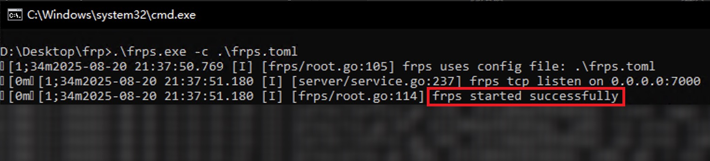
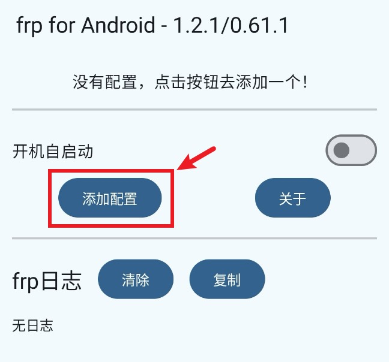
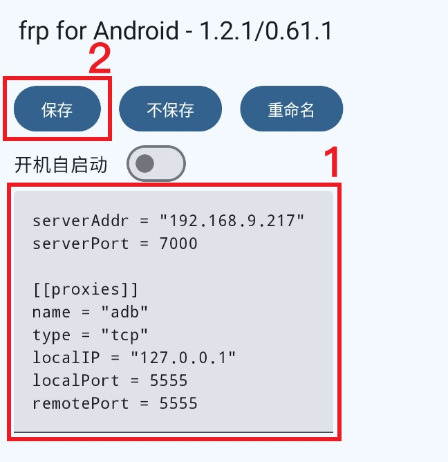
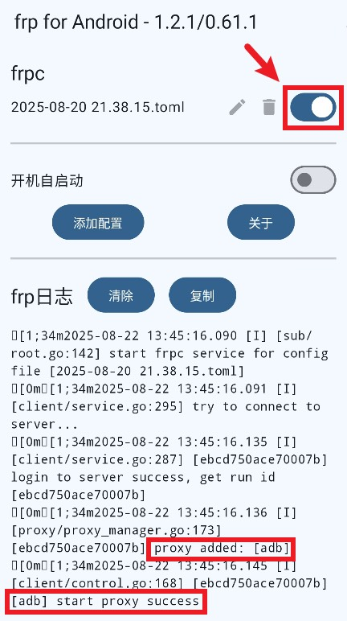
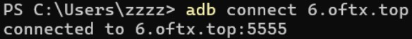
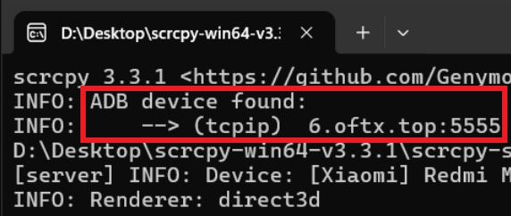
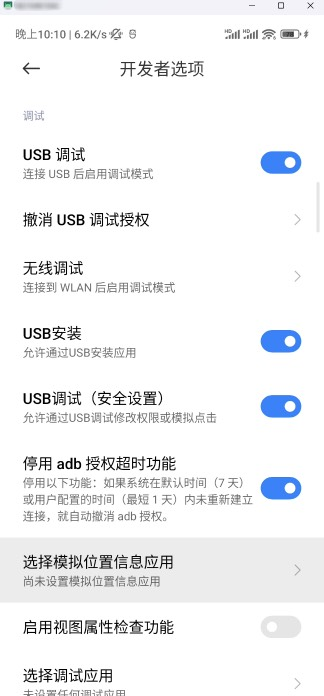

## 引言

最近遇到了远程调试 Android 设备的需求，找到了通过在 Android 设备上启动内网穿透服务的方法，记录操作过程为这篇文章。

## 设备和环境

- Android 设备 × 1
> 作为内网穿透客户端。使用 [frp-Android](https://github.com/AceDroidX/frp-Android/releases) 软件进行 ADB 端口的内网穿透。
- Windows 主机 × 1
> 作为内网穿透服务端，负责将转发的 ADB 端口暴露在公网。使用 [frp](https://github.com/fatedier/frp/releases) 部署内网穿透服务端。另外，使用 ADB 调试 Android 设备，需要使用 [SDK 平台工具](https://android-docs.cn/tools/releases/platform-tools)；控制 Android 设备，需要使用 [scrcpy](https://github.com/Genymobile/scrcpy/releases)。
- 具有公网 IPv6 的网络（非必须）
> 如果你的网络没有公网 IP，那么可以借助具有公网 IP 地址的服务器来进行内网穿透，不过速度大概不会有直连 IPv6 快。
- 域名 × 1（非必须）
> 使用域名是为了避免用户在连接 Android 设备时输入一长串 IPv6 地址，如果没有域名也是可以通过 **IP 直连**来访问 Android 设备的。需确保这个域名指向**内网穿透服务端所在主机的 IP**（这里是 Windows 主机）

## 操作步骤

### 内网穿透服务端（frps）

在 Windows 主机上，下载适用于 Windows 的 [frp](https://github.com/fatedier/frp/releases) 并将其解压到一个位置，打开 frp 文件夹，编辑 `frps.toml` 文件使用以下内容并保存：

```toml title="frps.toml" wrap=false
bindPort = 7000

```

在这个文件夹打开终端窗口，输入命令启动内网穿透服务端（frps）：

```ps showLineNumbers=false wrap=false frame="none"
.\frps.exe -c .\frps.toml
```



此时，内网穿透服务端已启动完成，下面需要在 Android 设备上配置内网穿透客户端。

> 此处由于 Windows 主机和 Android 设备处于同一个网络下，所以无需放通端口。

### 内网穿透客户端（frpc）

在 Android 设备上，下载并安装 [frp-Android](https://github.com/AceDroidX/frp-Android/releases) 软件进行 ADB 端口的内网穿透。

打开软件，可以看到如下界面。

点击“添加配置”按钮来添加一个新的内网穿透客户端（frpc）的配置。



填入以下内容，注意将 `serverAddr` 参数改为 Windows 主机的内网 IP，并点击保存按钮。

```toml title="frpc.toml" /192\.168\.9\.217/ wrap=false
serverAddr = "192.168.9.217"
serverPort = 7000

[[proxies]]
name = "adb"
type = "tcp"
localIP = "127.0.0.1"
localPort = 5555
remotePort = 5555

```



保存成功后返回到软件主界面，点击 frpc 配置文件的开关使 frpc 服务启动。



观察日志可发现已成功连接 frps。


### 配置 ADB 端口与外部访问

要使用电脑进行 ADB 设备调试，需要借助 [SDK 平台工具](https://android-docs.cn/tools/releases/platform-tools)。用户需要将 `platform-tools` 的路径加入 PATH 环境变量以便可到处使用 `adb` 命令。

确保手机设置的“开发者选项”和“USB 调试”已开启。

用电脑连接手机，在手机上授权 USB 调试，在终端使用 `adb tcpip 5555` 命令将 Android 设备的 ADB 端口固定为默认端口 5555。

运行成功后，Android 设备即开始监听 5555 端口。

接下来，在电脑设置防火墙以放通端口。


端口放通后，即可使外网设备访问内网的 Android 设备。

### 测试

要在 Windows 上控制 Android 设备，需要下载并安装 [scrcpy](https://github.com/Genymobile/scrcpy/releases)。

先连接 Android 设备，使用以下命令：

```ps showLineNumbers=false wrap=false frame="none"
adb connect <IP>
```


> 这里我使用了域名访问，命令中使用的 `6.oftx.top` 指向本 Windows 主机。如果没有域名，可以通过 IP 地址来访问。

连接成功！

启动 scrcpy 软件进行远程投屏控制。




可以看到成功连上并传输手机画面，并且在 IPv6 的网络下操作响应几乎无延迟。

> 如果无法访问，你可以通过以下步骤确保可访问性：
> 
> 1. 确保域名指向**内网穿透服务端所在主机的 IP**（这里是 Windows 主机）。
> 2. 确保端口已放通。可能需要在**高级安全 Windows Defender 防火墙**设置入站规则，或者在路由器进行设置。
> 3. 确保即将访问 Android 设备的外网设备可访问 IPv6。
> 
> 排查这些步骤后，Android 设备即处于就绪状态，等待外网设备的访问。

:::warning
FRP 本身不提供强大的加密机制，如果未启用加密，**数据传输可能是明文的**，意味着被截获的流量内容可以被轻易查看。实际操作时需考虑安全因素。
:::

## 结语

这篇文章是作者记录的操作流程，记录了一种内网穿透 Android ADB 端口的方法。  
另外其实，要借助 frp 使外网调试内网 Android 设备，还有一些可能可以的操作方法。  
比如我试想过一种极端情况：有 1 台 Android 设备连上了具有公网的网络，但没有电脑或其他设备。在这种情况下，可通过在 Android 设备上同时启动 frps 和 frpc 来进行内网穿透，外部设备通过 IP 地址即可访问设备。  
如有需要，可自行探索和尝试其他方法。

---

结束！
