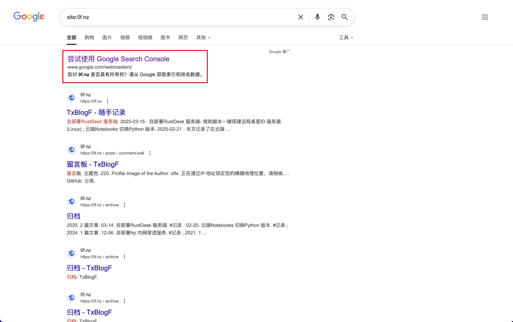
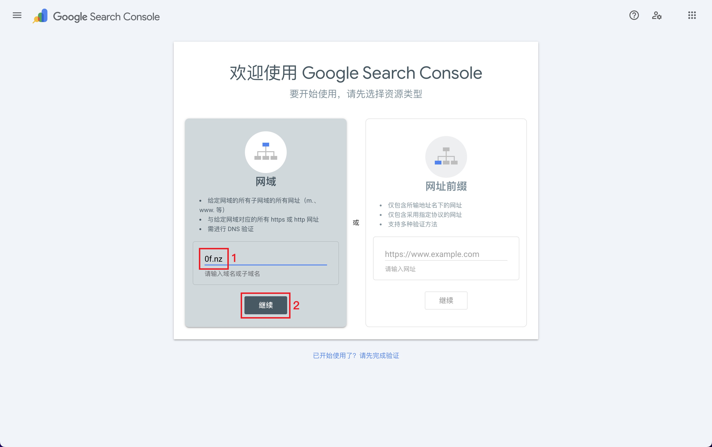
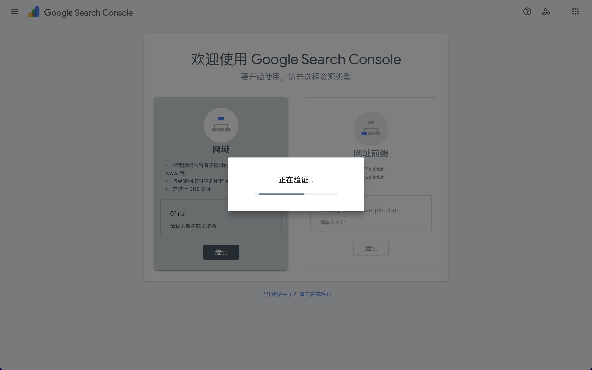
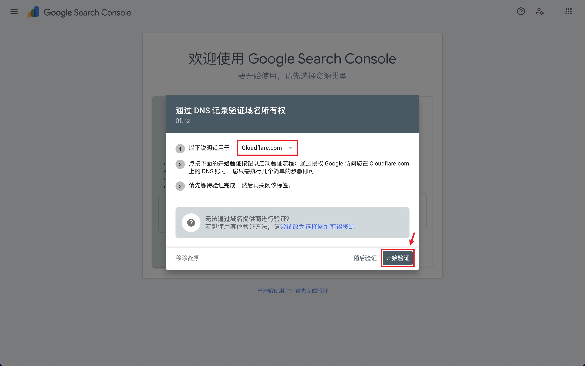
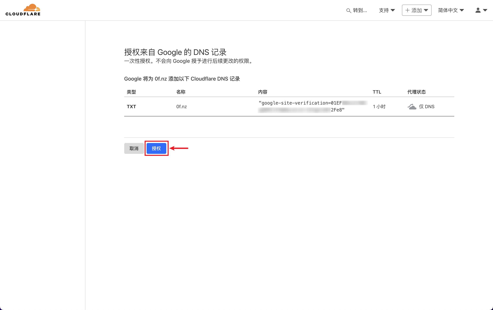
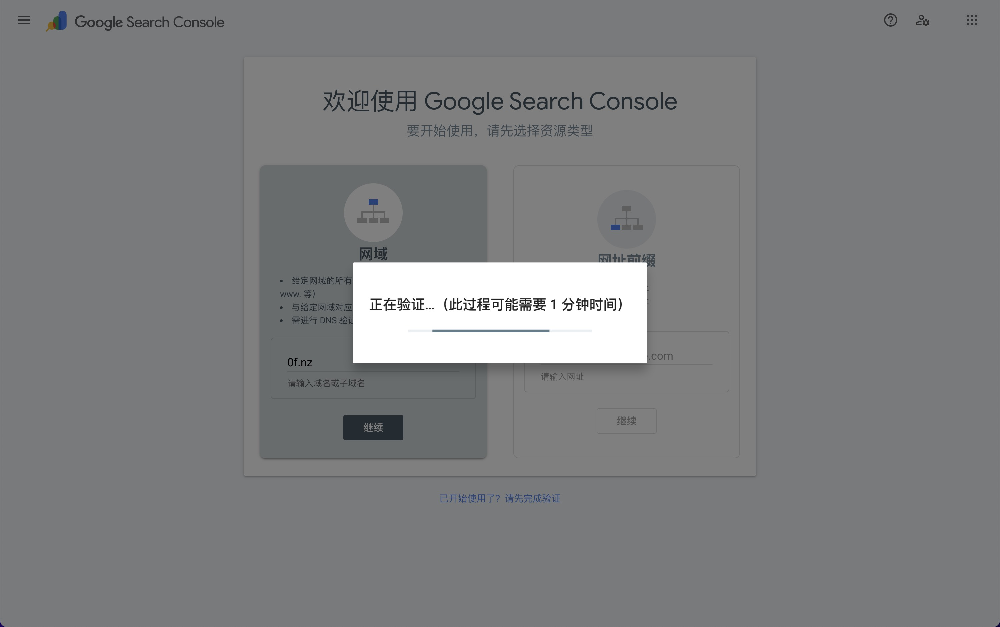
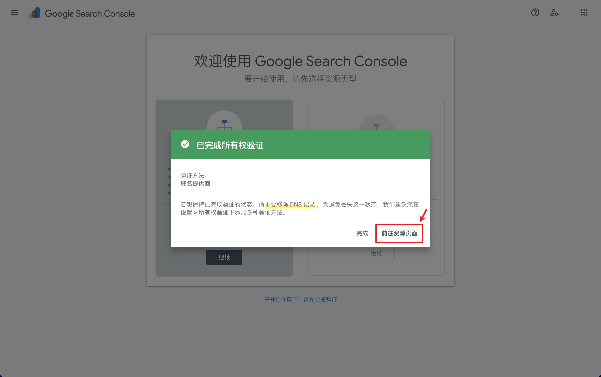
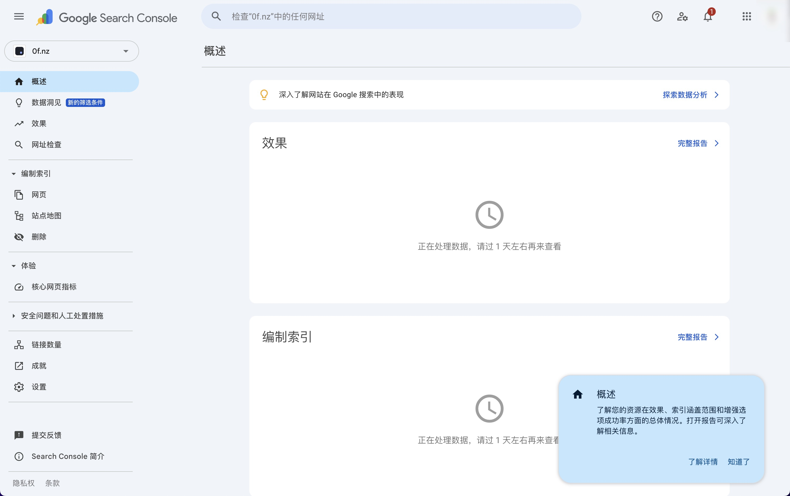

今日兴起，准备在谷歌搜索自己的域名看看会搜出什么，结果真的能搜出来自己的博客！页面顶端提醒我尝试使用 Google Search Console，我对此有兴趣，一起看看里面有什么。

进入 Google Search Console 后，添加网域。按照图示填写域名并点击“验证”按钮。

因为我的域名托管在 Cloudflare，所以使用它来认证。这个流程十分方便。

授权成功后自动跳转回 Google Search Console。

成功验证域名所有权！🎉

Google Search Console 的管理界面是长这样的，很简洁美观，见识到了。

结束！