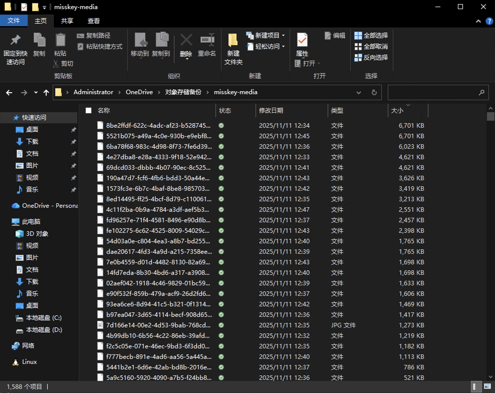
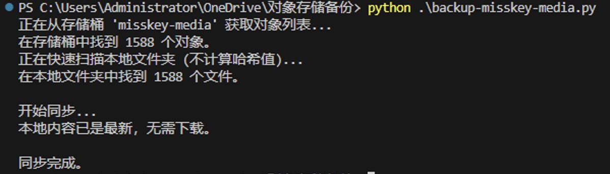

> 此篇文章内容大部分由 AI 生成。

## 1. 脚本简介

这是一个通用的 Python 脚本，旨在将任何兼容 S3 协议的对象存储服务（如 Oracle Cloud Infrastructure, AWS S3, MinIO 等）中的文件单向同步到本地文件夹。它被设计为一个强大的备份工具，兼具易用性与灵活性。

### 主要特性

*   **高兼容性**: 基于 `boto3` 库，可与任何提供 S3 兼容 API 的对象存储服务配合使用。
*   **双重配置模式**:
    1.  **一键运行**: 可直接在脚本中设置默认参数，配置完成后无需任何额外参数即可运行。
    2.  **参数化调用**: 支持通过命令行参数传入所有配置，方便集成到自动化任务和 CI/CD 流程中。命令行参数会覆盖脚本内的默认值。
*   **可选的哈希校验**:
    *   **默认模式（快速）**: 仅比较文件名，快速下载缺失文件和删除多余文件，性能极高。
    *   **校验模式（精确）**: 通过 `--enable-hash-check` 参数启用，会比较云端 ETag 和本地文件 MD5 哈希值，确保每个文件的内容都完全一致，但会增加本地文件扫描时间。
*   **简单可靠**: 单文件脚本，依赖标准库和 `boto3`，易于部署和理解。

## 2. 完整代码

```python
import os
import boto3
import hashlib
import argparse
from botocore.exceptions import ClientError, NoCredentialsError

# --- 1. 默认配置 (可在此处修改以便一键运行) ---
# 将下面的占位符替换为您的默认值。
# 如果通过命令行提供了参数，此处的值将被覆盖。
DEFAULT_ENDPOINT_URL = "https://<您的命名空间>.compat.objectstorage.<您的区域>.oraclecloud.com"
DEFAULT_BUCKET_NAME = "my-backup-bucket"
DEFAULT_ACCESS_KEY = "YOUR_ACCESS_KEY"
DEFAULT_SECRET_KEY = "YOUR_SECRET_KEY"
DEFAULT_LOCAL_DIR = "./my-s3-backup" # 默认备份到当前目录下的 my-s3-backup 文件夹

# --- 2. 核心功能函数 ---

def calculate_local_md5(file_path):
    """计算本地文件的十六进制 MD5 校验和。"""
    md5_hash = hashlib.md5()
    try:
        with open(file_path, "rb") as f:
            for byte_block in iter(lambda: f.read(4096), b""):
                md5_hash.update(byte_block)
            return md5_hash.hexdigest()
    except IOError as e:
        print(f"警告：无法读取文件 {file_path}: {e}")
        return None

def get_s3_objects(s3_client, bucket_name):
    """获取S3存储桶中所有对象及其ETag。"""
    print(f"正在从存储桶 '{bucket_name}' 获取对象列表...")
    s3_objects = {}
    try:
        paginator = s3_client.get_paginator('list_objects_v2')
        pages = paginator.paginate(Bucket=bucket_name)
        for page in pages:
            if "Contents" in page:
                for obj in page['Contents']:
                    s3_objects[obj['Key']] = obj['ETag'].strip('"')
    except ClientError as e:
        print(f"错误：访问存储桶时出错: {e}")
        return None
    print(f"在存储桶中找到 {len(s3_objects)} 个对象。")
    return s3_objects

def get_local_files(directory, enable_hash_check):
    """
    递归获取本地文件。如果开启哈希校验，则计算并返回MD5值。
    """
    if enable_hash_check:
        print("正在扫描本地文件夹并计算哈希值...")
    else:
        print("正在快速扫描本地文件夹 (不计算哈希值)...")
        
    local_files = {}
    for root, _, files in os.walk(directory):
        for name in files:
            file_path = os.path.join(root, name)
            relative_path = os.path.relpath(file_path, directory).replace("\\", "/")
            
            if enable_hash_check:
                hex_digest = calculate_local_md5(file_path)
                if hex_digest:
                    local_files[relative_path] = hex_digest
            else:
                local_files[relative_path] = True

    print(f"在本地文件夹中找到 {len(local_files)} 个文件。")
    return local_files

def synchronize(s3_client, bucket_name, local_dir, s3_objects, local_files, enable_hash_check):
    """根据是否开启哈希校验来对比和同步内容。"""
    print("\n开始同步...")
    local_keys = set(local_files.keys())
    s3_keys = set(s3_objects.keys())
    
    # 步骤1: 在本地删除云端不存在的文件
    files_to_delete = local_keys - s3_keys
    for file_key in files_to_delete:
        file_path = os.path.join(local_dir, file_key)
        print(f"删除 (远程不存在): {file_key}")
        try:
            os.remove(file_path)
        except OSError as e:
            print(f"错误：无法删除文件 {file_path}: {e}")
            
    # 步骤2: 确定需要下载的文件
    files_to_download = set()
    for obj_key in s3_keys:
        if obj_key not in local_keys:
            files_to_download.add(obj_key)
            
    if enable_hash_check:
        print("正在校验文件内容一致性...")
        for obj_key in s3_keys.intersection(local_keys):
            if s3_objects[obj_key] != local_files[obj_key]:
                print(f"计划更新 (校验和不一致): {obj_key}")
                files_to_download.add(obj_key)

    # 步骤3: 执行下载
    if not files_to_download:
        print("本地内容已是最新，无需下载。")
    else:
        print(f"\n需要下载 {len(files_to_download)} 个文件...")

    for obj_key in files_to_download:
        local_path = os.path.join(local_dir, obj_key)
        print(f"下载: {obj_key} -> {local_path}")
        try:
            os.makedirs(os.path.dirname(local_path), exist_ok=True)
            s3_client.download_file(bucket_name, obj_key, local_path)
        except ClientError as e:
            print(f"错误：无法下载对象 '{obj_key}': {e}")

    print("\n同步完成。")

# --- 3. 主程序入口 ---
def main():
    parser = argparse.ArgumentParser(
        description="将S3兼容的存储桶同步到本地文件夹。默认只检查文件是否存在，速度更快。",
        formatter_class=argparse.ArgumentDefaultsHelpFormatter
    )
    # 必要参数
    parser.add_argument('--endpoint-url', default=DEFAULT_ENDPOINT_URL, help='对象存储的端点URL。')
    parser.add_argument('--bucket-name', default=DEFAULT_BUCKET_NAME, help='要同步的存储桶名称。')
    parser.add_argument('--access-key', default=DEFAULT_ACCESS_KEY, help='访问密钥 ID。')
    parser.add_argument('--secret-key', default=DEFAULT_SECRET_KEY, help='秘密访问密钥。')
    parser.add_argument('--local-dir', default=DEFAULT_LOCAL_DIR, help='用于存储备份的本地文件夹路径。')
    
    # 可选功能参数
    parser.add_argument(
        '--enable-hash-check',
        action='store_true',
        help='启用MD5/ETag哈希校验，确保文件内容一致但会减慢扫描速度。'
    )
    
    args = parser.parse_args()

    if not os.path.isdir(args.local_dir):
        os.makedirs(args.local_dir)

    # 初始化 S3 客户端
    s3 = boto3.client(
        's3',
        endpoint_url=args.endpoint_url,
        aws_access_key_id=args.access_key,
        aws_secret_access_key=args.secret_key
    )

    # 获取云端和本地文件列表
    s3_data = get_s3_objects(s3, args.bucket_name)
    if s3_data is None: return
    local_data = get_local_files(args.local_dir, args.enable_hash_check)
    
    # 执行同步
    synchronize(s3, args.bucket_name, args.local_dir, s3_data, local_data, args.enable_hash_check)

if __name__ == "__main__":
    main()
```

## 3. 使用方法

### 步骤1：准备工作

首先，确保您的系统中已安装 Python。然后，安装脚本所需的 `boto3` 库。

```bash
pip install boto3
```

将上面的代码保存为一个 Python 文件，例如 `s3_sync.py`。

### 步骤2：配置脚本

您可以通过以下两种方式之一来配置脚本的参数。

#### 方法一：一键运行 (修改脚本内部变量)

这是最简单的方法，适合个人日常使用。

1.  打开 `s3_sync.py` 文件。
2.  修改文件顶部的 `--- 1. 默认配置 ---` 部分，填入您的对象存储端点、存储桶名称、访问密钥等信息。
3.  保存文件。
4.  在终端中直接运行脚本，无需任何参数：

```bash
python s3_sync.py
```

#### 方法二：参数化运行 (通过命令行)

这种方式更灵活，适合在自动化脚本或需要同步不同目标时使用。所有命令行参数都会覆盖脚本内部的同名默认值。

```bash
python s3_sync.py \
  --endpoint-url "您的端点URL" \
  --bucket-name "您的存储桶名称" \
  --access-key "您的访问密钥" \
  --secret-key "您的秘密密钥" \
  --local-dir "/path/to/your/backup/folder"
```

### 步骤3：控制哈希校验

*   **快速同步 (默认)**: 不带任何额外参数运行时，脚本仅检查文件是否存在。
    ```bash
    python s3_sync.py
    ```

*   **精确同步 (启用哈希校验)**: 如果需要确保本地和云端的文件内容完全一致，请添加 `--enable-hash-check` 标志。
    ```bash
    python s3_sync.py --enable-hash-check
    ```

## 4. 注意事项

1.  **关于校验和 (ETag 与 MD5)**:
    S3 的 ETag 对于通过单部分上传的文件，其值就是该文件内容的 MD5 哈希。但对于**分段上传的大文件**，ETag 是一个基于各部分 MD5 计算出的特殊值。本脚本使用本地 MD5 与 ETag 对比，因此在处理分段上传的大文件时，**哈希校验可能会失败**，导致这些大文件被重复下载。

2.  **凭证安全**:
    直接在脚本中写入密钥虽然方便，但存在安全风险。在生产环境中，建议使用更安全的方式管理凭证，例如环境变量、配置文件或 IAM 角色。

3.  **性能**:
    启用 `--enable-hash-check` 会显著增加脚本运行时间，因为它需要读取本地磁盘上的每一个文件来计算其哈希值。对于大型备份，这可能是非常耗时的操作。

4.  **单向同步**:
    这是一个**单向**同步脚本，方向为 **云端 -> 本地**。它会使本地文件夹的内容与云端存储桶保持一致。任何在本地文件夹中的手动修改（新增、删除、修改文件），在下次脚本运行时都可能被覆盖或删除。它不会将本地的变更上传到云端。

## 5. 脚本流程图

以下是脚本运行逻辑的文本流程图：

```text
                               [ 开始 ]
                                  |
                                  V
          +--------------------------------------------------+
          |  1. 解析命令行参数与脚本内默认配置                    |
          +--------------------------------------------------+
                                  |
                                  V
          +--------------------------------------------------+
          |  2. 优先级合并：命令行参数覆盖默认值，生成最终配置       |
          +--------------------------------------------------+
                                  |
                                  V
                       < 3. 本地目标文件夹是否存在? >
                                  |
          |-----------------------|-------------------------|
         [否]                                              [是]
          |                                                 |
+----------------------+                                    |
|    创建本地文件夹      |                                    |
+----------------------+                                    |
          |                                                 |
          '-------------------------------------------------'
                                  |
                                  V
          +--------------------------------------------------+
          |  4. 根据最终配置初始化 S3 客户端                     |
          +--------------------------------------------------+
                                  |
                                  V
          +--------------------------------------------------+
          |  5. 获取云端存储桶所有对象及其 ETag                  |
          +--------------------------------------------------+
                                  |
                                  V
          +--------------------------------------------------+
          |  6. 扫描本地文件夹所有文件 (根据是否启用哈希校验)       |
          +--------------------------------------------------+
                                  |
                                  V
          +--------------------------------------------------+
          |  7. 对比列表，找出本地需要删除的文件                  |
          |     (本地有，云端没有)                             |
          +--------------------------------------------------+
                                  |
                                  V
          +--------------------------------------------------+
          |  8. 对比列表，找出需要从云端下载的文件                 |
          |     (云端有，本地没有)                              |
          |     (若开启哈希校验：两边都有但校验和不一致)           |
          +--------------------------------------------------+
                                  |
                                  V
          +--------------------------------------------------+
          |  9. 执行所有删除和下载操作                           |
          +--------------------------------------------------+
                                  |
                                  V
          +--------------------------------------------------+
          |  10. 打印 "同步完成"                               |
          +--------------------------------------------------+
                                  |
                                  V
                               [ 结束 ]
```

## 6. 运行示例



