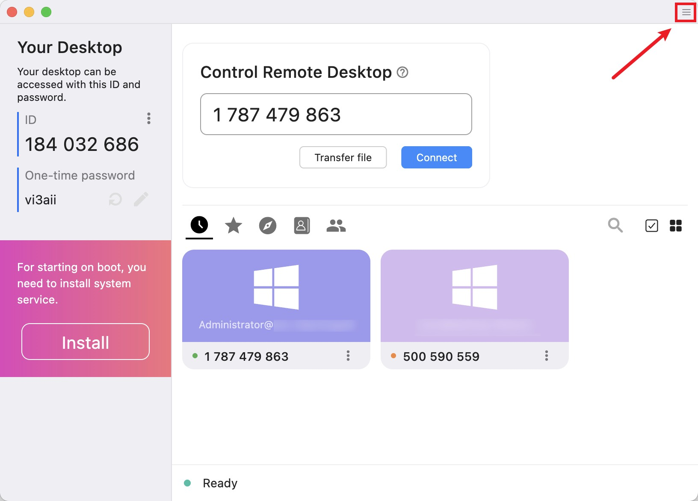
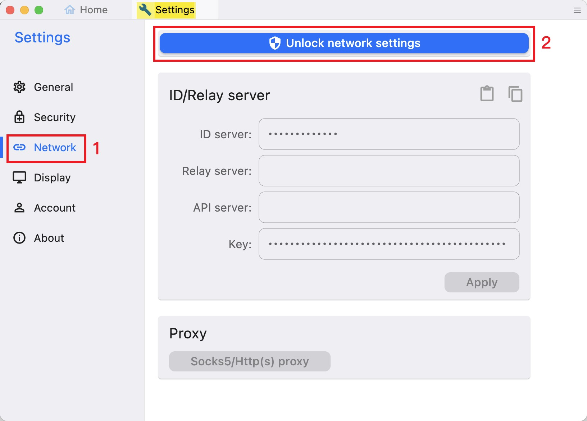
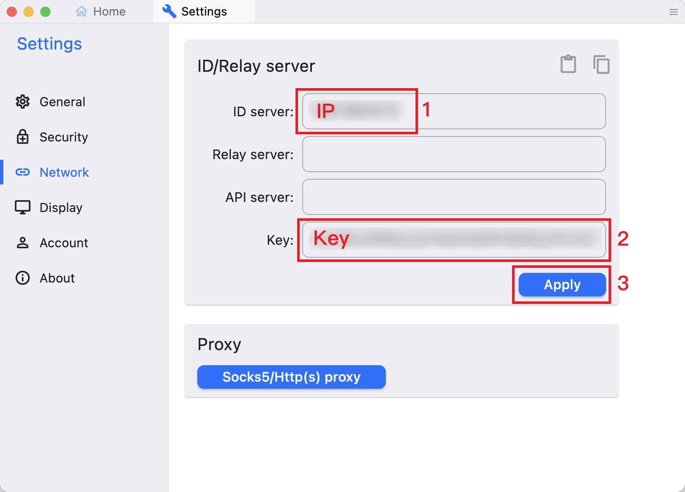
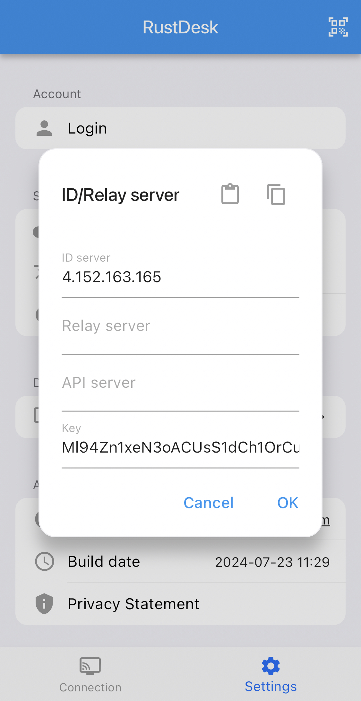

## 准备
1. 服务器 (需要公网IP，作为中继服务器)
2. 客户端×2 (手机、电脑等任何可以安装 RustDesk 软件的设备，用于测试远程桌面的可用性)

## 步骤
1. **在服务器使用脚本安装服务**  

使用简单易运行的安装脚本将您自己的服务器安装为 systemd 服务, 运行以下命令:
```sh wrap=false showLineNumbers=false frame="none"
wget https://raw.githubusercontent.com/techahold/rustdeskinstall/master/install.sh
chmod +x install.sh
./install.sh
```

根据脚本指示进行安装, 安装完成后, 将会显示类似于下面的输出👇
```sh title="Linux Terminal" showLineNumbers=false wrap=false
Your IP/DNS Address is 4.152.163.165
Your public key is Ml94Zn1xeN3oACUsS1dCh1OrCu22UjafdPWyot8RpCo=
Install Rustdesk on your machines and change your public key and IP/DNS name to the above
You can access your install scripts for clients by going to http://4.152.163.165:8000
Username is admin and password is Y8UlfES4CMDMJzE3
Press any key to finish install
```
这段输出包含了 IP/DNS 地址和公钥等信息, 需要记下**公钥**(Public key), 这在设置客户端时会用到。  
> 可以通过以上输出包含的链接和账号密码下载 RustDesk 客户端, 但通常在 [RustDesk 官方仓库](https://github.com/rustdesk/rustdesk/releases/)下载。  

2. **放通服务器端口**
> 需要开放的核心端口:  
> TCP 21114-21119  
> UDP 21116  
> 在附录中了解[每个端口的作用](#每个端口的作用)  

在服务器提供商网站上配置安全组规则以放通端口, 或在主机使用命令放通端口。

建议在放通端口后[测试端口连通性](#端口连通性测试)来确保端口可以被访问。  

> 至此, 服务端配置完成 🎉

3. **在客户端设置**
> 确保服务端运行正常并且端口可访问后, 可以开始在电脑或手机上安装 RustDesk 实现远程访问。

在两个设备的客户端上进行以下设置:

点击右上角“≡”进入菜单 -> 网络 -> 解锁网络设置 -> 设置 ID 服务器 -> 设置 Key -> 点击“应用”按钮  





> 在 ID 服务器处填写服务器 IP, 在 Key 处填写公钥, 其他留空即可。  



<!--  -->

测试客户端间的连接是否正常: 如果客户端的状态显示“就绪”, 并且可以控制远程桌面, 即成功配置。🎉


## 附录
### 每个端口的作用
> RustDesk Server 自托管所需的端口在很大程度上取决于您的环境以及您希望使用 RustDesk 做什么。官方文档中显示的示例通常包含建议打开的所有端口。  

| 端口 | 协议 | 作用 | 备注 |
| - | - | - | - |
| 21114 | TCP | API 服务器（无 SSL 代理时） | 可选 |
| 21115 | TCP | NAT 类型测试 | 必需 |
| 21116 | TCP和UDP | ID 注册、心跳检测、TCP 打洞与连接 | 必需 |
| 21117 | TCP | 中继服务器（hbbr） | 必需 |
| 21118 | TCP | Web 客户端访问 | 可选 |
| 21119 | WebSocket | Web 客户端通信 | 可选 |

### 端口连通性测试
1. 在 Windows, 可以参考以下命令在 PowerShell 测试特定端口的连通性:
```ps showLineNumbers=false wrap=false frame="none"
test-netconnection domain.com -p 21115
```
2. Netcat 是 macOS 自带的工具，可用于测试端口是否开放：
```sh showLineNumbers=false wrap=false frame="none"
nc -zv 目标IP或域名 端口号
```
3. 访问 [Open Port Check Tool -- Verify Port Forwarding on Your Router](https://canyouseeme.org/) 测试连接。

### 服务端维护
可以使用 systemctl 命令查看 RustDesk 相关服务运行状态:
```bash title="Linux Terminal" showLineNumbers=false wrap=false
root@hcss-ecs-a3f0:~# systemctl list-units --type=service | grep rustdesk
  rustdeskrelay.service              loaded active running Rustdesk Relay Server
  rustdesksignal.service             loaded active running Rustdesk Signal Server
```
```bash title="Linux Terminal" showLineNumbers=false wrap=false
root@hcss-ecs-a3f0:~# systemctl status rustdeskrelay
● rustdeskrelay.service - Rustdesk Relay Server
     Loaded: loaded (/etc/systemd/system/rustdeskrelay.service; enabled; vendor preset: enabled)
     Active: active (running) since Sat 2025-03-15 11:15:04 CST; 58min ago
   Main PID: 670 (hbbr)
      Tasks: 5 (limit: 1011)
     Memory: 3.0M
        CPU: 1.311s
     CGroup: /system.slice/rustdeskrelay.service
             └─670 /opt/rustdesk/hbbr

Mar 15 11:15:04 hcss-ecs-a3f0 systemd[1]: Started Rustdesk Relay Server.
```
```bash title="Linux Terminal" showLineNumbers=false wrap=false
root@hcss-ecs-a3f0:~# systemctl status rustdesksignal
● rustdesksignal.service - Rustdesk Signal Server
     Loaded: loaded (/etc/systemd/system/rustdesksignal.service; enabled; vendor preset: enabled)
     Active: active (running) since Sat 2025-03-15 11:15:04 CST; 58min ago
   Main PID: 671 (hbbs)
      Tasks: 9 (limit: 1011)
     Memory: 8.6M
        CPU: 983ms
     CGroup: /system.slice/rustdesksignal.service
             └─671 /opt/rustdesk/hbbs

Mar 15 11:15:04 hcss-ecs-a3f0 systemd[1]: Started Rustdesk Signal Server.
```

### 卸载服务
请根据安装脚本的内容卸载服务。  
可以使用以下提示词询问 AI:
```txt showLineNumbers=false wrap=false
使用脚本安装服务后,如何卸载rustdesk?
[在此处贴上安装脚本的完整代码]
```

AI 回答的总结:
```txt showLineNumbers=false wrap=false
卸载 RustDesk 服务的关键步骤是：
1. 停止并禁用 systemd 服务。
2. 删除安装的文件和文件夹。
3. 卸载不再需要的依赖项。
4. 删除额外的服务（如 Go HTTP Server）。
这将确保 RustDesk 及其相关组件被完全清理。
```

## 参考
1. [Self-host :: Documentation for RustDesk](https://rustdesk.com/docs/en/self-host/)
2. [安裝 :: RustDesk文檔](https://rustdesk.com/docs/zh-tw/self-host/rustdesk-server-oss/install/)
3. [techahold/rustdeskinstall: Easy install Script for Rustdesk](https://github.com/techahold/rustdeskinstall)